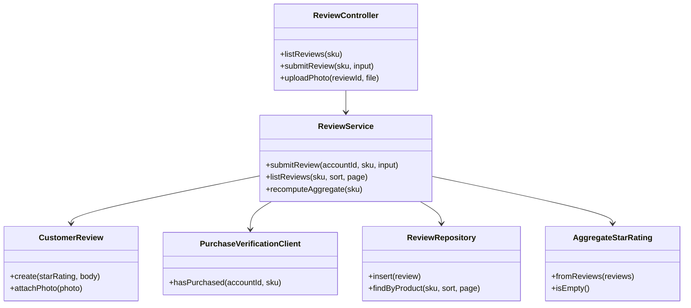
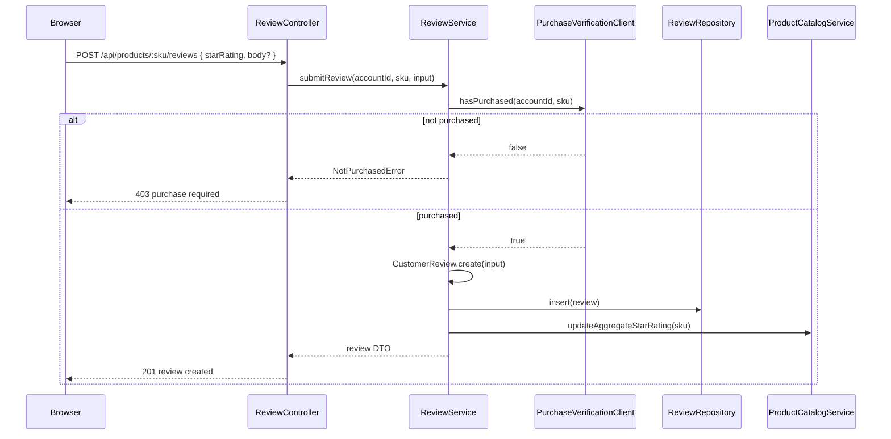
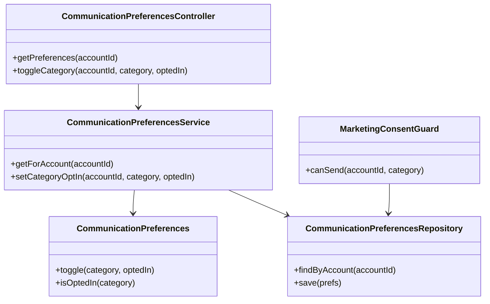
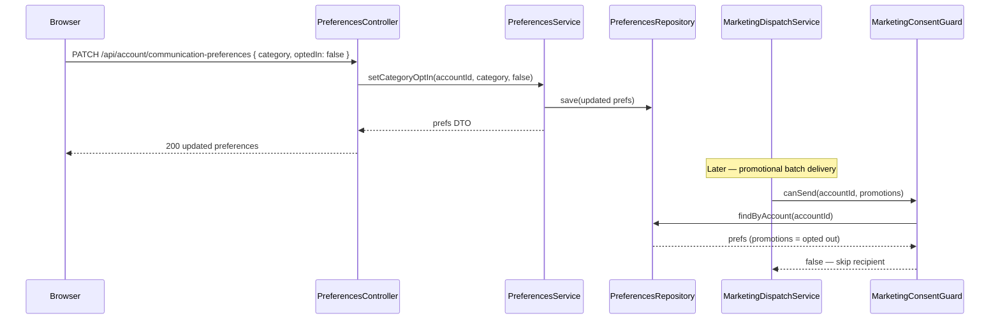
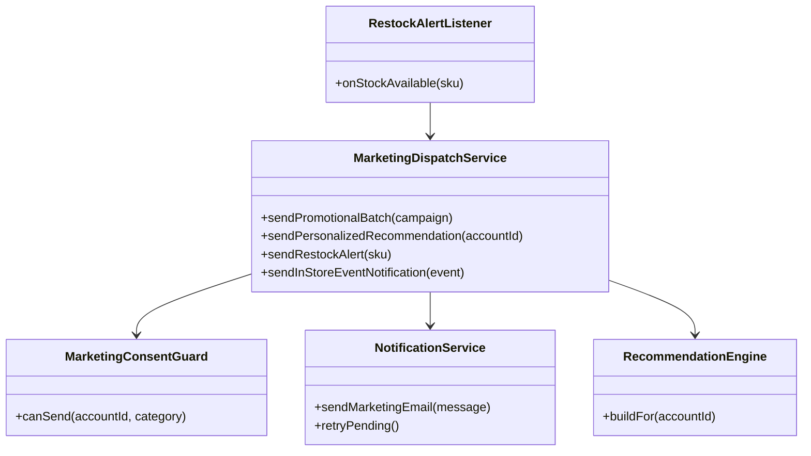
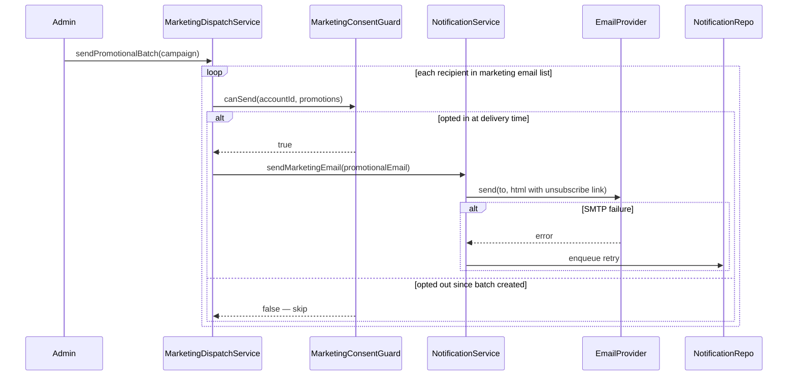
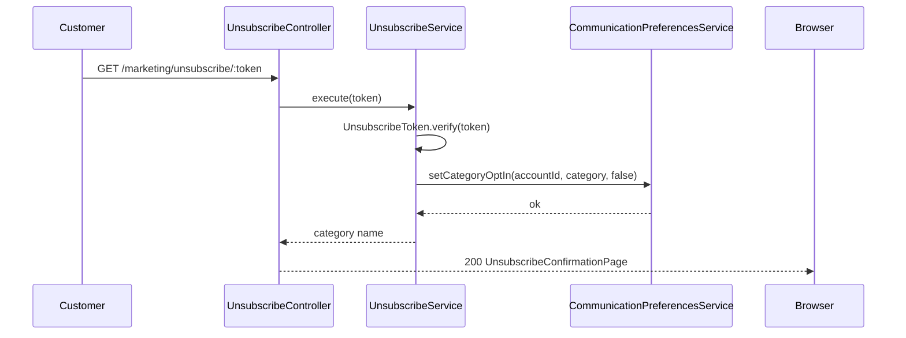
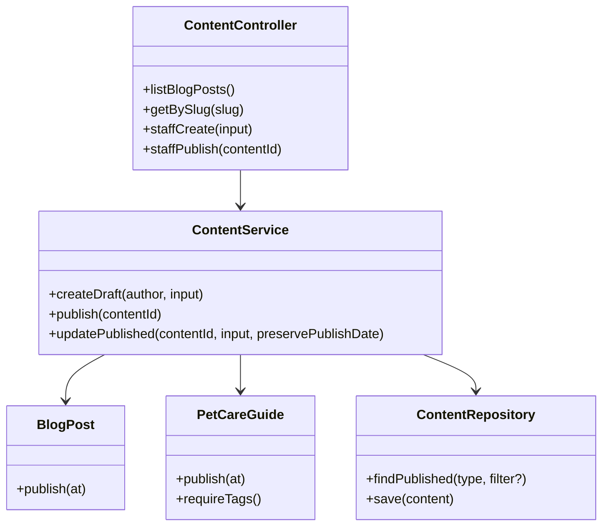
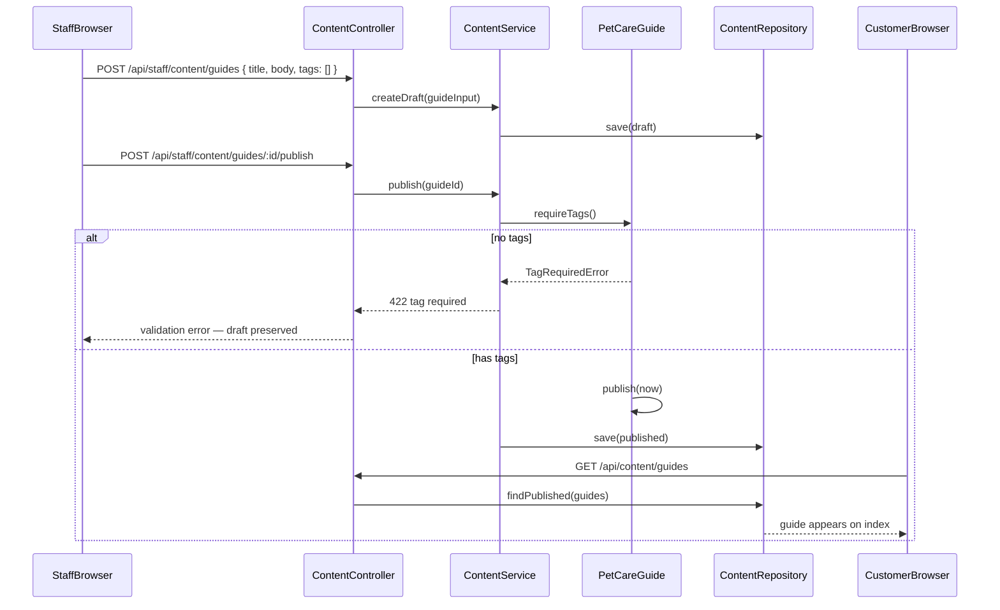
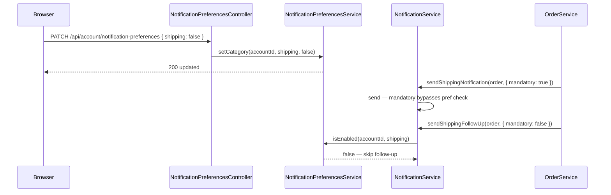

# PawPlace — Increment 8 Marketing Engine Architecture Reference

> **Status:** Exploration — companion to [`architecture-reference.md`](./architecture-reference.md) (Increments 1–7).
> **Last updated:** 2026-05-30
> **Scope:** Customer reviews, consent-gated marketing communications, content publishing (blog posts and pet care guides), and transactional notification preferences — scoped to existing MERN domain-first packages.
>
> **Companion docs:** [`architecture-blueprint.md`](./architecture-blueprint.md) · [`architecture-reference.md`](./architecture-reference.md) · [`marketing-engine-ubiquitous-language.md`](../domain/marketing-engine-ubiquitous-language.md) · [`increment-8-acceptance-criteria.md`](../story/acceptance-criteria/increment-8-acceptance-criteria.md) · [`increment-8-marketing-engine.md`](../ux/lo-fi/increment-8-marketing-engine.md)

Deep walkthroughs for Increment 8 mechanisms. Cross-cutting mechanisms from prior increments (**Error Handling**, **Validation**, **Persistence**, **Communication**, **Confirmation Email**, **Shipping Notification**, **Transactional Appointment Notification**, **Return & Refund Notification**) remain in the system reference — this document **extends** the notification package for marketing and adds Product Catalog review and Content publishing surfaces.

---

## Table of Contents

- [Overview](#overview)
- [Architecture Layers](#architecture-layers)
- [Mechanism: Customer Review](#mechanism-customer-review)
- [Mechanism: Communication Preferences & Marketing Consent Gate](#mechanism-communication-preferences--marketing-consent-gate)
- [Mechanism: Marketing Email Dispatch](#mechanism-marketing-email-dispatch)
- [Mechanism: Marketing Unsubscribe](#mechanism-marketing-unsubscribe)
- [Mechanism: Content Publishing](#mechanism-content-publishing)
- [Mechanism: Notification Preferences (Transactional)](#mechanism-notification-preferences-transactional)
- [Testing Architecture](#testing-architecture)
- [References](#references)

---

## Overview

PawPlace Increment 8 adds an engagement layer on top of the existing domain-first MERN stack: verified *customer reviews* on the product detail page, *communication preferences* that gate every *marketing communication*, four consent-checked email types (*promotional email*, *personalized recommendation*, *restock alert*, *in-store event notification*), published *content* (*blog post*, *pet care guide*), and customer-facing *notification preferences* for transactional email — distinct from marketing opt-in.

Principles inherited from the system reference:

1. **Domain First** — business rules live in `packages/*/shared` domain types and application services; HTTP adapters are thin.
2. **Bounded context isolation** — each capability owns collections and repositories; cross-context calls use service interfaces, not direct repository access.
3. **Fail at the edge** — request shape validation and HTTP status mapping happen in controllers; domain throws typed errors.
4. **Consent at delivery time** — marketing sends re-check *communication preferences* immediately before each recipient delivery, not only at batch creation.

**Increment 8 mechanisms:** **Customer Review**, **Communication Preferences & Marketing Consent Gate**, **Marketing Email Dispatch**, **Marketing Unsubscribe**, **Content Publishing**, **Notification Preferences (Transactional)**.

> Sources: layers from [`architecture-reference.md`](./architecture-reference.md) § Architecture Layers and [`architecture-blueprint.md`](./architecture-blueprint.md) §2–3; mechanisms from [`marketing-engine-ubiquitous-language.md`](../domain/marketing-engine-ubiquitous-language.md) and [`increment-8-acceptance-criteria.md`](../story/acceptance-criteria/increment-8-acceptance-criteria.md).

### Increment 8 specification traceability

| Mechanism | Package(s) | Lo-fi screens (Inc 8) | AC stories (count) |
|---|---|---|---|
| Customer Review | `packages/product-catalog/` | product detail page — reviews and ratings | Submit Written Review with Star Rating (5) · Submit Photo Review (4) · Read Customer Reviews (4) |
| Communication Preferences & Marketing Consent Gate | `packages/customer-account/` · `packages/marketing/` | customer account — communication preferences | Set Communication Preferences (5) · Opt In to Marketing Email List (4) |
| Marketing Email Dispatch | `packages/marketing/` · `packages/notification/` | notification preview — marketing communications | Send Promotional Email (4) · Send Personalized Recommendation (4) · Send Restock Alert (4) · Send In-Store Event Notification (4) |
| Marketing Unsubscribe | `packages/marketing/` · `packages/customer-account/` | unsubscribe confirmation | Unsubscribe from Marketing Emails (4) |
| Content Publishing | `packages/content/` | blog index · blog post detail · pet care guide index · pet care guide detail · admin — content editor | Publish Blog Post (4) · Publish Pet Care Guide (4) |
| Notification Preferences (Transactional) | `packages/notification/` · `packages/customer-account/` | customer account — notification preferences | Set Notification Preferences (4) |

*Transactional* order, shipping, and click-and-collect notifications formalised in Increment 8 AC reuse existing mechanisms in [`architecture-reference.md`](./architecture-reference.md) (**Confirmation Email**, **Shipping Notification**, **Click-and-Collect Fulfillment** notification path) — not duplicated here. Increment 8 adds the customer-facing *notification preferences* UI and enforcement layer only.

### Increment 8 engineering handoff (exploration — architecture reference pass)

| Mechanism | Primary server files | Primary client files | Routes | Test prefix |
|---|---|---|---|---|
| Customer Review | `CustomerReview.ts`, `StarRating.ts`, `ReviewPhoto.ts`, `AggregateStarRating.ts`, `review.service.ts`, `review.controller.ts`, `review.schema.ts`, `review.mongo-repository.ts` | extend `ProductDetailPage.tsx`, `ReviewForm.tsx`, `ReviewList.tsx`, `ReviewPhotoLightbox.tsx` | `GET/POST /api/products/:sku/reviews`, `POST /api/products/:sku/reviews/:reviewId/photos` | `Submit Written Review with Star Rating — AC` · `Submit Photo Review — AC` · `Read Customer Reviews — AC` |
| Communication Preferences | `CommunicationPreferences.ts`, `MarketingCategory.ts`, `communication-preferences.service.ts`, `communication-preferences.controller.ts` | `CommunicationPreferencesPage.tsx` | `GET/PATCH /api/account/communication-preferences`, `/account/communication` | `Set Communication Preferences — AC` · `Opt In to Marketing Email List — AC` |
| Marketing Email Dispatch | `marketing-dispatch.service.ts`, `PromotionalEmail.ts`, `PersonalizedRecommendation.ts`, `RestockAlert.ts`, `InStoreEventNotification.ts`, `marketing-consent.guard.ts`, `marketing-batch.repository.ts` | — (admin batch is system-only; preview in staff/dev UI) | `POST /api/admin/marketing/promotional` (internal), event/stock hooks invoke dispatch | `Send Promotional Email — AC` · `Send Personalized Recommendation — AC` · `Send Restock Alert — AC` · `Send In-Store Event Notification — AC` |
| Marketing Unsubscribe | `unsubscribe.service.ts`, `UnsubscribeToken.ts`, `unsubscribe.controller.ts` | `UnsubscribeConfirmationPage.tsx` | `GET /marketing/unsubscribe/:token`, `/marketing/unsubscribe/confirm` | `Unsubscribe from Marketing Emails — AC` |
| Content Publishing | `Content.ts`, `BlogPost.ts`, `PetCareGuide.ts`, `content.service.ts`, `content.controller.ts`, `content.schema.ts`, `content.mongo-repository.ts` | `BlogIndexPage.tsx`, `BlogPostPage.tsx`, `GuideIndexPage.tsx`, `GuideDetailPage.tsx`, `StaffContentEditorPage.tsx` | `GET /api/content/blog`, `GET /api/content/guides`, `GET /api/content/:slug`, `POST/PATCH /api/staff/content/*`, `/blog`, `/guides`, `/staff/content` | `Publish Blog Post — AC` · `Publish Pet Care Guide — AC` |
| Notification Preferences | `NotificationPreferences.ts`, `notification-preferences.service.ts`, extend `notification.service.ts` | `NotificationPreferencesPage.tsx` | `GET/PATCH /api/account/notification-preferences`, `/account/notifications` | `Set Notification Preferences — AC` |

---

## Architecture Layers

Summary from the system reference — layer names match [`architecture-reference.md`](./architecture-reference.md) § Architecture Layers byte-for-byte.

```
┌─────────────────────────────────────────────────────────────┐
│  Presentation — React (app-client, *-client views)          │
├─────────────────────────────────────────────────────────────┤
│  API — Express routers + controllers (*-server)               │
├─────────────────────────────────────────────────────────────┤
│  Application — *Service classes (orchestration, use cases)  │
├─────────────────────────────────────────────────────────────┤
│  Domain — shared entities, value objects, domain services   │
├─────────────────────────────────────────────────────────────┤
│  Infrastructure — MongoDB repositories (*mongo-repository)    │
└─────────────────────────────────────────────────────────────┘
```

| Layer | Tech | Location | Responsibility |
|-------|------|----------|----------------|
| **Presentation** | React + Vite | `packages/app-client`, `packages/*/client` | Product detail reviews UI, blog/guide indexes, account preference tabs, staff content editor |
| **API** | Express | `packages/*/server/*.routes.ts`, `*.controller.ts` | Review submission, preference toggles, content CRUD, unsubscribe token ingress |
| **Application** | TypeScript classes | `packages/*/server/*.service.ts` | Review authorship verification, consent gate, marketing batch orchestration, content draft/publish |
| **Domain** | TypeScript | `packages/*/shared` | `CustomerReview`, `CommunicationPreferences`, `MarketingCategory`, `BlogPost`, `PetCareGuide`, notification preference value objects |
| **Infrastructure** | MongoDB | `packages/*/server/*mongo-repository.ts`, `packages/notification/server/email.provider.ts` | Review photos storage, preference persistence, marketing send queue, SMTP adapter |

**New packages for Increment 8:**

| Package | Bounded context | Notes |
|---|---|---|
| `packages/marketing/` | Marketing Communication | Consent gate, batch dispatch, unsubscribe tokens; depends on `customer-account`, `notification`, `product-catalog`, `store` |
| `packages/content/` | Content | Blog post and pet care guide lifecycle; staff authoring only |

Existing packages extended: `packages/product-catalog/` (reviews), `packages/customer-account/` (communication preferences), `packages/notification/` (marketing templates + transactional preference enforcement).

---

## Mechanism: Customer Review

### Principles & Patterns

- **Principle:** Only a verified *customer account* that has **purchased** the *product* may author a *customer review*; *star rating* (1–5 integer) is mandatory; written text and *review photos* are optional; *aggregate star rating* recomputes on every review change and is **never shown as zero** when no reviews exist.
- **Pattern:** **Purchase-verified authorship gate + derived aggregate**
  - **Options:** Allow guest reviews (rejected — UL invariant); store aggregate as denormalized field updated on write (chosen — read-heavy product detail page); moderation queue before publish (rejected — no AC for moderation).
  - **Benefits:** Social proof on product detail page without cross-module repository access; photo upload failure isolated from review text submission.
  - **Trade-offs:** Aggregate must be kept consistent on edit/delete; purchase verification requires Order module lookup by SKU + account id.

### File Structure

```
packages/product-catalog/
  shared/
    CustomerReview.ts           # review entity: starRating, body?, photos[], authorId, productSku
    StarRating.ts                 # value object 1–5 integer
    ReviewPhoto.ts                # image metadata + storage key
    AggregateStarRating.ts        # computed average; empty state helper
    review.schema.ts              # Zod: createReviewSchema, reviewPhotoSchema
  server/
    review.service.ts             # submitReview, listReviews, recomputeAggregate
    review.controller.ts
    review.routes.ts
    review.mongo-repository.ts
    review-photo.storage.ts       # file upload adapter (size/format validation)
    purchase-verification.client.ts  # IOrderClient.hasPurchased(accountId, sku)
  client/
    ReviewForm.tsx
    ReviewList.tsx
    ReviewPhotoLightbox.tsx
packages/app-client/src/pages/ProductDetailPage.tsx  # extend with reviews section
```

### Participants



| Class / Module | Layer | Responsibility | Collaborators |
|---|---|---|---|
| **ReviewController** | API | Map HTTP to service; 403 when non-purchaser | ReviewService |
| **ReviewService** | Application | Verify purchase; create review; recompute aggregate | PurchaseVerificationClient, ReviewRepository |
| **CustomerReview** | Domain | Enforce star rating invariant; optional body/photos | StarRating, ReviewPhoto |
| **AggregateStarRating** | Domain | Average computation; empty-state (no zero display) | CustomerReview |
| **PurchaseVerificationClient** | Infrastructure | Cross-context call to Order module | OrderService |
| **ReviewRepository** | Infrastructure | Persist reviews and photos metadata | MongoDB |

### Flow



### Walkthrough Example

Scenario: Logged-in customer who purchased SKU `DOG-FOOD-01` submits a star-rating-only review.

1. **ReviewController** validates the request body with `createReviewSchema` and extracts `accountId` from session middleware.
2. **ReviewService.submitReview** calls **PurchaseVerificationClient.hasPurchased** — returns `true` for prior order line containing the SKU.
3. **CustomerReview.create** accepts `starRating: 4` with no body — valid per domain invariant.
4. **ReviewRepository.insert** persists the review linked to product SKU and account id.
5. **ReviewService.recomputeAggregate** loads all reviews for the SKU; **AggregateStarRating.fromReviews** computes the new average.
6. **ProductCatalogService.updateAggregateStarRating** stores the derived value; product detail page shows ★★★★☆ on next GET.

```typescript
// review.service.ts — abd-clean-code: constructor injection, domain language
export class ReviewService {
  constructor(
    private readonly reviews: ReviewRepository,
    private readonly purchaseVerification: PurchaseVerificationClient,
    private readonly catalog: ProductCatalogService,
  ) {}

  async submitReview(
    accountId: CustomerAccountId,
    sku: ProductSku,
    input: CreateReviewInput,
  ): Promise<CustomerReview> {
    const purchased = await this.purchaseVerification.hasPurchased(accountId, sku);
    if (!purchased) throw new NotPurchasedError(sku);

    const review = CustomerReview.create({
      authorId: accountId,
      productSku: sku,
      starRating: StarRating.of(input.starRating),
      body: input.body,
    });
    await this.reviews.insert(review);
    await this.recomputeAggregate(sku);
    return review;
  }
}
```

```typescript
// review.acceptance.test.ts — abd-acceptance-test-driven-development
class TestSubmitWrittenReviewWithStarRating {
  helper = new ReviewServerHelper();

  async test_star_rating_only_review_accepted_for_verified_purchaser() {
    await this.helper.givenLoggedInCustomerWhoPurchased('DOG-FOOD-01');
    await this.helper.whenCustomerSubmitsReviewWithStarRating(4);
    await this.helper.thenReviewAppearsOnProductDetailNewestFirst();
    await this.helper.thenAggregateStarRatingRecomputed();
  }
}
```

### Testing the Mechanism

- **Tier:** Domain (`StarRating` bounds, `AggregateStarRating` empty state); Application (`ReviewService` purchase gate); Integration (POST review → 403 non-purchaser, 201 purchaser); E2E (product detail review form states from lo-fi).
- **Helper:** `ReviewServerHelper` — `givenLoggedInCustomerWhoPurchased`, `whenCustomerSubmitsReviewWithStarRating`, `thenAggregateStarRatingRecomputed`.
- **Scenario coverage:** non-purchaser 403; guest login prompt; photo upload validation preserves text/rating; sort controls (newest, oldest, highest, lowest); no aggregate when zero reviews.

**Standards:** `abd-clean-code`, `abd-acceptance-test-driven-development`

---

## Mechanism: Communication Preferences & Marketing Consent Gate

### Principles & Patterns

- **Principle:** *Marketing communications* require explicit opt-in per *marketing category* (promotions, recommendations, restock alerts, events); new categories default to **opt-out**; preference changes persist **immediately** on toggle; the consent gate runs at **delivery time** for every recipient, not only when a batch is created.
- **Pattern:** **Per-category opt-in record + delivery-time consent guard**
  - **Options:** Global marketing on/off only (rejected — AC requires independent categories); batch-time filtering only (rejected — real-time opt-out between queue and send must be honoured); delayed "save" button (rejected — immediate persist AC).
  - **Benefits:** Legal/UX alignment with unchecked-by-default registration checkbox; extensible category list without retroactive opt-in.
  - **Trade-offs:** Every marketing send path must invoke `MarketingConsentGuard`; batch jobs iterate recipients with per-recipient re-check.

### File Structure

```
packages/customer-account/
  shared/
    CommunicationPreferences.ts   # Map<MarketingCategory, OptInStatus>
    MarketingCategory.ts            # enum: promotions | recommendations | restock_alerts | events
    communication-preferences.schema.ts
  server/
    communication-preferences.service.ts
    communication-preferences.controller.ts
    communication-preferences.routes.ts
packages/marketing/
  shared/
    MarketingConsentGuard.ts      # canSend(accountId, category): boolean
    OptInRecord.ts                # category, optedInAt, optedOutAt?
  server/
    marketing-consent.guard.ts    # reads CommunicationPreferences at send time
```

### Participants



| Class / Module | Layer | Responsibility | Collaborators |
|---|---|---|---|
| **CommunicationPreferences** | Domain | Per-category opt-in state; default opt-out for new categories | MarketingCategory |
| **CommunicationPreferencesService** | Application | Immediate persist on toggle; timestamp opt-in events | CommunicationPreferencesRepository |
| **MarketingConsentGuard** | Domain | Delivery-time consent check | CommunicationPreferencesRepository |
| **CommunicationPreferencesController** | API | Account-authenticated GET/PATCH | CommunicationPreferencesService |

### Flow



### Walkthrough Example

Scenario: Customer opts out of promotions via account settings; a queued promotional email batch delivers later the same hour.

1. **CommunicationPreferencesController** receives PATCH with `{ category: 'promotions', optedIn: false }` from authenticated session.
2. **CommunicationPreferencesService.setCategoryOptIn** loads current prefs, calls **CommunicationPreferences.toggle** — immediate write, no separate save action.
3. **CommunicationPreferencesRepository.save** persists the updated document on the *customer account*.
4. **MarketingDispatchService** iterates batch recipients created earlier with promotions opted-in.
5. For each recipient, **MarketingConsentGuard.canSend** re-reads prefs from repository — customer who opted out at step 2 returns `false`.
6. **MarketingDispatchService** skips that recipient — Send Promotional Email AC #2 satisfied.

```typescript
export class MarketingConsentGuard {
  constructor(private readonly prefsRepo: CommunicationPreferencesRepository) {}

  async canSend(accountId: CustomerAccountId, category: MarketingCategory): Promise<boolean> {
    const prefs = await this.prefsRepo.findByAccount(accountId);
    return prefs.isOptedIn(category);
  }
}
```

```typescript
class TestSetCommunicationPreferences {
  helper = new CommunicationPreferencesHelper();

  async test_toggle_persists_immediately_without_save_action() {
    await this.helper.givenLoggedInCustomerWithPromotionsOptedIn();
    await this.helper.whenCustomerTogglesCategory('promotions', false);
    await this.helper.thenCategoryShowsOptedOut('promotions');
    await this.helper.thenNoMarketingSentForCategory('promotions');
  }
}
```

### Testing the Mechanism

- **Tier:** Domain (default opt-out for new category); Application (immediate persist); Integration (PATCH toggle → subsequent marketing skip); E2E (communication preferences page from lo-fi).
- **Helper:** `CommunicationPreferencesHelper`.
- **Scenario coverage:** registration/checkout checkbox unchecked by default; guest 403/login prompt; transactional notifications unaffected when all marketing categories opted out.

**Standards:** `abd-clean-code`, `abd-acceptance-test-driven-development`

---

## Mechanism: Marketing Email Dispatch

### Principles & Patterns

- **Principle:** Four *marketing communication* types share a common dispatch pipeline gated by **MarketingConsentGuard** at delivery time: *promotional email* (admin batch), *personalized recommendation* (scheduled/triggered per account), *restock alert* (stock transition + wishlist match), *in-store event notification* (store match + events opt-in). Delivery failure queues for retry — not silently discarded. No marketing email to guest checkout sessions.
- **Pattern:** **Typed marketing template + consent-gated recipient fan-out + fire-and-queue**
  - **Options:** Separate SMTP pipeline for marketing (rejected — reuse `NotificationService` email provider and queue); send without personalization data (rejected — personalized recommendation invariant); guess store proximity for events (rejected — preferred store required).
  - **Benefits:** Reuses Increment 2–7 notification resilience; one guard enforces all four categories; templates carry unsubscribe links.
  - **Trade-offs:** Restock alert requires Product Catalog stock event + Customer Account wishlist cross-context calls; recommendation engine is best-effort MVP (purchase history + pet profile + browsing).

### File Structure

```
packages/marketing/
  shared/
    PromotionalEmail.ts
    PersonalizedRecommendation.ts
    RestockAlert.ts
    InStoreEventNotification.ts
    marketing.schema.ts
  server/
    marketing-dispatch.service.ts     # sendPromotionalBatch, sendRecommendation, sendRestockAlert, sendEventNotification
    promotional-batch.repository.ts
    recommendation.engine.ts          # selects in-stock SKUs from history/profile
    restock-alert.listener.ts         # subscribes to stock-availability transition events
    event-notification.service.ts
packages/notification/
  server/
    notification.service.ts             # +sendMarketingEmail(message) — reuses email.provider + queue
    email.provider.ts
    notification.repository.ts
packages/product-catalog/server/
  stock-availability.events.ts        # emits out-of-stock → in-stock transition
packages/customer-account/server/
  wishlist.service.ts                 # findAccountsWithSkuOnWishlist(sku)
packages/store/server/
  store-events.service.ts             # admin-created in-store events
```

### Participants



| Class / Module | Layer | Responsibility | Collaborators |
|---|---|---|---|
| **MarketingDispatchService** | Application | Orchestrate fan-out; skip non-consented recipients | MarketingConsentGuard, NotificationService |
| **PromotionalEmail** | Domain | Batch campaign template + unsubscribe link | MarketingCategory.promotions |
| **PersonalizedRecommendation** | Domain | Per-account product set; exclude out-of-stock | RecommendationEngine, ProductCatalogService |
| **RestockAlert** | Domain | Wishlist + restock_alerts category gate | WishlistService, MarketingConsentGuard |
| **InStoreEventNotification** | Domain | Preferred store match; no proximity guess | CustomerAccountService, StoreEventsService |
| **NotificationService** | Application | SMTP send + retry queue (shared with transactional) | EmailProvider, NotificationRepository |

### Flow



### Walkthrough Example

Scenario: Product SKU `CAT-LITTER-02` transitions from out-of-stock to in-stock; two customers have it on their wishlist.

1. **RestockAlertListener.onStockAvailable** receives domain event from Product Catalog with SKU and new availability state.
2. **WishlistService.findAccountsWithSkuOnWishlist** returns account ids `[acc-1, acc-2]`.
3. For `acc-1`, **MarketingConsentGuard.canSend(acc-1, restock_alerts)** returns `true` — **RestockAlert** template built with product name and product URL.
4. **NotificationService.sendMarketingEmail** delivers email; on SMTP failure, job enqueued with `type: 'restock_alert'`.
5. For `acc-2`, **MarketingConsentGuard.canSend(acc-2, restock_alerts)** returns `false` — no send despite wishlist presence (Send Restock Alert AC #2).
6. Neither send blocks stock state — alert is best-effort (Send Restock Alert AC #3).

```typescript
export class MarketingDispatchService {
  constructor(
    private readonly consent: MarketingConsentGuard,
    private readonly notifications: NotificationService,
    private readonly wishlist: WishlistService,
  ) {}

  async sendRestockAlert(sku: ProductSku, productName: string): Promise<void> {
    const accountIds = await this.wishlist.findAccountsWithSkuOnWishlist(sku);
    for (const accountId of accountIds) {
      if (!(await this.consent.canSend(accountId, 'restock_alerts'))) continue;

      const message = RestockAlert.create({ accountId, sku, productName });
      await this.notifications.sendMarketingEmail(message);
    }
  }
}
```

```typescript
class TestSendRestockAlert {
  helper = new MarketingDispatchHelper();

  async test_alert_sent_only_to_wishlist_customers_opted_in_to_restock_alerts() {
    await this.helper.givenProductBackInStock('CAT-LITTER-02');
    await this.helper.givenCustomerOnWishlistOptedIn('acc-1');
    await this.helper.givenCustomerOnWishlistOptedOut('acc-2');
    await this.helper.whenRestockAlertTriggered('CAT-LITTER-02');
    await this.helper.thenEmailSentTo('acc-1');
    await this.helper.thenNoEmailSentTo('acc-2');
  }
}
```

### Testing the Mechanism

- **Tier:** Application (consent skip, recommendation excludes OOS, event requires preferred store); Integration (stock event → selective emails); E2E (notification preview tabs from lo-fi — marketing communications).
- **Helper:** `MarketingDispatchHelper`.
- **Scenario coverage:** promotional batch delivery-time opt-out; no personalized recommendation without data; in-store event skipped when no preferred store; SMTP failure queued not discarded.

**Standards:** `abd-clean-code`, `abd-acceptance-test-driven-development`

---

## Mechanism: Marketing Unsubscribe

### Principles & Patterns

- **Principle:** *Unsubscribe* opts the customer out of a single *marketing category* **immediately** via email link or communication preferences page; produces idempotent "you've been unsubscribed" confirmation; must **not** suppress *transactional notifications*.
- **Pattern:** **Signed unsubscribe token + category-scoped opt-out**
  - **Options:** Global unsubscribe from all email (rejected — category-scoped AC); delayed opt-out (rejected — immediate effect); require login for email link (rejected — one-click unsubscribe AC).
  - **Benefits:** Token encodes account id + category — no session required on confirmation page; repeat clicks are idempotent.
  - **Trade-offs:** Tokens must be signed/expiring to prevent tampering; separate from transactional preference paths.

### File Structure

```
packages/marketing/
  shared/
    UnsubscribeToken.ts           # sign/verify(accountId, category)
  server/
    unsubscribe.service.ts
    unsubscribe.controller.ts
    unsubscribe.routes.ts
packages/app-client/src/pages/UnsubscribeConfirmationPage.tsx
packages/notification/shared/
    marketing-email-footer.ts     # inject unsubscribe URL into all marketing templates
```

### Participants

| Class / Module | Layer | Responsibility | Collaborators |
|---|---|---|---|
| **UnsubscribeToken** | Domain | HMAC-signed payload: accountId, category, issuedAt | — |
| **UnsubscribeService** | Application | Verify token; call CommunicationPreferencesService.setCategoryOptIn(false) | CommunicationPreferencesService |
| **UnsubscribeController** | API | GET `/marketing/unsubscribe/:token` → confirmation page | UnsubscribeService |
| **UnsubscribeConfirmationPage** | Presentation | Render confirmation; link to communication preferences | React Router |

### Flow



### Walkthrough Example

Scenario: Customer clicks unsubscribe link in a promotional email.

1. **UnsubscribeController** receives GET with signed token from email footer link.
2. **UnsubscribeService.execute** verifies **UnsubscribeToken** — extracts `accountId` and `category: promotions`.
3. **CommunicationPreferencesService.setCategoryOptIn** sets promotions to opted-out — immediate effect.
4. **UnsubscribeController** renders **UnsubscribeConfirmationPage** with "You've been unsubscribed" and category name.
5. Customer clicks link again (repeat) — step 3 is idempotent; same confirmation shown (Unsubscribe AC #4).
6. **NotificationService** continues sending order confirmations — transactional path does not consult marketing prefs.

```typescript
export class UnsubscribeService {
  constructor(private readonly preferences: CommunicationPreferencesService) {}

  async execute(token: string): Promise<MarketingCategory> {
    const { accountId, category } = UnsubscribeToken.verify(token);
    await this.preferences.setCategoryOptIn(accountId, category, false);
    return category;
  }
}
```

```typescript
class TestUnsubscribeFromMarketingEmails {
  helper = new UnsubscribeHelper();

  async test_email_link_immediately_opts_out_and_shows_confirmation() {
    await this.helper.givenCustomerOptedInToPromotions();
    await this.helper.whenCustomerClicksUnsubscribeLinkInEmail('promotions');
    await this.helper.thenConfirmationPageShowsUnsubscribed();
    await this.helper.thenNoFurtherPromotionalEmailsSent();
    await this.helper.thenOrderConfirmationStillSent();
  }
}
```

### Testing the Mechanism

- **Tier:** Domain (token verify/tamper rejection); Application (idempotent repeat); Integration (GET token → prefs updated); E2E (unsubscribe confirmation page states).
- **Helper:** `UnsubscribeHelper`.
- **Scenario coverage:** preferences-page unsubscribe path; transactional unaffected; invalid token → safe error page.

**Standards:** `abd-clean-code`, `abd-acceptance-test-driven-development`

---

## Mechanism: Content Publishing

### Principles & Patterns

- **Principle:** *Content* transitions **draft → published**; draft is invisible to customers; published content is URL-accessible; *blog post* requires title, summary, date, author on index; *pet care guide* requires at least one pet type/species tag before publish; published edits reflect immediately without changing publish date unless explicitly requested.
- **Pattern:** **Lifecycle state machine + public read API filtered by published status**
  - **Options:** Separate CMS microservice (rejected — scope fits domain-first package); schedule future publish (rejected — no AC); customer-visible drafts (rejected — invariant).
  - **Benefits:** Content feeds blog/guide indexes and can be linked from marketing emails; staff-only authoring via existing staff dashboard Content tab.
  - **Trade-offs:** Cross-linking guides to pet/product browsing requires tag-based lookup in client routes.

### File Structure

```
packages/content/
  shared/
    Content.ts                    # base: id, title, summary, body, status, publishDate
    BlogPost.ts                   # + author
    PetCareGuide.ts               # + speciesTags[]
    ContentStatus.ts              # draft | published
    content.schema.ts
  server/
    content.service.ts            # createDraft, publish, updatePublished
    content.controller.ts         # public GET (published only) + staff CRUD
    content.routes.ts
    content.mongo-repository.ts
  client/
    content.api.ts
packages/app-client/src/pages/
  BlogIndexPage.tsx
  BlogPostPage.tsx
  GuideIndexPage.tsx
  GuideDetailPage.tsx
  staff/StaffContentEditorPage.tsx
```

### Participants



| Class / Module | Layer | Responsibility | Collaborators |
|---|---|---|---|
| **ContentService** | Application | Draft/publish lifecycle; tag validation for guides | ContentRepository |
| **BlogPost** | Domain | Author metadata; publish date preservation on edit | Content |
| **PetCareGuide** | Domain | Enforce ≥1 species tag invariant at publish | Content |
| **ContentRepository** | Infrastructure | Filter `status = published` on public queries | MongoDB |
| **StaffContentEditorPage** | Presentation | Draft/publish actions; tag required validation UI | ContentController |

### Flow



### Walkthrough Example

Scenario: Content author publishes a pet care guide tagged "Dogs".

1. **ContentController** receives staff-authenticated POST to create guide draft with title, summary, body — no tags yet.
2. **ContentService.createDraft** saves **PetCareGuide** with `status: draft` — not returned by public GET endpoints.
3. Staff adds species tag "Dogs" and clicks Publish.
4. **ContentService.publish** calls **PetCareGuide.requireTags** — passes with one tag.
5. **PetCareGuide.publish** sets `status: published` and `publishDate: now`.
6. **ContentRepository.save** persists; **GuideIndexPage** lists the guide with tag badge; pet gallery cross-link query matches "Dogs" tag.

```typescript
export class PetCareGuide extends Content {
  constructor(
    readonly speciesTags: SpeciesTag[],
    ...fields: ContentFields,
  ) {
    super(fields);
  }

  requireTags(): void {
    if (this.speciesTags.length === 0) throw new TagRequiredError();
  }

  publish(at: Date): void {
    this.requireTags();
    super.publish(at);
  }
}
```

```typescript
class TestPublishPetCareGuide {
  helper = new ContentPublishingHelper();

  async test_publish_requires_at_least_one_species_tag() {
    await this.helper.givenStaffAuthorWithGuideDraftWithoutTags();
    await this.helper.whenStaffAttemptsToPublishGuide();
    await this.helper.thenValidationErrorTagRequired();
    await this.helper.thenDraftPreservedAndEditable();
  }
}
```

### Testing the Mechanism

- **Tier:** Domain (draft invisible, tag invariant, publish date preservation); Application (public API filters drafts); E2E (blog/guide indexes, staff content editor from lo-fi).
- **Helper:** `ContentPublishingHelper`.
- **Scenario coverage:** blog post draft not on index; direct URL 404 for draft; edit published without changing date; guide cross-link by tag.

**Standards:** `abd-clean-code`, `abd-acceptance-test-driven-development`

---

## Mechanism: Notification Preferences (Transactional)

### Principles & Patterns

- **Principle:** *Notification preferences* govern **transactional** email categories (order updates, shipping, appointments, returns) — separate from *communication preferences* (marketing). Critical notifications (order confirmation, refund completion) are **non-suppressible**; optional follow-ups respect toggles; changes persist immediately.
- **Pattern:** **Category toggle with mandatory override list**
  - **Options:** Merge marketing and transactional prefs (rejected — UL boundary); allow suppressing order confirmation (rejected — AC); delayed save (rejected — immediate persist).
  - **Benefits:** Clear UX separation on account nav (Communication vs Notifications tabs); reuses NotificationService routing with preference check before optional notifications.
  - **Trade-offs:** Dispatch code must classify each template as mandatory vs optional; marketing path must never read notification preferences.

### File Structure

```
packages/notification/
  shared/
    NotificationPreferences.ts      # order_updates | shipping | appointments | returns
    TransactionalCategory.ts
    notification-preferences.schema.ts
  server/
    notification-preferences.service.ts
    notification.service.ts         # +shouldSendTransactional(accountId, category, mandatory)
packages/customer-account/server/
  notification-preferences.controller.ts
packages/app-client/src/pages/account/NotificationPreferencesPage.tsx
```

### Participants

| Class / Module | Layer | Responsibility | Collaborators |
|---|---|---|---|
| **NotificationPreferences** | Domain | Per-category on/off; does not affect marketing | TransactionalCategory |
| **NotificationPreferencesService** | Application | Immediate persist | NotificationPreferencesRepository |
| **NotificationService** | Application | Skip optional transactional sends when pref off; always send mandatory | NotificationPreferencesService |
| **NotificationPreferencesPage** | Presentation | Toggles + critical notifications note | NotificationPreferencesController |

### Flow



### Walkthrough Example

Scenario: Customer disables shipping notifications; order ships with tracking.

1. **NotificationPreferencesController** persists `shipping: false` immediately on toggle.
2. Order transitions to shipped; **NotificationService.sendShippingNotification** called with `{ category: 'shipping', mandatory: true }`.
3. **NotificationService** sends initial shipping email — mandatory flag bypasses preference check (Send Shipping Update AC #3).
4. Carrier reports "out for delivery"; follow-up invoked with `{ mandatory: false }`.
5. **NotificationPreferencesService.isEnabled** returns `false` — follow-up skipped.
6. *Order confirmation* on payment success always sends — listed in mandatory set regardless of prefs (Set Notification Preferences AC #3).

```typescript
export class NotificationService {
  async sendTransactional(
    accountId: CustomerAccountId | null,
    guestEmail: EmailAddress,
    message: TransactionalEmail,
    options: { category: TransactionalCategory; mandatory: boolean },
  ): Promise<void> {
    if (!options.mandatory && accountId) {
      const enabled = await this.notificationPrefs.isEnabled(accountId, options.category);
      if (!enabled) return;
    }
    await this.sendEmail(message.toRecipient(guestEmail));
  }
}
```

```typescript
class TestSetNotificationPreferences {
  helper = new NotificationPreferencesHelper();

  async test_critical_order_confirmation_sent_when_all_prefs_disabled() {
    await this.helper.givenLoggedInCustomerWithAllNotificationPrefsDisabled();
    await this.helper.whenOrderPaymentConfirmed();
    await this.helper.thenOrderConfirmationEmailSent();
  }
}
```

### Testing the Mechanism

- **Tier:** Application (mandatory bypass, optional skip); Integration (toggle → follow-up suppressed); E2E (notification preferences page + transactional preview tabs).
- **Helper:** `NotificationPreferencesHelper`.
- **Scenario coverage:** guest login prompt; guest order emails via checkout email; marketing prefs unaffected.

**Standards:** `abd-clean-code`, `abd-acceptance-test-driven-development`

---

## Testing Architecture

Increment 8 tests follow the pyramid established in [`architecture-reference.md`](./architecture-reference.md) § Testing Architecture:

| Tier | Tool | Emphasis | Location |
|------|------|----------|----------|
| **Domain unit** | Vitest | Review invariants, consent guard, content lifecycle, unsubscribe token | `packages/*/shared/**/*.test.ts` |
| **Application integration** | Vitest + mongodb-memory-server | Review purchase gate, marketing skip paths, preference persistence | `packages/*/server/**/*.test.ts` |
| **E2E** | Playwright | Product detail reviews, preference toggles, blog/guide browse, unsubscribe page | `packages/app-client/e2e/increment-8/` |

Increment 8 E2E paths (from [`increment-8-acceptance-criteria.md`](../story/acceptance-criteria/increment-8-acceptance-criteria.md)):

- Product detail — verified purchaser submits star-rating-only review — appears newest first — aggregate updates
- Non-purchaser — "purchase this product to leave a review" — existing reviews still visible
- Photo upload validation error — text and star rating preserved
- Communication preferences — toggle promotions off — immediate persist — no further promotional emails
- Unsubscribe email link — confirmation page — idempotent repeat click
- Blog post published — appears on blog index — draft invisible — direct URL works
- Pet care guide — publish blocked without tag — draft preserved — cross-link on guide index with filter
- Notification preferences — disable shipping follow-ups — initial shipping email still sent
- Restock alert — wishlisted + opted-in only — SMTP failure queued

Mechanism-specific code and test examples are embedded in each mechanism section above.

**Standards:** `abd-acceptance-test-driven-development`, `mern-technical-architecture`, `abd-clean-code`

---

## References

- [`architecture-blueprint.md`](./architecture-blueprint.md)
- [`architecture-reference.md`](./architecture-reference.md) — system-level mechanisms (Confirmation Email, Shipping Notification, Communication, etc.)
- [`marketing-engine-ubiquitous-language.md`](../domain/marketing-engine-ubiquitous-language.md)
- [`increment-8-acceptance-criteria.md`](../story/acceptance-criteria/increment-8-acceptance-criteria.md)
- [`increment-8-marketing-engine.md`](../ux/lo-fi/increment-8-marketing-engine.md)
- [`increment-8-marketing-engine.drawio`](../ux/lo-fi/increment-8-marketing-engine.drawio)
- **Code conventions:** `abd-clean-code`
- **Test conventions:** `abd-acceptance-test-driven-development`
