# PawPlace — Architecture Reference (Increments 1–7)

> **Status:** Exploration — Increment 7 returns-and-refunds mechanisms added (Return Lifecycle, Refund Routing, In-Store Return, Return & Refund Notification); Increments 1–6 mechanisms preserved.
> **Last updated:** 2026-05-27 (slot 177 — exploration-stage Increment 7 architecture reference)
> **Walkthrough:** [`docs/domain/increment-1-walkthrough.md`](../domain/increment-1-walkthrough.md) · [`docs/domain/increment-3-walkthrough.md`](../domain/increment-3-walkthrough.md) · [`docs/domain/increment-4-walkthrough.md`](../domain/increment-4-walkthrough.md)
> **Interface spec (Inc 1):** [`docs/ux/increment-1-interface-design.md`](../ux/increment-1-interface-design.md)
> **Interface spec (Inc 2):** [`docs/ux/increment-2-interface-design.md`](../ux/increment-2-interface-design.md)
> **Interface spec (Inc 3):** [`docs/ux/increment-3-interface-design.md`](../ux/increment-3-interface-design.md)
> **Interface spec (Inc 4):** [`docs/ux/increment-4-interface-design.md`](../ux/increment-4-interface-design.md)
> **Increment 2 lo-fi:** [`docs/ux/lo-fi/increment-2-click-and-collect.md`](../ux/lo-fi/increment-2-click-and-collect.md)
> **Increment 3 AC:** [`docs/story/acceptance-criteria/increment-3-acceptance-criteria.md`](../story/acceptance-criteria/increment-3-acceptance-criteria.md)
> **Increment 4 lo-fi:** [`docs/ux/lo-fi/increment-4-returning-customers.md`](../ux/lo-fi/increment-4-returning-customers.md)
> **Increment 4 AC:** [`docs/story/acceptance-criteria/increment-4-acceptance-criteria.md`](../story/acceptance-criteria/increment-4-acceptance-criteria.md)
> **Increment 5 lo-fi:** [`docs/ux/lo-fi/increment-5-pay-your-way.md`](../ux/lo-fi/increment-5-pay-your-way.md)
> **Interface spec (Inc 5):** [`docs/ux/increment-5-interface-design.md`](../ux/increment-5-interface-design.md)
> **Increment 5 AC:** [`docs/story/acceptance-criteria/increment-5-acceptance-criteria.md`](../story/acceptance-criteria/increment-5-acceptance-criteria.md)
> **Increment 5 walkthrough:** [`docs/domain/increment-5-walkthrough.md`](../domain/increment-5-walkthrough.md)
> **Increment 6 lo-fi:** [`docs/ux/lo-fi/increment-6-pet-visits.md`](../ux/lo-fi/increment-6-pet-visits.md)
> **Increment 6 AC:** [`docs/story/acceptance-criteria/increment-6-acceptance-criteria.md`](../story/acceptance-criteria/increment-6-acceptance-criteria.md)
> **Increment 6 spec-by-example:** [`docs/story/specification-by-example/increment-6-specification-by-example.md`](../story/specification-by-example/increment-6-specification-by-example.md)
> **Blueprint:** [`architecture-blueprint.md`](./architecture-blueprint.md)

Deep walkthroughs for cross-cutting mechanisms used by **Product Catalog**, **Store Locator**, and **App Shell** (Increment 1); **Cart**, **Order**, **Payment**, **Notification**, **Inventory Reservation**, and **Click-and-Collect Fulfillment** (Increment 2); **Shipping Address**, **Delivery Option**, **Unified Order Queue**, **Ship-to-Home Fulfillment**, **Shipping Notification**, and **Order Status Page** (Increment 3 ship-to-home); **Authentication**, **Customer Session**, **Customer Profile & Account**, **Wishlist**, and **Saved Entities** (Increment 4 returning customers); **PayNova Digital Wallet Payment**, **VaultPay Buy-Now-Pay-Later Payment**, and **Payment Retry Policy** (Increment 5 pay your way — extends **Payment** and **Saved Entities** for multi-vendor checkout); and **Pet Catalog**, **Adoption Appointment Lifecycle**, **Staff Appointment Workflow**, and **Transactional Appointment Notification** (Increment 6 pet visits — adoption side: gallery browse, appointment booking, staff management, automated notifications). Engineering slots implement packages listed in each mechanism's File Structure block; this document is the implementation contract.

---

## Table of Contents

- [Overview](#overview)
- [Architecture Layers](#architecture-layers)
- [Mechanism: Error Handling & Resilience](#mechanism-error-handling--resilience)
- [Mechanism: Validation](#mechanism-validation)
- [Mechanism: Persistence](#mechanism-persistence)
- [Mechanism: Communication](#mechanism-communication)
- [Mechanism: Cart Session](#mechanism-cart-session)
- [Mechanism: Order Placement & Guest Checkout](#mechanism-order-placement--guest-checkout)
- [Mechanism: Payment (StripeWave & Webhook)](#mechanism-payment-stripewave--webhook)
- [Mechanism: PayNova Digital Wallet Payment](#mechanism-paynova-digital-wallet-payment)
- [Mechanism: VaultPay Buy-Now-Pay-Later Payment](#mechanism-vaultpay-buy-now-pay-later-payment)
- [Mechanism: Payment Retry Policy](#mechanism-payment-retry-policy)
- [Mechanism: Confirmation Email](#mechanism-confirmation-email)
- [Mechanism: Inventory Reservation](#mechanism-inventory-reservation)
- [Mechanism: Click-and-Collect Fulfillment](#mechanism-click-and-collect-fulfillment)
- [Mechanism: Unified Order Queue](#mechanism-unified-order-queue)
- [Mechanism: Ship-to-Home Fulfillment & Tracking Number](#mechanism-ship-to-home-fulfillment--tracking-number)
- [Mechanism: Shipping Notification](#mechanism-shipping-notification)
- [Mechanism: Order Status Page & Guest Lookup](#mechanism-order-status-page--guest-lookup)
- [Mechanism: Authentication](#mechanism-authentication)
- [Mechanism: Customer Session](#mechanism-customer-session)
- [Mechanism: Customer Profile & Account](#mechanism-customer-profile--account)
- [Mechanism: Wishlist](#mechanism-wishlist)
- [Mechanism: Saved Entities](#mechanism-saved-entities)
- [Mechanism: Pet Catalog](#mechanism-pet-catalog)
- [Mechanism: Adoption Appointment Lifecycle](#mechanism-adoption-appointment-lifecycle)
- [Mechanism: Staff Appointment Workflow](#mechanism-staff-appointment-workflow)
- [Mechanism: Transactional Appointment Notification](#mechanism-transactional-appointment-notification)
- [Mechanism: Return Lifecycle](#mechanism-return-lifecycle)
- [Mechanism: Refund Routing](#mechanism-refund-routing)
- [Mechanism: In-Store Return](#mechanism-in-store-return)
- [Mechanism: Return & Refund Notification](#mechanism-return--refund-notification)
- [API Surface (Increments 2–7)](#api-surface-increments-27)
- [Security](#security)
- [Logging & Observability](#logging--observability)
- [Configuration](#configuration)
- [Testing Architecture](#testing-architecture)
- [References](#references)

---

## Overview

PawPlace is a **domain-first MERN** stack: React client, Express host, MongoDB persistence, Zod contracts in shared packages. Principles:

1. **Domain First** — business rules live in `packages/*/shared` domain types and application services; HTTP adapters are thin.
2. **Bounded context isolation** — each capability owns collections and repositories; cross-context calls use service interfaces, not direct repository access.
3. **Fail at the edge** — request shape validation and HTTP status mapping happen in controllers; domain throws typed errors.
4. **REST for queries and commands** — synchronous JSON under `/api`; *webhook callback* ingress from *payment vendor* adapters (StripeWave, PayNova, VaultPay) is the only server-initiated inbound HTTP path for checkout reconciliation.

**Increment 1** mechanisms: **Error Handling**, **Validation**, **Persistence**, **Communication** (Product Catalog, Store Locator, App Shell).

**Increment 2** mechanisms: **Cart Session**, **Order Placement & Guest Checkout**, **Payment (StripeWave & Webhook)**, **Confirmation Email**, **Inventory Reservation**, **Click-and-Collect Fulfillment** (guest click-and-collect only — no accounts, shipping, PayNova, or VaultPay).

**Increment 3** mechanisms: extends **Order Placement** for *shipping address* and *delivery option* (*standard delivery* + *click-and-collect*); **Unified Order Queue** (staff view across both fulfillment paths); **Ship-to-Home Fulfillment & Tracking Number**; **Shipping Notification**; **Order Status Page & Guest Lookup**. Guest checkout only — no accounts, login, or *saved address* at Increment 3 scope. *StripeWave* unchanged. Express and same-day delivery deferred.

**Increment 4** mechanisms: **Authentication** (registration, login, logout, password reset, *email verification*); **Customer Session** (multi-device *customer session*, cart merge, session invalidation); **Customer Profile & Account** (*order history*, *reorder*, guest-order retroactive linking); **Wishlist**; **Saved Entities** (*address book*, *saved address*, *saved payment method*, checkout pre-fill). *Guest checkout* and Increment 1–3 paths remain valid — account features are additive. Email + password only; *StripeWave* sole active *payment vendor* for tokenized *saved payment method* until Increment 5.

**Increment 5** mechanisms: extends **Payment (StripeWave & Webhook)** with **multi-vendor *payment method selector*** and vendor router (*StripeWave*, *PayNova*, *VaultPay*); **PayNova Digital Wallet Payment** (*digital wallet* redirect/embed, PayNova *webhook callback*, save PayNova wallet token); **VaultPay Buy-Now-Pay-Later Payment** (*eligibility check*, *instalment plan*, VaultPay *webhook callback*, save VaultPay identity); **Payment Retry Policy** (*transient error* auto-*payment retry* within *retry window*, *hard decline* never auto-retried, background retry on navigate-away). *Guest checkout* and *StripeWave* card UX preserved; multi-vendor *saved payment method* tokens per vendor.

**Increment 6** mechanisms: **Pet Catalog** (species-filtered *Pet Gallery* browse, *Pet Profile Page* with *Pet Photo Gallery* and *Temperament Notes*, *Pet Status* available/adopted, store distance from *Customer Location* reusing Increment 1 distance logic, *Available Time Slots* display from *Appointment Calendar*); **Adoption Appointment Lifecycle** (*Selected Slot* temporary hold to prevent double-booking, *Appointment Booking* creation gated to *Customer Account*, hold-expiry release and notification, concurrency guard — first-confirm wins, *Appointment Cancellation*, *Appointment Confirmation Email*); **Staff Appointment Workflow** (*Incoming Appointments* view by store, *Check-In* with *Checked-In Time*, *Visit Outcome* recording (Adopted/Interested–Returning/Not-a-Fit/Browsing-Only), *No-Show* recording, *Follow-Up Action* (none/schedule-return-visit/hold-pet/send-adoption-paperwork) with *Follow-Up Date*, *Mark Pet as Adopted* transitioning *Pet Status*); **Transactional Appointment Notification** (*Appointment Confirmation Email* on booking, 24-hour *Appointment Reminder* email, *Pet Adopted Before Visit Notification* on adoption with pending visits, *Visit Follow-Up Notification* on *Follow-Up Date* — all using the existing email queue/retry pattern from Increments 2–5). *Appointment booking* is *customer-account*-only; *guest checkout* and e-commerce paths are unchanged.

> Sources: layers and mechanism catalogue from [`architecture-blueprint.md`](./architecture-blueprint.md) §2–3; Increment 1 AC in [`increment-1-acceptance-criteria.md`](../story/acceptance-criteria/increment-1-acceptance-criteria.md); Increment 2 AC in [`increment-2-acceptance-criteria.md`](../story/acceptance-criteria/increment-2-acceptance-criteria.md); Increment 3 AC in [`increment-3-acceptance-criteria.md`](../story/acceptance-criteria/increment-3-acceptance-criteria.md); Increment 4 AC in [`increment-4-acceptance-criteria.md`](../story/acceptance-criteria/increment-4-acceptance-criteria.md); Increment 5 AC in [`increment-5-acceptance-criteria.md`](../story/acceptance-criteria/increment-5-acceptance-criteria.md); interface specs in [`increment-2-interface-design.md`](../ux/increment-2-interface-design.md), [`increment-3-interface-design.md`](../ux/increment-3-interface-design.md), [`increment-4-interface-design.md`](../ux/increment-4-interface-design.md), and [`increment-5-interface-design.md`](../ux/increment-5-interface-design.md); Increment 5 lo-fi in [`increment-5-pay-your-way.md`](../ux/lo-fi/increment-5-pay-your-way.md); walkthrough in [`increment-5-walkthrough.md`](../domain/increment-5-walkthrough.md); spec-by-example in [`increment-5-specification-by-example.md`](../story/specification-by-example/increment-5-specification-by-example.md); domain model in [`docs/domain/crc.md`](../domain/crc.md), [`docs/domain/object-model.md`](../domain/object-model.md), [`docs/domain/increment-3-walkthrough.md`](../domain/increment-3-walkthrough.md), and [`docs/domain/increment-4-walkthrough.md`](../domain/increment-4-walkthrough.md); spec-by-example in [`increment-4-specification-by-example.md`](../story/specification-by-example/increment-4-specification-by-example.md); UL in [`docs/domain/ubiquitous-language.md`](../domain/ubiquitous-language.md) (slot 119 Increment 5 refresh).


**Increment 7** mechanisms: **Return Lifecycle** (customer-initiated *return request* from *order history*, *return eligibility* gating within *return window*, *returned items* and *return reason* capture, *return label* PDF and *return QR code* generation as non-blocking side-effect, *return status* tracking through receipt/inspection/*refund* processing, partial *return* support); **Refund Routing** (*vendor-routing invariant* — every *refund* routes through the *original payment vendor* that captured the charge, vendor-specific *refund* APIs for *StripeWave*/*PayNova*/*VaultPay*, *refund retry* on transient vendor failure, *refund status* lifecycle processing/completed/requires-review, escalation on exhaustion); **In-Store Return** (*store employee* order lookup by number or email, *in-store return* creation with same *refund* routing, *manager override* for ineligible items, guest *order* support without account); **Return & Refund Notification** (*return received notification* on warehouse receipt, *refund completed notification* with amount and payment method, *refund under review notification* on retry exhaustion — all using existing email queue/retry pattern from Increments 2–6).
### Increment 2 specification traceability

| Mechanism | Package(s) | Interface screens | AC stories (count) |
|---|---|---|---|
| Cart Session | `packages/cart/` | product page — add to cart · *shopping cart* | Add Product to Cart (5) · Update Cart Quantity (4) · Remove Product from Cart (3) |
| Order Placement & Guest Checkout | `packages/order/` | click-and-collect store selection · guest checkout — billing address | Select Click-and-Collect Store (4) · Check Out as Guest (4) · Enter Billing Address (4) |
| Payment (StripeWave & Webhook) | `packages/payment/` | payment — StripeWave | Select Payment Method (3) · Process Card Payment via StripeWave (5) |
| Confirmation Email | `packages/notification/` | order confirmation page | Confirm Order and Send Confirmation Email (3) |
| Inventory Reservation | `packages/product-catalog/` (reserve API) · `packages/order/` (orchestrator) | *(server-side — stock warning on staff order detail)* | Prepare Click-and-Collect Orders for Pickup AC #3 |
| Click-and-Collect Fulfillment | `packages/order/` | click-and-collect queue · click-and-collect order detail | Prepare Click-and-Collect Orders for Pickup (3) · Fulfill Click-and-Collect Order (3) |

*Inventory reservation* has no customer-facing UI beyond reduced *stock availability* on the product page after confirm; staff *stock warning* appears on the order detail screen when reservation failed but payment succeeded.

### Increment 3 specification traceability

| Mechanism | Package(s) | Interface screens (Inc 3 spec) | AC stories (count) |
|---|---|---|---|
| Order Placement (extended — *shipping address* + *delivery option*) | `packages/order/` | guest checkout — shipping address · delivery option selection · payment (review extension) | Enter Shipping Address (5) · Select Delivery Option (4) |
| Unified Order Queue | `packages/order/` · `packages/app-client/` | order queue | View and Process Incoming Orders (4) |
| Ship-to-Home Fulfillment & Tracking Number | `packages/order/` · `packages/app-client/` | ship-to-home order detail | View and Process Incoming Orders AC #2–4 |
| Shipping Notification | `packages/notification/` | *(system — no UI)* | Send Shipping Notification with Tracking Number (4) |
| Order Status Page & Guest Lookup | `packages/order/` · `packages/app-client/` | order status page · guest order lookup | Track Order Status (5) |
| Confirmation Email (extended — status page link) | `packages/notification/` | order confirmation page (link) | Track Order Status AC #1 (via confirmation email link) |

*Click-and-collect* checkout and fulfillment paths from Increment 2 remain unchanged; Increment 3 adds the *standard delivery* branch and unifies the staff *order queue*. *StripeWave* payment and click-and-collect PATCH routes are preserved.

### Increment 3 engineering handoff (slots 85–92)

Implementation contract for Engineering — each row maps a mechanism to planned files, routes, and test naming (from [`increment-3-interface-design.md`](../ux/increment-3-interface-design.md) AC → behaviour → test mapping).

| Mechanism | Primary server files | Primary client files | Routes | Test prefix |
|---|---|---|---|---|
| *Shipping address* capture | `ShippingAddress.ts`, `order.schema.ts` (`shippingAddressSchema`) | `ShippingAddressPage.tsx`, `CheckoutProgressTabs.tsx` | `/checkout/shipping` | `Enter Shipping Address — AC` |
| *Delivery option* selection | `DeliveryOption.ts`, `order.schema.ts` (`deliveryOptionSchema`) | `DeliveryOptionPage.tsx`, `PickupStoreSelectionPage.tsx` (extend) | `/checkout/delivery-option`, `/checkout/pickup-store` | `Select Delivery Option — AC` |
| Order Placement (checkout POST) | `order.service.ts` (`placeGuestOrder`), `order.controller.ts` | checkout wizard router | `POST /api/orders` | `Check Out as Guest — AC` (Inc 2) + Inc 3 branches |
| Unified Order Queue | `order.service.ts` (`listQueue`), `order.repository.ts` | `OrderQueuePage.tsx` | `GET /api/orders/queue`, `/admin/orders` | `View and Process Incoming Orders — AC` |
| Ship-to-Home Fulfillment | `Order.ts` (`markFulfilled`, `ship`), `TrackingNumber.ts` | `ShipToHomeOrderDetailPage.tsx` | `PATCH .../fulfilled`, `PATCH .../tracking`, `/admin/orders/:orderNumber/ship-to-home` | `View and Process Incoming Orders — AC` |
| Shipping Notification | `notification.service.ts`, `ShippingNotification.ts` | — | *(internal)* | `Send Shipping Notification with Tracking Number — AC` |
| Order Status Page | `order.service.ts` (`lookupByGuestEmail`, `getOrderStatus`), `order-status-token.ts` | `OrderStatusPage.tsx`, `OrderLookupPage.tsx` | `GET /api/orders/status/:orderNumber`, `POST /api/orders/status/lookup`, `/orders/status/:orderNumber`, `/orders/lookup` | `Track Order Status — AC` |

**Checkout wizard step order** (guest only — no login):

| Path | Step sequence | Skipped steps |
|---|---|---|
| *Standard delivery* | cart → billing address → shipping address → delivery option → payment → order confirmation page | pickup store |
| *Click-and-collect* | cart → delivery option → billing address → pickup store → payment → order confirmation page | shipping address |

Mid-checkout *delivery option* switch (Select Delivery Option AC #3): client wizard state resets skipped steps; server validates branch on `POST /api/orders` — *billing address* always required; *shipping address* required only when `deliveryOption = standard_delivery`; *pickup store* required only when `deliveryOption = click_and_collect`.

**Order status enum extension** (`order.schema.ts` — Engineering extends Increment 2 enum):

| Delivery path | Status values (in order) |
|---|---|
| *Click-and-collect* | `pending_payment` → `confirmed` → `ready_for_pickup` → `collected` |
| *Standard delivery* | `pending_payment` → `confirmed` → `fulfilled` → `shipped` → `delivered` |

Presentation labels on *order status page* (Track Order Status): ship-to-home — Confirmed · Fulfilled · Shipped · Delivered; click-and-collect — Confirmed · Ready for pickup · Collected.

### Increment 4 specification traceability

| Mechanism | Package(s) | Interface screens (Inc 4 lo-fi) | AC stories (count) |
|---|---|---|---|
| Authentication | `packages/customer-account/` | register account · log in · verify email · reset password | Register Account (4) · Send Email Verification (3) · Verify Email Address (3) · Log In (4) · Log Out (2) · Reset Password (4) |
| Customer Session | `packages/customer-account/` · `packages/cart/` | account dashboard · log in (cart merge) | Maintain Session Across Devices (3) · Log In AC #4 · Log Out AC #2 |
| Customer Profile & Account | `packages/customer-account/` · `packages/order/` | account dashboard · order history · order history detail · shopping cart — after reorder | View Order History (4) · Reorder Previous Purchase (4) |
| Wishlist | `packages/customer-account/` · `packages/product-catalog/client/` | product page — wishlist · wishlist page · wishlist — guest prompt | Manage Wishlist (5) |
| Saved Entities | `packages/customer-account/` · `packages/payment/` | address book · edit saved address · saved payment methods · logged-in checkout — saved address · logged-in checkout — saved payment method | Save Delivery Address (3) · Manage Saved Addresses (4) · Save Payment Method (3) · Manage Saved Payment Methods (3) · Select Saved Address at Checkout (4) · Select Saved Payment Method at Checkout (4) |

*Guest checkout* shipping and payment screens from Increment 3 remain unchanged for guests — manual entry only with optional login/register prompt. Logged-in checkout adds *saved address* listbox and *saved payment method* selection steps; *Order Placement* and *Payment* mechanisms consume selected entity ids.

### Increment 4 engineering handoff (slots 113–120)

Implementation contract for Engineering — each row maps a mechanism to planned files, routes, and test naming (from [`increment-4-interface-design.md`](../ux/increment-4-interface-design.md) AC → behaviour → test mapping).

| Mechanism | Primary server files | Primary client files | Routes | Test prefix |
|---|---|---|---|---|
| Authentication | `CustomerAccount.ts`, `VerificationLink.ts`, `auth.service.ts`, `auth.controller.ts`, `customer-account.schema.ts`, `verification-email.ts` | `RegisterPage.tsx`, `LoginPage.tsx`, `VerifyEmailPage.tsx`, `ResetPasswordRequestPage.tsx`, `ResetPasswordSetPage.tsx`, `RegistrationConfirmationPage.tsx` | `/register`, `/login`, `/verify-email/*`, `/reset-password`, `/api/auth/*` | `Register Account — AC`, `Send Email Verification — AC`, `Verify Email Address — AC`, `Log In — AC`, `Reset Password — AC` |
| Customer Session | `session.service.ts`, `session.middleware.ts`, `session.repository.ts` | `AuthContext.tsx`, `ProtectedRoute.tsx`, `AccountDashboardPage.tsx` | session middleware on protected routes; `POST /api/auth/logout`, `/logout-everywhere` | `Log Out — AC`, `Maintain Session Across Devices — AC` |
| Customer Profile & Account | `profile.service.ts`, `order.service.ts` (`listOrdersForAccount`, `buildReorderLines`, `linkGuestOrdersToAccount`) | `AccountDashboardPage.tsx`, `OrderHistoryPage.tsx`, `OrderHistoryDetailPage.tsx`, `ReorderButton.tsx` | `/account`, `/account/orders`, `/api/account`, `/api/account/orders/:orderId/reorder` | `View Order History — AC`, `Reorder Previous Purchase — AC` |
| Wishlist | `Wishlist.ts`, `wishlist.service.ts`, `wishlist.controller.ts` | `WishlistPage.tsx`, `WishlistGuestPromptModal.tsx`, `ProductPage.tsx` (extend) | `/wishlist`, `/api/wishlist`, `/api/wishlist/:sku/add-to-cart` | `Manage Wishlist — AC` |
| Saved Entities | `AddressBook.ts`, `SavedAddress.ts`, `address-book.service.ts`, `SavedPaymentMethod.ts`, `saved-payment-method.service.ts`, `stripewave-token.adapter.ts` | `AddressBookPage.tsx`, `EditSavedAddressPage.tsx`, `SavedPaymentMethodsPage.tsx`, `ShippingAddressPage.tsx` (logged-in branch), `PaymentPage.tsx` (logged-in branch) | `/account/addresses`, `/account/payment-methods`, `/api/account/addresses`, `/api/account/payment-methods` | `Save Delivery Address — AC`, `Manage Saved Addresses — AC`, `Save Payment Method — AC`, `Manage Saved Payment Methods — AC`, `Select Saved Address at Checkout — AC`, `Select Saved Payment Method at Checkout — AC` |
| Cart Session (extended) | `cart.account-repository.ts`, `cart.service.ts` (`getCartForPrincipal`, `mergeGuestCartIntoAccount`) | `CartContext.tsx` | `GET/POST/PATCH/DELETE /api/cart` (principal-aware) | `Log In — AC 4`, `Reorder Previous Purchase — AC 4` |
| Order Placement (extended) | `order.service.ts` (`placeAuthenticatedOrder`), `order.schema.ts` (`authenticatedCheckoutSchema`) | checkout wizard (`checkoutWizard.ts`), logged-in shipping/payment branches | `POST /api/orders` (guest body unchanged; authenticated adds `savedAddressId` / manual address + save flag) | `Select Saved Address at Checkout — AC`, `Check Out as Guest — AC` (guest preserved) |
| Payment (extended — saved token) | `payment.service.ts` (`chargeWithSavedToken`), `saved-payment-method.service.ts` | `PaymentPage.tsx` (saved-method listbox + expired dimming) | `POST /api/orders/:orderNumber/pay` (`savedPaymentMethodId` or `cardToken`) | `Select Saved Payment Method at Checkout — AC`, `Process Card Payment via StripeWave — AC` |

**Checkout wizard step order** (verified *customer account* — extends Increment 3 guest paths; guest rows unchanged):

| Path | Actor | Step sequence | Skipped steps |
|---|---|---|---|
| *Standard delivery* (logged in) | verified account | cart → billing address → shipping (*saved address* or manual + save opt-in) → delivery option → payment (*saved payment method* or StripeWave + save opt-in) → order confirmation page | pickup store |
| *Click-and-collect* (logged in) | verified account | cart → delivery option → billing address → pickup store → payment (saved or manual) → order confirmation page | shipping address |
| *Standard delivery* (guest) | guest | *(Increment 3 — unchanged)* | pickup store |
| *Click-and-collect* (guest) | guest | *(Increment 3 — unchanged)* | shipping address |

**Verification gate (middleware):** `SessionMiddleware.requireVerifiedCustomer` guards `/api/account/*`, `/api/wishlist`, logged-in `POST /api/orders`, and reorder/saved-entity mutations. Unverified accounts receive `403` with `{ error: 'Please verify your email first', resendAvailable: true }` — mirrors Log In AC #3.

**Guest-order linking job:** `ProfileService.linkGuestOrdersOnRegister` runs synchronously on register completion and asynchronously on verify-email success — sets optional `customerAccountId` on prior *guest checkout* *order* rows where *guest email* matches (View Order History AC #4).

### Increment 5 specification traceability

| Mechanism | Package(s) | Lo-fi screens (Inc 5) | AC stories (count) |
|---|---|---|---|
| Payment (multi-vendor router + *payment method selector*) | `packages/payment/` · `packages/app-client/` | payment method selector · StripeWave card entry (unchanged) | Select Payment Method (extended) · Process Card Payment via StripeWave (preserved) |
| PayNova Digital Wallet Payment | `packages/payment/` | PayNova wallet flow · PayNova hard decline · save PayNova modal | Process Digital Wallet Payment via PayNova (5) |
| VaultPay Buy-Now-Pay-Later Payment | `packages/payment/` | VaultPay BNPL flow · VaultPay hard decline · save VaultPay modal | Process Buy-Now-Pay-Later via VaultPay (5) |
| Payment Retry Policy | `packages/payment/` | retry in progress · retry exhausted · background notification | Retry Failed Payment (5) |
| Saved Entities (extended — multi-vendor tokens) | `packages/payment/` · `packages/customer-account/` | logged-in selector · saved payment methods | Select Saved Payment Method at Checkout (extended) · Save Payment Method (extended) |

*Guest checkout* and *StripeWave* card entry UX from Increments 2–4 remain valid — Increment 5 adds *payment method selector* listbox with all three *payment vendor* options and vendor-specific sub-flows. Webhook reconciliation AC #4 for PayNova and VaultPay is system-only (no customer screen).

### Increment 5 engineering handoff (specification — Engineering implementation pass)

Implementation contract for Engineering — each row maps a mechanism to planned files, routes, and test naming (from [`increment-5-interface-design.md`](../ux/increment-5-interface-design.md) AC → behaviour → test mapping). **15 AC clauses** across **3 stories** — test names use `Story — AC n: short label` pattern from interface spec.

| Mechanism | Primary server files | Primary client files | Routes | Test prefix |
|---|---|---|---|---|
| Payment (multi-vendor router + *payment method selector*) | `payment-vendor.router.ts`, `payment.service.ts`, `payment.controller.ts`, `payment.schema.ts` | `PaymentMethodSelector.tsx`, extend `PaymentPage.tsx` | `/checkout/payment`, `GET /api/orders/:orderNumber/payment-methods`, `POST /api/orders/:orderNumber/pay` | `Select Payment Method — AC` (extended) · `Process Card Payment via StripeWave — AC` (preserved) |
| PayNova Digital Wallet Payment | `vendors/paynova/paynova.adapter.ts`, `paynova-session.repository.ts`, `webhook.controller.ts` | `PayNovaWalletFlow.tsx`, `PayNovaHardDecline.tsx` | `/checkout/payment/paynova`, `/checkout/payment/paynova/declined`, `POST /api/webhooks/paynova` | `Process Digital Wallet Payment via PayNova — AC` |
| VaultPay Buy-Now-Pay-Later Payment | `vendors/vaultpay/vaultpay.adapter.ts`, `InstalmentPlanReference.ts`, `webhook.controller.ts` | `VaultPayBnplFlow.tsx`, `VaultPayHardDecline.tsx` | `/checkout/payment/vaultpay`, `/checkout/payment/vaultpay/declined`, `POST /api/webhooks/vaultpay` | `Process Buy-Now-Pay-Later via VaultPay — AC` |
| Payment Retry Policy | `payment-retry.service.ts`, `payment-retry.job.ts`, `payment-retry.repository.ts`, `PaymentRetryAttempt.ts` | `PaymentRetryIndicator.tsx`, `PaymentRetryExhausted.tsx` | `/checkout/payment/retrying`, `/checkout/payment/retry-exhausted`, `GET /api/payment-retries/:orderNumber/status` | `Retry Failed Payment — AC` |
| Saved Entities (multi-vendor tokens) | `saved-payment-method.service.ts` (`vendor` discriminator), `paynova-token.adapter.ts`, `vaultpay-identity.adapter.ts` | logged-in selector branch, `SavePayNovaPrompt.tsx`, `SaveVaultPayPrompt.tsx` | `POST /api/account/payment-methods` (vendor token only) | `Process Digital Wallet Payment via PayNova — AC 5` · `Process Buy-Now-Pay-Later via VaultPay — AC 5` · `Select Saved Payment Method at Checkout — AC` (extended) |
| Confirmation Email (multi-vendor mask) | `ConfirmationEmail.ts` (extend masked vendor display) | extend `OrderConfirmationPage.tsx` | `/order-confirmation/:orderNumber` | PayNova/VaultPay/Retry AC #2 (confirmation + email) |
| Background retry notification | `payment-retry-notification.ts` | `PaymentRetryNotificationPage.tsx` | `/account/notifications/:id` (or email deep link) | `Retry Failed Payment — AC 5` |

**Checkout payment sub-routes** (guest and logged-in share paths; logged-in shows *saved payment method* listbox first, then *use a different payment method* reveals full selector):

| Step | Route | Server / client notes |
|---|---|---|
| *payment method selector* | `/checkout/payment` | `GET /api/orders/:orderNumber/payment-methods` returns vendors + saved methods; StripeWave default selection |
| StripeWave card entry | `/checkout/payment/stripewave` | StripeWave Elements unchanged; *transient error* → `PaymentRetryService` |
| PayNova wallet flow | `/checkout/payment/paynova` | `POST /pay { vendor: 'paynova' }` → redirect URL; cancel returns to selector |
| PayNova *hard decline* | `/checkout/payment/paynova/declined` | `402 { hardDecline: true }` — selector shows StripeWave + VaultPay |
| VaultPay BNPL flow | `/checkout/payment/vaultpay` | *eligibility check* + *instalment plan* before capture |
| VaultPay *hard decline* | `/checkout/payment/vaultpay/declined` | VaultPay decision — order stays `pending_payment` |
| *payment retry* in progress | `/checkout/payment/retrying` | Poll `GET /api/payment-retries/:orderNumber/status`; `aria-live` on indicator |
| *payment retry* exhausted | `/checkout/payment/retry-exhausted` | `409 { restoreSelector: true }` — full selector + manual card entry |

**Pay request schema (Zod — extends Increment 4 `payOrderSchema`):**

```typescript
export const payOrderSchema = z.object({
  vendor: z.enum(['stripewave', 'paynova', 'vaultpay']).optional(),
  cardToken: z.string().min(1).optional(),
  savedPaymentMethodId: z.string().uuid().optional(),
  savePaymentMethod: z.boolean().optional(),
  paynovaSessionId: z.string().optional(),
  vaultpaySessionId: z.string().optional(),
  acceptedInstalmentPlanId: z.string().optional(),
}).superRefine((data, ctx) => {
  const hasChargePath =
    data.cardToken ||
    data.savedPaymentMethodId ||
    data.paynovaSessionId ||
    (data.vendor === 'vaultpay' && data.vaultpaySessionId && data.acceptedInstalmentPlanId);
  if (!hasChargePath) {
    ctx.addIssue({ code: 'custom', message: 'Payment method required', path: ['payment'] });
  }
});
```

**Multi-vendor *saved payment method* display (logged-in selector):**

| `vendor` | Display label | Charge path | Special rule |
|---|---|---|---|
| `stripewave` | `•••• 4242` (masked) | `chargeWithSavedToken` → StripeWaveAdapter | Expired → dim + `expired`; 422 `SAVED_PAYMENT_EXPIRED` |
| `paynova` | `PayNova wallet` | `chargeWithSavedToken` → PayNovaAdapter | Token-only storage — no wallet secrets |
| `vaultpay` | `VaultPay BNPL` | pre-fill BNPL session | Per-transaction *eligibility check* required even with saved identity |

**Increment 4 sole-vendor superseded:** logged-in checkout *payment method selector* lists all three vendor tokens; Increment 4 scope guard row in interface spec documents supersession — Engineering must not gate PayNova/VaultPay behind feature flag.

### Increment 6 specification traceability

| Mechanism | Package(s) | Lo-fi screens (Inc 6) | AC stories (count) |
|---|---|---|---|
| Pet Catalog | `packages/pet/` | pet gallery · pet profile — available · pet profile — adopted | Browse Pets by Species (3) · View Pet Profile (4) · View Pet Store Location and Distance (4) · View Available Time Slots at Store (3) |
| Adoption Appointment Lifecycle | `packages/appointment/` | book appointment — select time slot · book appointment — confirm · appointment confirmation page · upcoming appointments | Select Date and Time Slot (3) · Add Visit Note (3) · Confirm Appointment Booking (4) · View Upcoming and Past Appointments (3) · Cancel or Rebook Appointment After Pet Adoption (4) |
| Staff Appointment Workflow | `packages/appointment/` · `packages/pet/` | staff — incoming appointments · staff — pet management | View Incoming Appointments (3) · Check In Customer (4) · Record Visit Outcome (5) · Record No-Show (4) · Set Follow-Up Action (4) · Update Pet Profile (4) · Mark Pet as Adopted (3) |
| Transactional Appointment Notification | `packages/notification/` | *(system — email only)* | Send Appointment Reminder (4) · Send Pet Adopted Before Visit Notification (4) · Send Visit Follow-Up Notification (4) |

*Appointment booking* is *customer-account*-only — *guest checkout* cannot book a visit (*Confirm Appointment Booking* AC #2). E-commerce paths (cart, order, payment) are unchanged. *Pet Catalog* browse is public (unauthenticated); the "Book a Visit" action gates to logged-in on click.

### Increment 6 engineering handoff (exploration — architecture reference pass)

Implementation contract for Engineering — each row maps a mechanism to planned files, routes, and test naming (from [`increment-6-acceptance-criteria.md`](../story/acceptance-criteria/increment-6-acceptance-criteria.md) + [`increment-6-pet-visits.md`](../ux/lo-fi/increment-6-pet-visits.md)).

| Mechanism | Primary server files | Primary client files | Routes | Test prefix |
|---|---|---|---|---|
| Pet Catalog | `Pet.ts`, `PetStatus.ts`, `Species.ts`, `TemperamentNotes.ts`, `pet.service.ts`, `pet.controller.ts`, `pet.schema.ts`, `pet.mongo-repository.ts` | `PetGalleryPage.tsx`, `PetProfilePage.tsx`, `SpeciesFilterBar.tsx`, `PetCard.tsx`, `PetPhotoGallery.tsx` | `GET /api/pets?species=`, `GET /api/pets/:petId`, `/pets`, `/pets/:petId` | `Browse Pets by Species — AC` · `View Pet Profile — AC` · `View Pet Store Location and Distance — AC` |
| Adoption Appointment Lifecycle | `Appointment.ts`, `TimeSlot.ts`, `SlotHold.ts`, `appointment.service.ts`, `appointment.controller.ts`, `appointment.schema.ts`, `appointment.mongo-repository.ts`, `slot-hold.mongo-repository.ts` | `BookAppointmentPage.tsx` (wizard: slot → confirm), `AppointmentCalendar.tsx`, `AppointmentConfirmationPage.tsx`, `AppointmentListPage.tsx` | `GET /api/pets/:petId/time-slots?from=&to=`, `POST /api/pets/:petId/slot-holds`, `DELETE /api/pets/:petId/slot-holds/:holdId`, `POST /api/appointments`, `GET /api/account/appointments`, `DELETE /api/appointments/:appointmentId`, `/pets/:petId/book`, `/account/appointments`, `/appointments/:appointmentId/confirmation` | `Select Date and Time Slot — AC` · `Confirm Appointment Booking — AC` · `View Upcoming and Past Appointments — AC` · `Cancel or Rebook Appointment After Pet Adoption — AC` |
| Staff Appointment Workflow | `pet.service.ts` (`markAdopted`, `updateProfile`), `appointment.service.ts` (`checkIn`, `recordOutcome`, `recordNoShow`, `setFollowUp`) | `StaffAppointmentsPage.tsx` (incoming appointments), `StaffPetManagementPage.tsx` | `GET /api/staff/appointments?storeCode=`, `PATCH /api/appointments/:appointmentId/check-in`, `PATCH /api/appointments/:appointmentId/outcome`, `PATCH /api/appointments/:appointmentId/no-show`, `PATCH /api/appointments/:appointmentId/follow-up`, `PATCH /api/pets/:petId/status`, `PATCH /api/pets/:petId/profile`, `/staff/appointments`, `/staff/pets/:petId/edit` | `View Incoming Appointments — AC` · `Check In Customer — AC` · `Record Visit Outcome — AC` · `Record No-Show — AC` · `Set Follow-Up Action — AC` · `Mark Pet as Adopted — AC` · `Update Pet Profile — AC` |
| Transactional Appointment Notification | `appointment-notification.service.ts`, `AppointmentConfirmationEmail.ts`, `AppointmentReminderEmail.ts`, `PetAdoptedNotification.ts`, `VisitFollowUpNotification.ts`, `appointment-reminder.job.ts`, `follow-up-notification.job.ts` | — | *(system — email queue / scheduled jobs; no REST endpoint)* | `Send Appointment Reminder — AC` · `Send Pet Adopted Before Visit Notification — AC` · `Send Visit Follow-Up Notification — AC` |

**Appointment status lifecycle** (`appointment.schema.ts` — new `AppointmentStatus` enum):

| Status | Transition trigger |
|---|---|
| `confirmed` | Customer confirms booking (slot hold consumed) |
| `checked_in` | Staff records `Check In` action |
| `outcome_recorded` | Staff records `Visit Outcome` |
| `no_show` | Staff records `No-Show` after slot passes without check-in |
| `cancelled` | Customer cancels (or auto-cancel on adoption rebook) |

**Appointment booking flow** (logged-in *customer account* only):

| Step | Route | Server / client notes |
|---|---|---|
| Pet profile | `/pets/:petId` | `GET /api/pets/:petId` — shows "Book a Visit" if *Pet Status* is *Available* |
| Time slot selection | `/pets/:petId/book` | `GET /api/pets/:petId/time-slots` — *Available Time Slots* within lookahead window; `POST .../slot-holds` creates *Selected Slot* temporary hold |
| Visit note + confirm | `/pets/:petId/book/confirm` | *Visit Note* optional field; `POST /api/appointments` — consumes hold; sends *Appointment Confirmation Email* |
| Guest auth gate | `/pets/:petId/book/sign-in` | Intercept for non-logged-in customer; hold preserved during sign-in |
| Confirmation page | `/appointments/:appointmentId/confirmation` | `GET /api/account/appointments/:appointmentId` |

---

## Architecture Layers

```
┌─────────────────────────────────────────────────────────────┐
│  Presentation — React (app-client, *-client views)          │
├─────────────────────────────────────────────────────────────┤
│  API — Express routers + controllers (*-server)               │
├─────────────────────────────────────────────────────────────┤
│  Application — *Service classes (orchestration, use cases)  │
├─────────────────────────────────────────────────────────────┤
│  Domain — shared entities, value objects, domain services   │
├─────────────────────────────────────────────────────────────┤
│  Infrastructure — MongoDB repositories (*mongo-repository)    │
└─────────────────────────────────────────────────────────────┘
```

| Layer | Tech | Location | Responsibility |
|-------|------|----------|----------------|
| **Presentation** | React + Vite | `packages/app-client`, `packages/*/client` | Routes, chrome, cart badge, checkout wizard, staff queue |
| **API** | Express | `packages/*/server/*.routes.ts`, `*.controller.ts` | HTTP mapping, status codes, StripeWave webhook ingress |
| **Application** | TypeScript classes | `packages/*/server/*.service.ts` | Catalog, cart, order checkout, payment orchestration, email dispatch |
| **Domain** | TypeScript | `packages/*/shared` | `Product`, `Store`, `ShoppingCart`, `Order`, `Payment`, `StockAvailability` invariants |
| **Infrastructure** | MongoDB + session store + vendor SDK | `packages/*/server/*.mongo-repository.ts`, `stripewave.adapter.ts`, `email.provider.ts` | Persistence, session cart, StripeWave HTTP, SMTP/queue |

---

## Mechanism: Error Handling & Resilience

### Principles & Patterns

- **Principle:** Domain failures are **explicit and typed**; controllers translate known errors to HTTP 4xx; unknown errors become 500 with a generic body.
- **Pattern:** **Throw domain error at invariant breach → catch in controller → map to status**
  - **Options:** Result/Either types (deferred); global Express error middleware (partial).
  - **Benefits:** Stock update rejection (`NegativeQuantityError`) is testable in domain tier without HTTP.
  - **Trade-offs:** Each controller repeats catch blocks until a shared error translator ships (Increment 2+).

### File Structure

```
packages/product-catalog/
  shared/StockAvailability.ts      # NegativeQuantityError
  server/product-catalog.service.ts # throws on invalid quantity
  server/product-catalog.controller.ts # catch → 400/500
packages/store/
  server/store.controller.ts       # 404 for missing store
```

### Participants

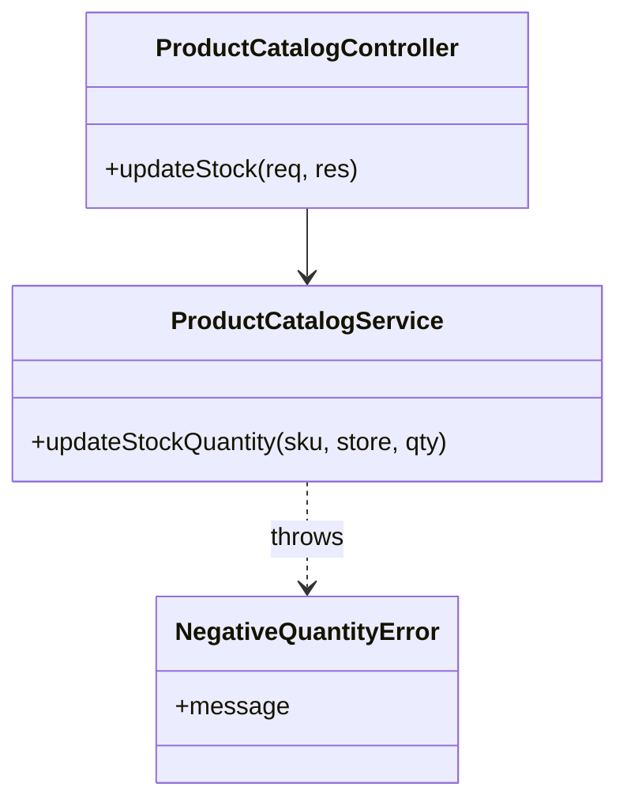
```mermaid
classDiagram
    class ProductCatalogController {
        +updateStock(req, res)
    }
    class ProductCatalogService {
        +updateStockQuantity(sku, store, qty)
    }
    class NegativeQuantityError {
        +message
    }
    ProductCatalogController --> ProductCatalogService
    ProductCatalogService ..> NegativeQuantityError : throws
```

| Class / Module | Layer | Responsibility | Collaborators |
|---|---|---|---|
| **ProductCatalogService** | Application | Enforce stock invariants | StockAvailability domain |
| **NegativeQuantityError** | Domain | Signal invalid quantity | ProductCatalogController |
| **ProductCatalogController** | API | Map error → HTTP 400 | Express Response |

### Flow

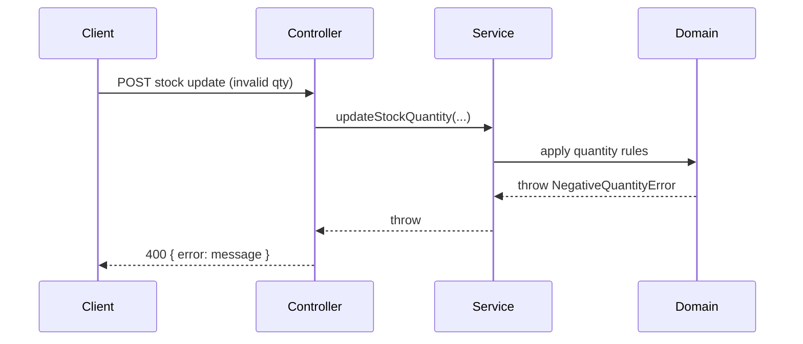
```mermaid
sequenceDiagram
    participant Client
    participant Controller
    participant Service
    participant Domain
    Client->>Controller: POST stock update (invalid qty)
    Controller->>Service: updateStockQuantity(...)
    Service->>Domain: apply quantity rules
    Domain-->>Service: throw NegativeQuantityError
    Service-->>Controller: throw
    Controller-->>Client: 400 { error: message }
```

### Walkthrough Example

Scenario: *store employee* submits a negative *stock level* on the *admin dashboard* form.

1. **ProductCatalogController** receives `quantity_on_hand` in the request body.
2. **ProductCatalogService.updateStockQuantity** loads stock and delegates to **StockAvailability** rules.
3. Domain invariant fails → **NegativeQuantityError** thrown.
4. Controller catches, responds **400** with `{ error: error.message }`; previous *stock level* unchanged (AC #3).

```typescript
// product-catalog.controller.ts — API edge mapping
} catch (error) {
  if (error instanceof NegativeQuantityError) {
    res.status(400).json({ error: error.message });
    return;
  }
  res.status(500).json({ error: 'Internal server error' });
}
```

```typescript
// Example domain test (Vitest) — no HTTP
it('rejects negative quantity', () => {
  expect(() => stock.applyQuantity(-1)).toThrow(NegativeQuantityError);
});
```

### Testing the mechanism

- **Tier:** Domain + Application
- **Helper:** Direct service construction with in-memory repository fake
- **Scenario coverage:** negative quantity, missing product/store (404 path at controller)

**Standards:** `abd-clean-code`, `abd-acceptance-test-driven-development`

---

## Mechanism: Validation

### Principles & Patterns

- **Principle:** **Validate shape at the API boundary** with shared Zod schemas; **validate business rules in domain services**.
- **Pattern:** **Shared Zod DTO + domain invariant**
  - **Options:** Joi/class-validator (not used); manual parsing (rejected).
  - **Benefits:** Client and server can import the same schema from `@pawplace/*/shared`.
  - **Trade-offs:** Two layers to maintain — schema vs domain rules must not duplicate semantics.

### File Structure

```
packages/product-catalog/shared/product.schema.ts
packages/store/shared/store.schema.ts
packages/*/server/*.routes.ts          # parse middleware (where applied)
packages/*/server/*.controller.ts      # assumes parsed body
```

### Participants

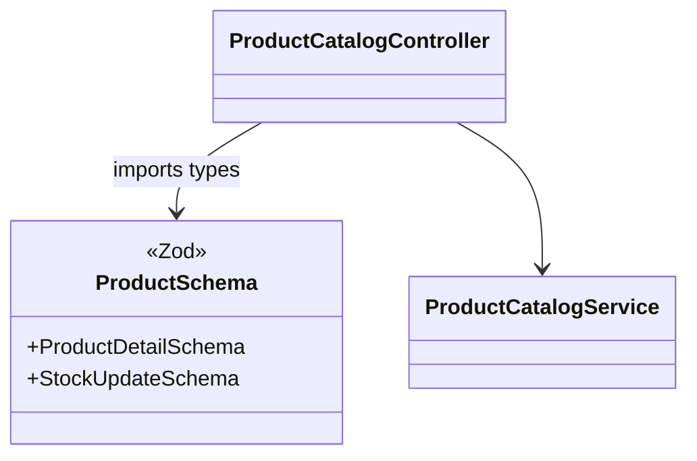
```mermaid
classDiagram
    class ProductSchema {
        <<Zod>>
        +ProductDetailSchema
        +StockUpdateSchema
    }
    class ProductCatalogController
    class ProductCatalogService
    ProductCatalogController --> ProductSchema : imports types
    ProductCatalogController --> ProductCatalogService
```

### Flow

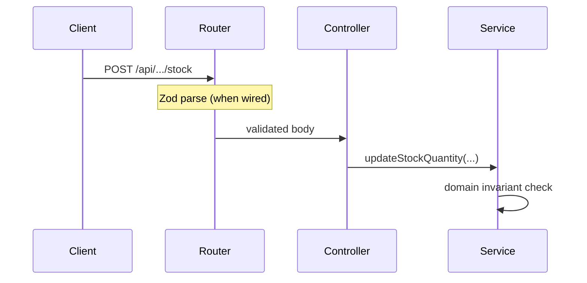
```mermaid
sequenceDiagram
    participant Client
    participant Router
    participant Controller
    participant Service
    Client->>Router: POST /api/.../stock
    Note over Router: Zod parse (when wired)
    Router->>Controller: validated body
    Controller->>Service: updateStockQuantity(...)
    Service->>Service: domain invariant check
```

### Walkthrough Example

Scenario: Staff stock update with non-numeric *stock level*.

1. Request body fails Zod parse → **400** before service (when route middleware enabled).
2. If numeric but negative, passes Zod, fails in **ProductCatalogService** → **NegativeQuantityError** → **400** from controller.

```typescript
// product.schema.ts (pattern)
import { z } from 'zod';
export const StockUpdateBodySchema = z.object({
  quantity_on_hand: z.number().int().min(0),
});
```

### Testing the mechanism

- **Tier:** Integration (supertest + invalid payloads), Domain (invariant tests)
- **Scenario coverage:** malformed JSON, negative quantity, missing SKU

**Standards:** `abd-clean-code`, `mern-technical-architecture`

---

## Mechanism: Persistence

### Principles & Patterns

- **Principle:** **One repository per bounded context**; no cross-collection writes; stock rows reference `store_code` by value, not MongoDB join.
- **Pattern:** **Repository interface + Mongo adapter**
  - **Options:** Single shared DB module (rejected — couples contexts).
  - **Benefits:** Product Catalog and Store Locator evolve independently; tests swap in-memory fakes.
  - **Trade-offs:** No transactional stock+store update across collections (acceptable for Increment 1 manual entry).

### File Structure

```
packages/product-catalog/server/
  product-catalog.repository.ts       # interface
  product-catalog.mongo-repository.ts
packages/store/server/
  store.repository.ts
  store.mongo-repository.ts
packages/app-server/db.ts             # MongoClient bootstrap
```

### Participants

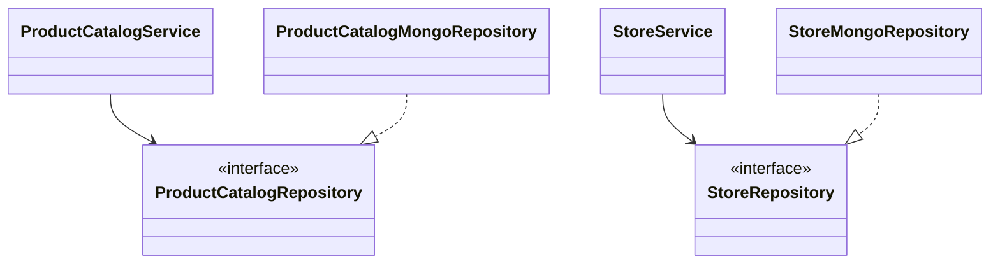
```mermaid
classDiagram
    class ProductCatalogService
    class ProductCatalogRepository {
        <<interface>>
    }
    class ProductCatalogMongoRepository
    class StoreService
    class StoreRepository {
        <<interface>>
    }
    class StoreMongoRepository
    ProductCatalogService --> ProductCatalogRepository
    ProductCatalogMongoRepository ..|> ProductCatalogRepository
    StoreService --> StoreRepository
    StoreMongoRepository ..|> StoreRepository
```

### Flow

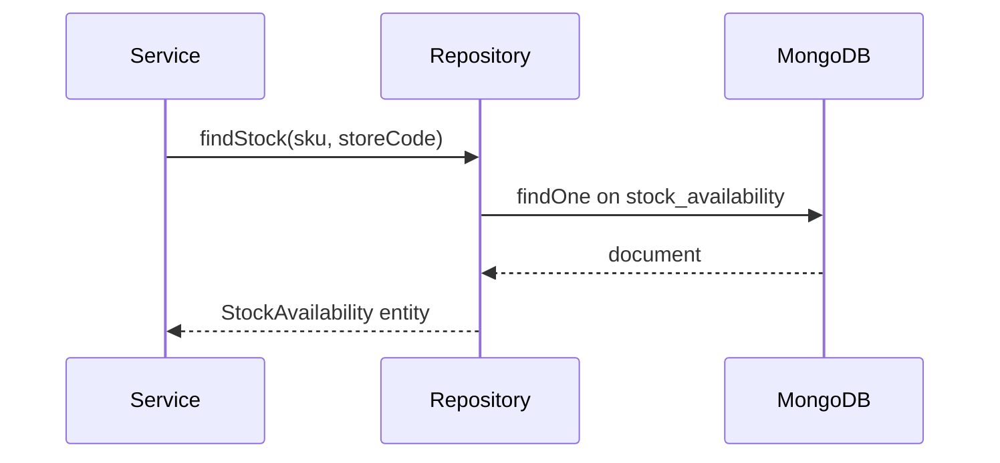
```mermaid
sequenceDiagram
    participant Service
    participant Repository
    participant MongoDB
    Service->>Repository: findStock(sku, storeCode)
    Repository->>MongoDB: findOne on stock_availability
    MongoDB-->>Repository: document
    Repository-->>Service: StockAvailability entity
```

### Walkthrough Example

Scenario: Customer views *stock availability* on *product page* — read path.

1. **ProductCatalogService.getStockAvailabilityByProduct** calls repository `findStockByProduct`.
2. **ProductCatalogMongoRepository** queries `stock_availability` collection filtered by `product_sku`.
3. Each row includes `store_code` and quantities; client joins store names via separate store API or embedded denormalized `store_name` in DTO.

```typescript
// Repository interface (excerpt)
export interface ProductCatalogRepository {
  findProductBySku(sku: string): StoredProduct | null;
  findStockByProduct(productSku: string): StoredStockAvailability[];
  findStock(productSku: string, storeCode: string): StoredStockAvailability | null;
  saveStock(stock: StoredStockAvailability): void;
}
```

### Testing the mechanism

- **Tier:** Application (in-memory repo), Integration (Mongo + seed)
- **Helper:** `dev-seed.ts` fixtures; in-memory implementations for unit tests
- **Scenario coverage:** per-store stock isolation (update at store A does not change store B)

**Standards:** `abd-clean-code`, `abd-acceptance-test-driven-development`

---

## Mechanism: Communication

### Principles & Patterns

- **Principle:** **Synchronous REST/JSON** grouped by capability under `/api`; AppServerHost composes module routers only.
- **Pattern:** **Module factory (`createXModule`) returns router + repository**
  - **Options:** GraphQL, tRPC (deferred).
  - **Benefits:** Matches MERN spike; each package mounts its own routes.
  - **Trade-offs:** No async events for stock change notifications until Notification increment.

### File Structure

```
packages/app-server/index.ts           # createApp(db) — session middleware, module mounts, webhook raw body
packages/store/server/index.ts         # createStoreModule
packages/product-catalog/server/index.ts
packages/cart/server/index.ts          # createCartModule(sessionStore)
packages/order/server/index.ts         # createOrderModule(db)
packages/payment/server/index.ts       # createPaymentModule(db) + webhook router
packages/notification/server/index.ts  # createNotificationModule(db) — internal; no public REST in Inc 2
packages/*/client/*.api.ts             # fetch wrappers per module
packages/app-client/src/context/CartContext.tsx
```

### Participants

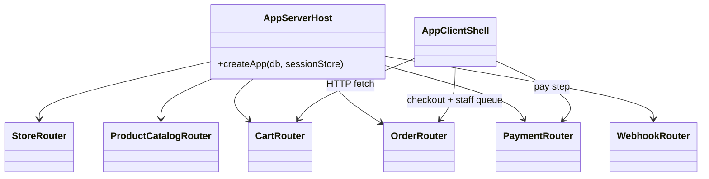
```mermaid
classDiagram
    class AppServerHost {
        +createApp(db, sessionStore)
    }
    class StoreRouter
    class ProductCatalogRouter
    class CartRouter
    class OrderRouter
    class PaymentRouter
    class WebhookRouter
    class AppClientShell
    AppServerHost --> StoreRouter
    AppServerHost --> ProductCatalogRouter
    AppServerHost --> CartRouter
    AppServerHost --> OrderRouter
    AppServerHost --> PaymentRouter
    AppServerHost --> WebhookRouter
    AppClientShell --> CartRouter : HTTP fetch
    AppClientShell --> OrderRouter : checkout + staff queue
    AppClientShell --> PaymentRouter : pay step
```

### Flow

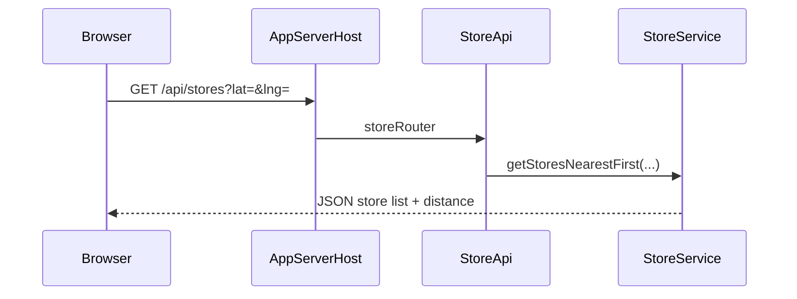
```mermaid
sequenceDiagram
    participant Browser
    participant AppServerHost
    participant StoreApi
    participant StoreService
    Browser->>AppServerHost: GET /api/stores?lat=&lng=
    AppServerHost->>StoreApi: storeRouter
    StoreApi->>StoreService: getStoresNearestFirst(...)
    StoreService-->>Browser: JSON store list + distance
```

### Walkthrough Example

Scenario: *store locator* *list view* loads all *store* rows, then customer enters *postcode*.

1. **AppClientShell** `store.api.ts` calls `GET /api/stores` (or nearest-first variant with query params).
2. **AppServerHost** delegates to **storeRouter** → **StoreController** → **StoreService**.
3. **StoreLocator** domain sorts *nearest-first* when coordinates provided; response DTO includes `distance_km`.

```typescript
// app-server/index.ts — composition root (Increment 1 + 2)
export function createApp(db: Db, sessionStore: Store) {
  const app = express();

  // Webhook raw body before JSON parser (StripeWave signature verification)
  app.use('/api/webhooks/stripewave', express.raw({ type: 'application/json' }));

  app.use(express.json());
  app.use(session({ store: sessionStore, secret: process.env.SESSION_SECRET! }));

  const { storeRouter } = createStoreModule(db);
  const { productCatalogRouter } = createProductCatalogModule(db);
  const { cartRouter } = createCartModule(sessionStore);
  const { orderRouter } = createOrderModule(db);
  const { paymentRouter, webhookRouter } = createPaymentModule(db);
  createNotificationModule(db); // wired into OrderService/PaymentService — no public routes

  app.use('/api', storeRouter);
  app.use(productCatalogRouter);
  app.use('/api/cart', cartRouter);
  app.use('/api/orders', orderRouter);
  app.use('/api', paymentRouter);
  app.use('/api/webhooks', webhookRouter);

  return { app };
}
```

### Testing the mechanism

- **Tier:** Integration (supertest on `createApp`), E2E (Playwright through browser)
- **Scenario coverage:** store list, product detail, stock update round-trip

**Standards:** `mern-technical-architecture`, `abd-acceptance-test-driven-development`

---

## Mechanism: Cart Session

### Principles & Patterns

- **Principle:** The *shopping cart* is **session-scoped for guests** and **account-scoped for logged-in customers** (Increment 4) — guest carts live only for the browser session; verified *customer account* carts persist across devices and survive session expiry.
- **Pattern:** **Dual repository — session cart (guest) + account cart (authenticated)**
  - **Options:** Client-only localStorage cart (rejected — server must validate stock at checkout); single MongoDB cart collection keyed only by account (rejected for guest path — breaks Increment 2 guest flow).
  - **Benefits:** Cart survives in-tab navigation and server-side stock validation; session expiry naturally clears guest carts (AC: Add Product to Cart #5); login merge sums duplicate SKUs (Increment 4 Log In AC #4).
  - **Trade-offs:** Requires session middleware plus account cart repository; merge logic runs at login boundary.

### File Structure

```
packages/cart/
  shared/
    ShoppingCart.ts              # domain entity + CartItem value object
    cart.schema.ts               # Zod DTOs for cart API
  server/
    cart.service.ts              # add/update/remove, subtotal recalc
    cart.repository.ts           # interface (session read/write)
    cart.session-repository.ts   # express-session backed adapter
    cart.account-repository.ts   # MongoDB cart keyed by customerAccountId (Increment 4)
    cart.controller.ts
    cart.routes.ts
    index.ts                     # createCartModule(sessionStore)
packages/app-server/index.ts     # mounts cartRouter + session middleware
packages/app-client/src/context/CartContext.tsx  # item count badge, API calls
packages/product-catalog/client/  # Add to Cart on product page
```

### Participants

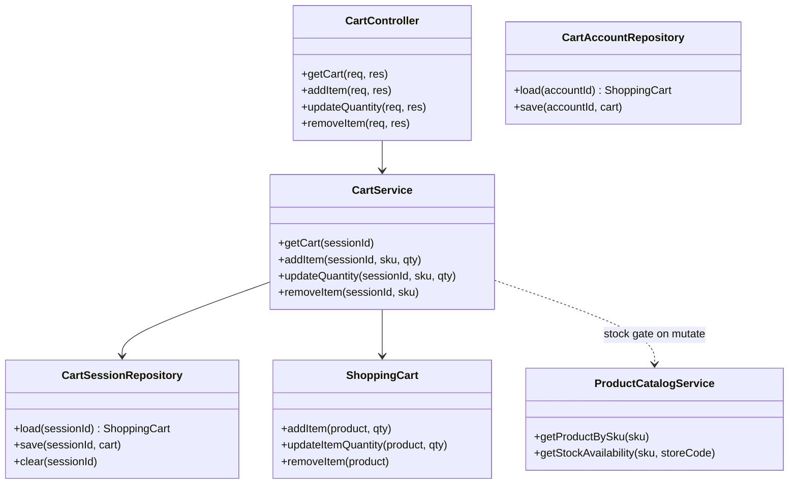
```mermaid
classDiagram
    class CartController {
        +getCart(req, res)
        +addItem(req, res)
        +updateQuantity(req, res)
        +removeItem(req, res)
    }
    class CartService {
        +getCart(sessionId)
        +addItem(sessionId, sku, qty)
        +updateQuantity(sessionId, sku, qty)
        +removeItem(sessionId, sku)
    }
    class CartSessionRepository {
        +load(sessionId) ShoppingCart
        +save(sessionId, cart)
        +clear(sessionId)
    }
    class CartAccountRepository {
        +load(accountId) ShoppingCart
        +save(accountId, cart)
    }
    class ShoppingCart {
        +addItem(product, qty)
        +updateItemQuantity(product, qty)
        +removeItem(product)
    }
    class ProductCatalogService {
        +getProductBySku(sku)
        +getStockAvailability(sku, storeCode)
    }
    CartController --> CartService
    CartService --> CartSessionRepository
    CartService --> ShoppingCart
    CartService ..> ProductCatalogService : stock gate on mutate
```

| Class / Module | Layer | Responsibility | Collaborators |
|---|---|---|---|
| **CartController** | API | Map session cookie → service calls; 400 on validation errors | CartService |
| **CartService** | Application | Merge duplicate SKUs, recalculate subtotals, enforce stock gate; route to session or account repository by principal | CartSessionRepository, CartAccountRepository, ProductCatalogService |
| **CartSessionRepository** | Infrastructure | Persist cart JSON under session id (guest) | express-session store |
| **CartAccountRepository** | Infrastructure | Persist cart JSON under `customerAccountId` (verified account) | MongoDB `carts` collection |
| **ShoppingCart** | Domain | Cart invariants (qty ≥ 1, merge duplicates) | CartItem |
| **ProductCatalogService** | Application (peer) | Supply product price and available-to-sell for gating | StockAvailability |

### Flow

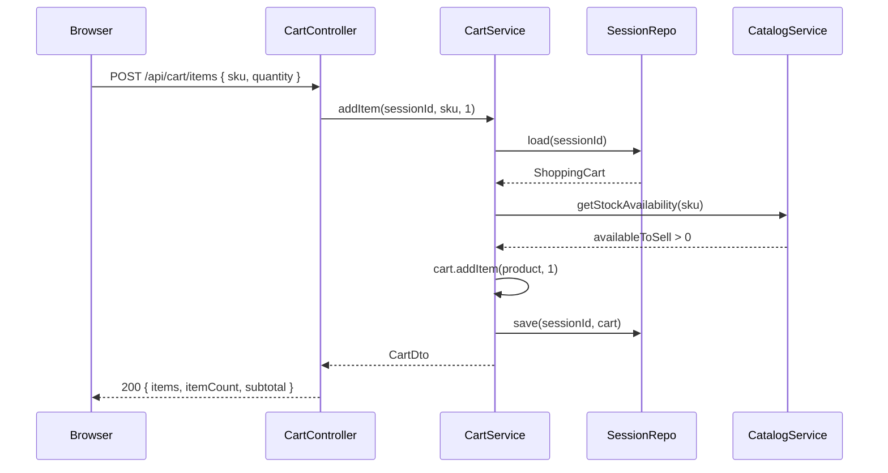
```mermaid
sequenceDiagram
    participant Browser
    participant CartController
    participant CartService
    participant SessionRepo
    participant CatalogService
    Browser->>CartController: POST /api/cart/items { sku, quantity }
    CartController->>CartService: addItem(sessionId, sku, 1)
    CartService->>SessionRepo: load(sessionId)
    SessionRepo-->>CartService: ShoppingCart
    CartService->>CatalogService: getStockAvailability(sku)
    CatalogService-->>CartService: availableToSell > 0
    CartService->>CartService: cart.addItem(product, 1)
    CartService->>SessionRepo: save(sessionId, cart)
    CartService-->>CartController: CartDto
    CartController-->>Browser: 200 { items, itemCount, subtotal }
```

### Walkthrough Example

Scenario: Guest customer adds a *product* from the *product page*; the item count badge updates.

1. **CartController** reads `sessionId` from the session cookie set by AppServerHost middleware.
2. **CartService.addItem** loads the **ShoppingCart** from **CartSessionRepository**.
3. **ProductCatalogService** confirms *stock availability* — `availableToSellQuantity > 0` or action rejected (Add Product to Cart AC #3).
4. **ShoppingCart.addItem** merges quantity if SKU already present (AC #2).
5. Repository saves cart; response DTO drives header badge count.

Scenario C (Increment 4): Verified customer with account cart; session expires; cart preserved on account.

1. **CartService.getCartForPrincipal** detects verified `CustomerPrincipal` → loads from **CartAccountRepository** by `accountId` — not session id (Maintain Session AC #2).
2. Guest with only session cookie → **CartSessionRepository** path unchanged (Increment 2).
3. On login, **CartService.mergeGuestCartIntoAccount** sums duplicate SKU quantities then clears guest session cart (Log In AC #4–5).
4. **ReorderButton** → **CartService.addReorderLines(accountId, lines)** merges into account cart (Reorder AC #4).

```typescript
// cart.service.ts — principal-aware cart resolution (Increment 4)
async getCartForPrincipal(principal: CartPrincipal): Promise<CartDto> {
  if (principal.isVerifiedCustomer()) {
    return toCartDto(await this.accountRepository.load(principal.accountId));
  }
  return toCartDto(await this.sessionRepository.load(principal.sessionId));
}

async addItem(principal: CartPrincipal, sku: string, quantity: number): Promise<CartDto> {
  const cart = principal.isVerifiedCustomer()
    ? await this.accountRepository.load(principal.accountId)
    : await this.sessionRepository.load(principal.sessionId);
  // ... stock gate + merge (same as guest path)
  if (principal.isVerifiedCustomer()) {
    await this.accountRepository.save(principal.accountId, cart);
  } else {
    await this.sessionRepository.save(principal.sessionId, cart);
  }
  return toCartDto(cart);
}
```

```typescript
// cart.service.ts — merge duplicate SKU (guest session path — unchanged)
async addItem(sessionId: string, sku: string, quantity: number): Promise<CartDto> {
  const cart = await this.repository.load(sessionId);
  const product = await this.catalog.getProductBySku(sku);
  if (!product) throw new ProductNotFoundError(sku);

  const stock = await this.catalog.getStockAvailability(sku);
  if (stock.availableToSellQuantity <= 0) {
    throw new OutOfStockError(sku);
  }

  cart.addItem(product, quantity);
  await this.repository.save(sessionId, cart);
  return toCartDto(cart);
}
```

```typescript
// cart.service.test.ts — domain merge without HTTP
it('increments quantity when product already in cart', async () => {
  const cart = new ShoppingCart(guestSession);
  cart.addItem(dogFood, 1);
  cart.addItem(dogFood, 1);
  expect(cart.cartItems).toHaveLength(1);
  expect(cart.cartItems[0].quantity).toBe(2);
});
```

### Testing the mechanism

- **Tier:** Application (CartService + in-memory session repo), Integration (supertest with session cookie)
- **Helper:** Fake session store; seeded catalog products with stock rows
- **Scenario coverage:** duplicate SKU merge, out-of-stock reject, zero-qty removal, empty cart state, session expiry clears guest cart but preserves account cart, login merge sums quantities, reorder merge

**Standards:** `abd-clean-code`, `abd-acceptance-test-driven-development`

---

## Mechanism: Order Placement & Guest Checkout

### Principles & Patterns

- **Principle:** An *order* is created only after checkout collects fulfillment details for the chosen *delivery option* — *shipping address* for *standard delivery*, *pickup store* for *click-and-collect*. **Guest path:** *guest email*, *billing address*, and inline address snapshots (Increment 2–3). **Authenticated path (Increment 4):** verified *customer account* may reference *saved address* and *saved payment method* ids; snapshots still copied onto *order* at placement — edits to *address book* later do not mutate historical *order* rows.
- **Pattern:** **Cart-to-order transition with inline address snapshots and delivery-option branch**
  - **Options:** Persist guest profile for reorder (deferred); express/same-day delivery variants (deferred per thin-slicing).
  - **Benefits:** Order aggregate is self-contained for staff queue, confirmation email, shipping notification, and order status page; aligns with UL guest-checkout invariant and dual *delivery option* paths in Increment 3.
  - **Trade-offs:** Repeat guests re-enter details until Customer Account increment; checkout wizard adjusts steps when customer switches between *standard delivery* and *click-and-collect* mid-flow.

### File Structure

```
packages/order/
  shared/
    Order.ts                     # entity, status enum, line item snapshots; Inc 3: markFulfilled(), ship()
    GuestCheckout.ts             # guest email + name value object
    BillingAddress.ts            # inline snapshot (not SavedAddress)
    ShippingAddress.ts           # inline snapshot for standard delivery (Inc 3)
    DeliveryOption.ts            # standard_delivery | click_and_collect enum + shippingCost + estimatedWindow
    TrackingNumber.ts            # value object — carrier ref + carrier name (Inc 3)
    order.schema.ts              # Zod checkout DTOs (branching validation + status enum extension)
  server/
    order.service.ts             # placeGuestOrder, placeAuthenticatedOrder, confirm, staff status updates, lookupByGuestEmail
    order.repository.ts
    order.mongo-repository.ts
    order.controller.ts
    order.routes.ts
    order-status-token.ts        # HMAC signed links for email deep links (Inc 3)
    index.ts                     # createOrderModule(db)
packages/app-client/src/
  pages/
    ShippingAddressPage.tsx      # /checkout/shipping — standard path only
    DeliveryOptionPage.tsx       # /checkout/delivery-option — both options + C&C store list
    PickupStoreSelectionPage.tsx # /checkout/pickup-store — C&C path (extend Inc 2)
    PaymentPage.tsx              # extend order review — shipping snapshot + cost; Inc 4: saved payment branch
    LoggedInCheckoutSavedAddressPage.tsx   # Inc 4 — saved address listbox state within ShippingAddressPage
    LoggedInCheckoutSavedPaymentPage.tsx   # Inc 4 — saved payment listbox state within PaymentPage
    OrderConfirmationPage.tsx    # extend — shipping block + statusPageUrl link
  components/
    CheckoutProgressTabs.tsx     # dynamic tabs per delivery path
    checkoutWizard.ts            # step order + mid-flow delivery switch
packages/app-client/src/pages/OrderQueuePage.tsx           # unified staff queue (Inc 3)
packages/app-client/src/pages/ClickAndCollectQueuePage.tsx  # redirect → /admin/orders (Inc 3)
```

### Participants

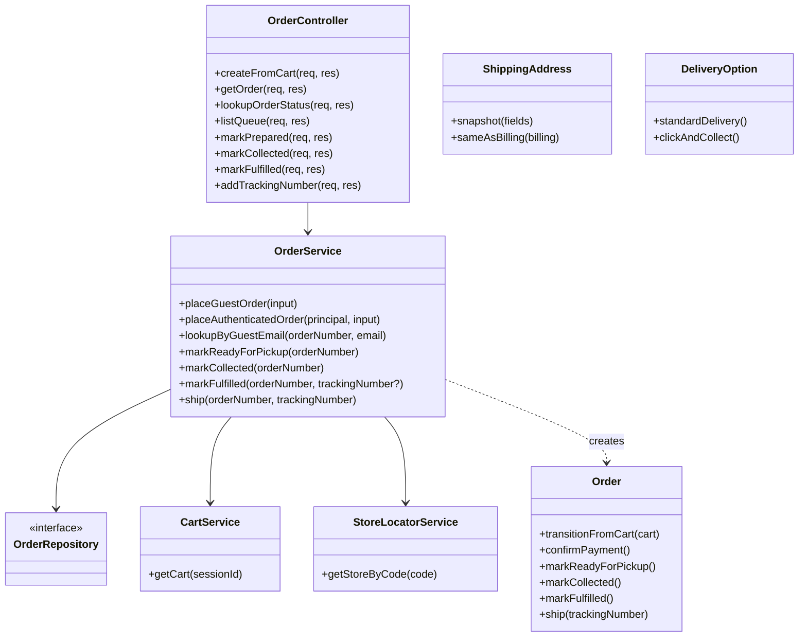
```mermaid
classDiagram
    class OrderController {
        +createFromCart(req, res)
        +getOrder(req, res)
        +lookupOrderStatus(req, res)
        +listQueue(req, res)
        +markPrepared(req, res)
        +markCollected(req, res)
        +markFulfilled(req, res)
        +addTrackingNumber(req, res)
    }
    class OrderService {
        +placeGuestOrder(input)
        +placeAuthenticatedOrder(principal, input)
        +lookupByGuestEmail(orderNumber, email)
        +markReadyForPickup(orderNumber)
        +markCollected(orderNumber)
        +markFulfilled(orderNumber, trackingNumber?)
        +ship(orderNumber, trackingNumber)
    }
    class OrderRepository {
        <<interface>>
    }
    class Order {
        +transitionFromCart(cart)
        +confirmPayment()
        +markReadyForPickup()
        +markCollected()
        +markFulfilled()
        +ship(trackingNumber)
    }
    class ShippingAddress {
        +snapshot(fields)
        +sameAsBilling(billing)
    }
    class DeliveryOption {
        +standardDelivery()
        +clickAndCollect()
    }
    class CartService {
        +getCart(sessionId)
    }
    class StoreLocatorService {
        +getStoreByCode(code)
    }
    OrderController --> OrderService
    OrderService --> OrderRepository
    OrderService --> CartService
    OrderService --> StoreLocatorService
    OrderService ..> Order : creates
```

| Class / Module | Layer | Responsibility | Collaborators |
|---|---|---|---|
| **OrderController** | API | Guest checkout POST; staff queue GET/PATCH; guest order status lookup | OrderService |
| **OrderService** | Application | Build order from cart + guest + delivery branch; lifecycle transitions | CartService, StoreLocatorService, OrderRepository |
| **Order** | Domain | Status machine: click-and-collect `pending_payment` → `confirmed` → `ready_for_pickup` → `collected`; ship-to-home `pending_payment` → `confirmed` → `fulfilled` → `shipped` → `delivered` | OrderLineItem snapshots |
| **ShippingAddress** | Domain | Validates required fields (`recipientName`, `addressLine1`, `city`, `postcode`, `country`); supports `sameAsBilling` pre-fill with per-field override — client-side pre-fill, server re-validates completeness | BillingAddress |
| **DeliveryOption** | Domain | Records fulfillment method, shipping cost (`STANDARD_DELIVERY_COST_PENCE`), estimated window (`3–5 business days`); express/same-day absent | StandardDelivery, ClickAndCollect |
| **GuestCheckout** | Domain | Validates *guest email* before payment step; no customer account persistence | — |
| **ShippingAddressPage** | Presentation | *same as billing* checkbox; field-level validation messages verbatim from spec-by-example; blocks advance when invalid | CheckoutProgressTabs |
| **DeliveryOptionPage** | Presentation | Radio group *standard delivery* / *click-and-collect*; mid-checkout switch adjusts wizard steps | checkoutWizard |
| **OrderRepository** | Infrastructure | Persist orders collection | MongoDB |

### Flow

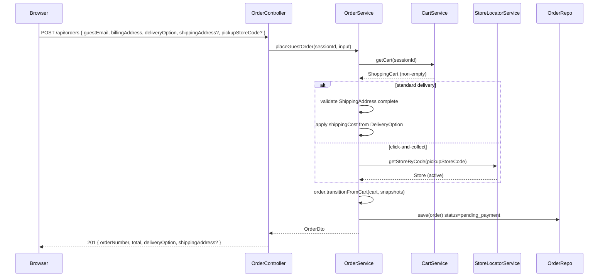
```mermaid
sequenceDiagram
    participant Browser
    participant OrderController
    participant OrderService
    participant CartService
    participant StoreLocatorService
    participant OrderRepo
    Browser->>OrderController: POST /api/orders { guestEmail, billingAddress, deliveryOption, shippingAddress?, pickupStoreCode? }
    OrderController->>OrderService: placeGuestOrder(sessionId, input)
    OrderService->>CartService: getCart(sessionId)
    CartService-->>OrderService: ShoppingCart (non-empty)
    alt standard delivery
        OrderService->>OrderService: validate ShippingAddress complete
        OrderService->>OrderService: apply shippingCost from DeliveryOption
    else click-and-collect
        OrderService->>StoreLocatorService: getStoreByCode(pickupStoreCode)
        StoreLocatorService-->>OrderService: Store (active)
    end
    OrderService->>OrderService: order.transitionFromCart(cart, snapshots)
    OrderService->>OrderRepo: save(order) status=pending_payment
    OrderService-->>OrderController: OrderDto
    OrderController-->>Browser: 201 { orderNumber, total, deliveryOption, shippingAddress? }
```

### Walkthrough Example

Scenario A: Guest on *standard delivery* path completes *shipping address* and selects *standard delivery*; order is created pending payment.

1. **ShippingAddressPage** renders on `/checkout/shipping` after billing (Enter Shipping Address AC #1). *Click-and-collect* path skips this route entirely (AC #1 branch — customer selected C&C on delivery option first).
2. Customer checks *same as billing* → client pre-fills from **BillingAddress** snapshot in wizard state (AC #2); override of single field (e.g. city → Edinburgh) leaves other pre-filled fields unchanged (AC #3).
3. Missing required fields → client Zod/`shippingAddressSchema` surfaces verbatim messages: *Recipient name is required*, *Address line 1 is required*, *Postcode is required* (AC #4); no navigation to *delivery option*.
4. Valid submit → **DeliveryOptionPage** at `/checkout/delivery-option`; order summary panel shows *28 Oak Lane, Edinburgh, EH1 3DG* (AC #5).
5. Customer confirms *standard delivery* (*£4.99*, *3–5 business days*) → wizard advances to payment with shipping snapshot on review (Select Delivery Option AC #2).
6. **OrderController** receives `POST /api/orders` with **GuestCheckoutSchema**, **BillingAddressSchema**, **ShippingAddressSchema**, **DeliveryOptionSchema** (Zod `.parse()` at boundary).
7. **OrderService.placeGuestOrder** loads non-empty cart; **ShippingAddress.snapshot** copies fields onto order; **DeliveryOption.standardDelivery** records cost; order persisted `status = pending_payment`.

Scenario B: Guest switches from *standard delivery* to *click-and-collect* mid-checkout (Select Delivery Option AC #3).

1. **DeliveryOptionPage** calls `checkoutWizard.switchTo('click_and_collect')` — hides *shipping address* tab, shows *pickup store* step; wizard state drops shipping snapshot.
2. **OrderService** on final POST omits `shippingAddress`; validates `pickupStoreCode` via **StoreLocatorService** instead.

Scenario C (Increment 4): Logged-in verified customer checks out with *default address* on *standard delivery* path.

1. **ShippingAddressPage** at `/checkout/shipping` renders logged-in branch — `GET /api/account/addresses` pre-selects *default address* (Select Saved Address AC #1).
2. Customer confirms pre-selected address → wizard advances without manual field entry (Select Saved Address AC #2).
3. **OrderController** `POST /api/orders` with `SessionMiddleware.requireVerifiedCustomer` — body includes `savedAddressId` (or manual address + `saveToAddressBook: true`).
4. **OrderService.placeAuthenticatedOrder** resolves `savedAddressId` via **AddressBookService** → **SavedAddress.snapshot** onto order; sets `customerAccountId` on order aggregate.
5. Payment step uses `savedPaymentMethodId` — see [Payment (StripeWave & Webhook)](#mechanism-payment-stripewave--webhook) saved-token path; guest `POST /api/orders` body and validation unchanged.

```typescript
// order.schema.ts — authenticated checkout (Increment 4; guest schemas unchanged above)
export const authenticatedCheckoutSchema = guestCheckoutInc3Schema.extend({
  savedAddressId: z.string().uuid().optional(),
  manualShippingAddress: shippingAddressSchema.optional(),
  saveToAddressBook: z.boolean().optional(),
  savedPaymentMethodId: z.string().uuid().optional(),
}).superRefine((data, ctx) => {
  if (data.deliveryOption.type === 'standard_delivery' && !data.savedAddressId && !data.manualShippingAddress) {
    ctx.addIssue({ code: 'custom', message: 'Shipping address incomplete', path: ['shippingAddress'] });
  }
});

// order.service.ts — resolve saved address then snapshot (Increment 4)
async placeAuthenticatedOrder(
  principal: CustomerPrincipal,
  input: AuthenticatedCheckoutInput,
): Promise<Order> {
  const cart = await this.cartService.getCartForPrincipal(principal);
  if (cart.isEmpty()) throw new EmptyCartError();

  let shippingSnapshot: ShippingAddressFields | undefined;
  if (input.deliveryOption.type === 'standard_delivery') {
    if (input.savedAddressId) {
      const saved = await this.addressBookService.requireOwnedAddress(principal.accountId, input.savedAddressId);
      shippingSnapshot = SavedAddress.snapshot(saved);
    } else {
      shippingSnapshot = ShippingAddress.snapshot(input.manualShippingAddress!);
      if (input.saveToAddressBook) {
        await this.addressBookService.add(principal.accountId, input.manualShippingAddress!);
      }
    }
  }
  // ... same delivery-option branch as placeGuestOrder; order.customerAccountId = principal.accountId
}
```

```typescript
// order.schema.ts — shipping address (Increment 3; messages from spec-by-example)
export const shippingAddressSchema = z.object({
  recipientName: z.string().min(1, 'Recipient name is required'),
  addressLine1: z.string().min(1, 'Address line 1 is required'),
  addressLine2: z.string().optional(),
  city: z.string().min(1, 'City is required'),
  countyOrRegion: z.string().optional(),
  postcode: z.string().min(1, 'Postcode is required'),
  country: z.string().min(1, 'Country is required'),
});

export const deliveryOptionSchema = z.discriminatedUnion('type', [
  z.object({
    type: z.literal('standard_delivery'),
    shippingCostPence: z.number().int().positive(),
    estimatedDeliveryWindow: z.string(), // e.g. '3–5 business days'
  }),
  z.object({
    type: z.literal('click_and_collect'),
    pickupStoreCode: z.string().min(1),
  }),
]);

export const guestCheckoutInc3Schema = z.object({
  guestEmail: z.string().email(),
  guestName: z.string().min(1),
  billingAddress: billingAddressSchema,
  deliveryOption: deliveryOptionSchema,
  shippingAddress: shippingAddressSchema.optional(),
}).superRefine((data, ctx) => {
  if (data.deliveryOption.type === 'standard_delivery' && !data.shippingAddress) {
    ctx.addIssue({ code: 'custom', message: 'Shipping address incomplete', path: ['shippingAddress'] });
  }
});
```

```typescript
// ShippingAddress.ts — domain snapshot (no persistence beyond order)
export class ShippingAddress {
  static snapshot(fields: ShippingAddressFields): ShippingAddressFields {
    if (!fields.recipientName || !fields.addressLine1 || !fields.city || !fields.postcode || !fields.country) {
      throw new IncompleteShippingAddressError();
    }
    return { ...fields };
  }

  static preFillFromBilling(billing: BillingAddressFields): ShippingAddressFields {
    return {
      recipientName: billing.name,
      addressLine1: billing.addressLine1,
      addressLine2: billing.addressLine2,
      city: billing.city,
      countyOrRegion: billing.countyOrRegion,
      postcode: billing.postcode,
      country: billing.country,
    };
  }
}
```

```typescript
// order.service.ts — dual delivery path (Increment 3)
async placeGuestOrder(sessionId: string, input: GuestCheckoutInput): Promise<Order> {
  const cart = await this.cartService.getCart(sessionId);
  if (cart.isEmpty()) throw new EmptyCartError();

  if (input.deliveryOption.type === 'standard_delivery') {
    if (!input.shippingAddress) throw new IncompleteShippingAddressError();
    const order = Order.fromGuestCartWithShipping({
      cart,
      guestEmail: input.guestEmail,
      guestName: input.guestName,
      billingAddress: BillingAddress.snapshot(input.billingAddress),
      shippingAddress: ShippingAddress.snapshot(input.shippingAddress),
      deliveryOption: DeliveryOption.standardDelivery({
        shippingCostPence: input.deliveryOption.shippingCostPence,
        estimatedDeliveryWindow: input.deliveryOption.estimatedDeliveryWindow,
      }),
    });
    await this.repository.save(order);
    return order;
  }

  const store = await this.storeLocatorService.getStoreByCode(input.deliveryOption.pickupStoreCode);
  if (!store?.isActive) throw new StoreUnavailableError(input.deliveryOption.pickupStoreCode);

  const order = Order.fromGuestCart({
    cart,
    guestEmail: input.guestEmail,
    guestName: input.guestName,
    billingAddress: BillingAddress.snapshot(input.billingAddress),
    pickupStore: store,
    deliveryOption: DeliveryOption.clickAndCollect(),
  });
  await this.repository.save(order);
  return order;
}
```

```typescript
// order.service.test.ts
it('snapshots shipping address on standard delivery order without persisting guest profile', async () => {
  const order = await service.placeGuestOrder(sessionId, standardDeliveryInput);
  expect(order.shippingAddress!.postcode).toBe('EH1 3DG');
  expect(order.deliveryOption.type).toBe('standard_delivery');
  expect(await customerRepo.findByEmail(standardDeliveryInput.guestEmail)).toBeNull();
});

it('rejects standard delivery POST without shipping address', async () => {
  await expect(service.placeGuestOrder(sessionId, { ...standardDeliveryInput, shippingAddress: undefined }))
    .rejects.toThrow(IncompleteShippingAddressError);
});
```

### Testing the mechanism

- **Tier:** Application (OrderService + fakes), Integration (supertest checkout POST for both delivery paths)
- **Scenario coverage:** empty cart guard, invalid guest email, shipping address required for standard delivery, pickup store required for click-and-collect, delivery option switch mid-checkout, billing always required; authenticated saved-address resolution and address-book save opt-in; guest POST body unchanged; staff queue behaviour → see [Unified Order Queue](#mechanism-unified-order-queue)

**Standards:** `abd-clean-code`, `abd-acceptance-test-driven-development`

---

## Mechanism: Payment (StripeWave & Webhook)

### Principles & Patterns

- **Principle:** No *order* reaches **confirmed** without successful *payment confirmation* from the selected *payment vendor* (*StripeWave*, *PayNova*, or *VaultPay*). Increment 4 *saved payment method* charges use vendor tokens only; expired tokens are never charged silently. Increment 5 adds ***payment method selector*** — customer chooses vendor at checkout; canceling a vendor sub-flow returns to the full selector without abandoning the *order*.
- **Pattern:** **Vendor router + gateway adapter + authorize-capture-settle + per-vendor webhook reconciliation**
  - **Options:** Direct card POST to StripeWave from browser (rejected — PCI scope); separate checkout apps per vendor (rejected — fragments UX); hard-coded vendor switch in OrderService (rejected — violates router).
  - **Benefits:** **PaymentVendorRouter** resolves `IPaymentGateway` by vendor id; OrderService calls `charge(order, vendor, credentials)` without vendor SDK knowledge; each vendor adapter owns *webhook callback* signature verification and idempotent reconcile (Process Card Payment AC #4; PayNova/VaultPay AC #4).
  - **Trade-offs:** Three webhook endpoints and secrets; **SavedPaymentMethod** gains `vendor` discriminator; PayNova/VaultPay sandbox credentials in env.

### File Structure

```
packages/payment/
  shared/
    Payment.ts                   # entity, status lifecycle, vendor + vendorTransactionReference
    PaymentVendor.ts             # enum: stripewave | paynova | vaultpay
    payment.schema.ts            # pay request DTOs per vendor path
    SavedPaymentMethod.ts        # vendor, vendorToken, display metadata (Inc 4 + Inc 5 multi-vendor)
  server/
    payment.service.ts           # charge, chargeWithSavedToken, reconcileWebhook, scheduleRetry
    payment-vendor.router.ts     # resolve gateway by PaymentVendor
    saved-payment-method.service.ts
    stripewave.adapter.ts        # StripeWave SDK (unchanged card path)
    paynova.adapter.ts             # PayNova wallet redirect + capture (Increment 5)
    vaultpay.adapter.ts            # VaultPay BNPL eligibility + instalment capture (Increment 5)
    payment-gateway.ts             # IPaymentGateway interface
    payment.controller.ts          # POST /api/orders/:id/pay, GET payment-methods for selector
    webhook.controller.ts          # POST /api/webhooks/{stripewave|paynova|vaultpay}
    payment.routes.ts
    index.ts
packages/app-client/
  pages/
    PaymentMethodSelectorPage.tsx    # *payment method selector* listbox (Inc 5)
    PaymentPage.tsx                  # StripeWave branch (unchanged split-screen)
    PayNovaWalletPage.tsx            # wallet redirect/embed return handling
    VaultPayBnplPage.tsx             # BNPL flow return handling
packages/app-server/index.ts     # mount webhooks before JSON parser; raw body for all vendors
```

### Participants

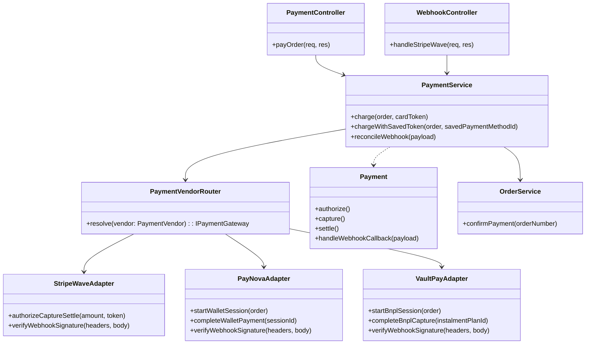
```mermaid
classDiagram
    class PaymentController {
        +payOrder(req, res)
    }
    class WebhookController {
        +handleStripeWave(req, res)
    }
    class PaymentService {
        +charge(order, cardToken)
        +chargeWithSavedToken(order, savedPaymentMethodId)
        +reconcileWebhook(payload)
    }
    class PaymentVendorRouter {
        +resolve(vendor: PaymentVendor): IPaymentGateway
    }
    class PayNovaAdapter {
        +startWalletSession(order)
        +completeWalletPayment(sessionId)
        +verifyWebhookSignature(headers, body)
    }
    class VaultPayAdapter {
        +startBnplSession(order)
        +completeBnplCapture(instalmentPlanId)
        +verifyWebhookSignature(headers, body)
    }
    class StripeWaveAdapter {
        +authorizeCaptureSettle(amount, token)
        +verifyWebhookSignature(headers, body)
    }
    class Payment {
        +authorize()
        +capture()
        +settle()
        +handleWebhookCallback(payload)
    }
    class OrderService {
        +confirmPayment(orderNumber)
    }
    PaymentController --> PaymentService
    WebhookController --> PaymentService
    PaymentService --> PaymentVendorRouter
    PaymentVendorRouter --> StripeWaveAdapter
    PaymentVendorRouter --> PayNovaAdapter
    PaymentVendorRouter --> VaultPayAdapter
    PaymentService --> OrderService
    PaymentService ..> Payment
```

| Class / Module | Layer | Responsibility | Collaborators |
|---|---|---|---|
| **PaymentController** | API | Initiate charge for pending order; route by vendor; map decline to 402 | PaymentService |
| **WebhookController** | API | Verify per-vendor signature; idempotent reconcile | PaymentService |
| **PaymentService** | Application | One payment per order per attempt; vendor-aware charge | PaymentVendorRouter, OrderService |
| **PaymentVendorRouter** | Application | Resolve `IPaymentGateway` by *payment vendor* | StripeWaveAdapter, PayNovaAdapter, VaultPayAdapter |
| **StripeWaveAdapter** | Infrastructure | Card token authorize-capture-settle | — |
| **PayNovaAdapter** | Infrastructure | *Digital wallet* session + capture | — |
| **VaultPayAdapter** | Infrastructure | *Eligibility check* + *instalment plan* capture | — |
| **Payment** | Domain | Status lifecycle; records vendor + *vendor transaction reference* | Order |

### Flow

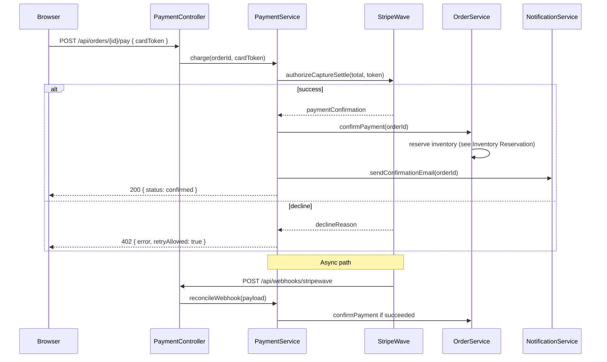
```mermaid
sequenceDiagram
    participant Browser
    participant PaymentController
    participant PaymentService
    participant StripeWave
    participant OrderService
    participant NotificationService
    Browser->>PaymentController: POST /api/orders/{id}/pay { cardToken }
    PaymentController->>PaymentService: charge(orderId, cardToken)
    PaymentService->>StripeWave: authorizeCaptureSettle(total, token)
    alt success
        StripeWave-->>PaymentService: paymentConfirmation
        PaymentService->>OrderService: confirmPayment(orderId)
        OrderService->>OrderService: reserve inventory (see Inventory Reservation)
        PaymentService->>NotificationService: sendConfirmationEmail(orderId)
        PaymentService-->>Browser: 200 { status: confirmed }
    else decline
        StripeWave-->>PaymentService: declineReason
        PaymentService-->>Browser: 402 { error, retryAllowed: true }
    end
    Note over StripeWave,PaymentService: Async path
    StripeWave->>PaymentController: POST /api/webhooks/stripewave
    PaymentController->>PaymentService: reconcileWebhook(payload)
    PaymentService->>OrderService: confirmPayment if succeeded
```

### Walkthrough Example

Scenario: Customer confirms *order*; *StripeWave* returns success; *order* transitions to confirmed.

1. **PaymentController** receives StripeWave card token (client-side Elements — no raw PAN on server).
2. **PaymentService.charge** creates **Payment** linked to order; calls **StripeWaveAdapter.authorizeCaptureSettle**.
3. On *payment confirmation*, **OrderService.confirmPayment** sets status `confirmed` and triggers inventory reservation.
4. On decline, order stays `pending_payment`; customer sees reason and retry form (AC #3).
5. If browser times out, **WebhookController** receives *webhook callback*; **Payment.handleWebhookCallback** idempotently completes step 3 if payment succeeded.

Scenario B (Increment 4): Logged-in customer pays with *default payment method* vendor token.

1. **PaymentPage** logged-in branch loads `GET /api/account/payment-methods` — *default payment method* pre-selected; expired rows dimmed with *expired* label (Select Saved Payment Method AC #1, #4).
2. **PaymentController** `POST /api/orders/:orderNumber/pay { savedPaymentMethodId }` — no StripeWave Elements mount required (AC #2).
3. **SavedPaymentMethodService.listSelectableForCheckout** excludes expired tokens before charge candidate list is built.
4. **PaymentService.chargeWithSavedToken** loads `vendorToken` from owned **SavedPaymentMethod** → **StripeWaveAdapter.authorizeCaptureSettle(total, vendorToken)**.
5. Optional `savePaymentMethod: true` on manual card path → **StripeWaveTokenAdapter.tokenize** persists new **SavedPaymentMethod** (Save Payment Method AC #2).
6. On expired token submitted despite UI guard → `422 { error: 'Payment method expired', code: 'SAVED_PAYMENT_EXPIRED' }`.

Scenario C (Increment 5): Guest selects vendor at *payment method selector*.

1. **PaymentMethodSelectorPage** at `/checkout/payment` loads `GET /api/orders/:orderNumber/payment-methods` — returns `{ vendors: ['stripewave','paynova','vaultpay'], savedMethods: [] }` for guest.
2. Customer selects PayNova → client navigates `/checkout/payment/paynova`; **PaymentController** `POST /pay { vendor: 'paynova' }` starts wallet session (see [PayNova Digital Wallet Payment](#mechanism-paynova-digital-wallet-payment)).
3. Customer cancels wallet auth → client returns to `/checkout/payment` with all three vendors still selectable (Process Digital Wallet Payment via PayNova AC #1).
4. On VaultPay path, *eligibility check* failure is *hard decline* — **PaymentRetryService** does not schedule retry (Retry Failed Payment AC #4).

```typescript
// payment.schema.ts — pay request (Increment 5 extends Inc 4 — see engineering handoff)
export const payOrderSchema = z.object({
  vendor: z.enum(['stripewave', 'paynova', 'vaultpay']).optional(),
  cardToken: z.string().min(1).optional(),
  savedPaymentMethodId: z.string().uuid().optional(),
  savePaymentMethod: z.boolean().optional(),
  paynovaSessionId: z.string().optional(),
  vaultpaySessionId: z.string().optional(),
  acceptedInstalmentPlanId: z.string().optional(),
}).superRefine((data, ctx) => {
  const hasChargePath =
    data.cardToken ||
    data.savedPaymentMethodId ||
    data.paynovaSessionId ||
    (data.vendor === 'vaultpay' && data.vaultpaySessionId && data.acceptedInstalmentPlanId);
  if (!hasChargePath) {
    ctx.addIssue({ code: 'custom', message: 'Payment method required', path: ['payment'] });
  }
});

// payment.service.ts — saved token path (Increment 5 — vendor-aware)
async chargeWithSavedToken(orderId: OrderId, accountId: CustomerAccountId, methodId: string): Promise<PaymentResult> {
  const method = await this.savedPaymentMethods.requireSelectable(accountId, methodId);
  if (method.isExpired()) throw new SavedPaymentExpiredError(methodId);
  const gateway = this.vendorRouter.resolve(method.vendor);
  return this.chargeWithGateway(orderId, gateway, method.vendorToken);
}

// payment-vendor.router.ts
resolve(vendor: PaymentVendor): IPaymentGateway {
  switch (vendor) {
    case 'stripewave': return this.stripeWave;
    case 'paynova': return this.payNova;
    case 'vaultpay': return this.vaultPay;
  }
}
```

```typescript
// stripewave.adapter.ts — env-only secrets
export class StripeWaveAdapter implements IPaymentGateway {
  constructor(
    private readonly apiKey: string,
    private readonly webhookSecret: string,
  ) {}

  async authorizeCaptureSettle(amount: Money, token: string): Promise<PaymentResult> {
    // sandbox SDK call — maps vendor response to domain PaymentResult
  }

  verifyWebhookSignature(headers: IncomingHttpHeaders, rawBody: Buffer): boolean {
    // HMAC verify using this.webhookSecret
  }
}
```

```typescript
// payment.service.test.ts — no duplicate charge on retry
it('does not create second payment when retrying failed charge', async () => {
  await service.charge(order, token); // fails
  await expect(service.charge(order, token)).rejects.toThrow(DuplicatePaymentError);
});
```

### Testing the mechanism

- **Tier:** Application (PaymentService + fake gateways per vendor), Integration (supertest pay + webhooks for all three vendors)
- **Helper:** StripeWave / PayNova / VaultPay sandbox stubs; per-vendor webhook signature test vectors
- **Scenario coverage:** StripeWave success/decline (preserved), *payment method selector* lists all vendors, saved-token charge routes to correct adapter, timeout + *webhook callback* reconcile per vendor, vendor unavailable (503), idempotent webhook replay, expired saved token rejected with 422

**Standards:** `abd-clean-code`, `abd-acceptance-test-driven-development`

---

## Mechanism: PayNova Digital Wallet Payment

### Principles & Patterns

- **Principle:** *PayNova* is the *digital wallet* *payment vendor* — checkout redirects or embeds PayNova wallet authentication; successful *payment confirmation* records vendor = PayNova and *vendor transaction reference*; *hard decline* returns customer to *payment method selector* with *StripeWave* and *VaultPay* alternatives.
- **Pattern:** **Redirect-or-embed wallet session + server-side capture + PayNova webhook reconcile**
  - **Options:** Client-side wallet SDK only (rejected — cannot confirm *order* server-side); skip webhook (rejected — timeout path AC #4).
  - **Benefits:** Same reconcile pattern as StripeWave; cancel wallet flow preserves other vendor options on selector.
  - **Trade-offs:** Redirect latency; wallet session state stored server-side until complete or timeout.

### File Structure

```
packages/payment/server/
  paynova.adapter.ts
  paynova-session.repository.ts    # in-flight wallet session by orderNumber
  webhook.controller.ts            # POST /api/webhooks/paynova
packages/app-client/pages/
  PayNovaWalletPage.tsx            # launch + return URL handler
  PaymentMethodSelectorPage.tsx    # PayNova listbox option
```

### Participants

| Class / Module | Layer | Responsibility | Collaborators |
|---|---|---|---|
| **PayNovaAdapter** | Infrastructure | Start wallet session; complete capture; verify webhook | PayNova API |
| **PayNovaSessionRepository** | Infrastructure | Persist session id until callback or timeout | MongoDB |
| **PaymentService** | Application | Orchestrate PayNova path; map *hard decline* to selector response | PayNovaAdapter, OrderService |
| **WebhookController** | API | PayNova *webhook callback* ingress | PaymentService |
| **PaymentMethodSelectorPage** | Presentation | Offer PayNova alongside StripeWave and VaultPay | PaymentController |

### Flow

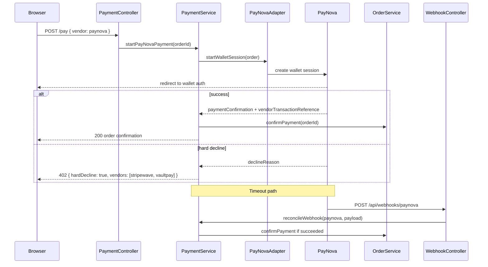
```mermaid
sequenceDiagram
    participant Browser
    participant PaymentController
    participant PaymentService
    participant PayNovaAdapter
    participant PayNova
    participant OrderService
    Browser->>PaymentController: POST /pay { vendor: paynova }
    PaymentController->>PaymentService: startPayNovaPayment(orderId)
    PaymentService->>PayNovaAdapter: startWalletSession(order)
    PayNovaAdapter->>PayNova: create wallet session
    PayNova-->>Browser: redirect to wallet auth
    alt success
        PayNova-->>PaymentService: paymentConfirmation + vendorTransactionReference
        PaymentService->>OrderService: confirmPayment(orderId)
        PaymentService-->>Browser: 200 order confirmation
    else hard decline
        PayNova-->>PaymentService: declineReason
        PaymentService-->>Browser: 402 { hardDecline: true, vendors: [stripewave, vaultpay] }
    end
    Note over PayNova,PaymentService: Timeout path
    PayNova->>WebhookController: POST /api/webhooks/paynova
    WebhookController->>PaymentService: reconcileWebhook(paynova, payload)
    PaymentService->>OrderService: confirmPayment if succeeded
```

### Walkthrough Example

Scenario: Customer selects *PayNova* at *payment method selector* and completes wallet payment.

1. **PaymentMethodSelectorPage** posts `{ vendor: 'paynova' }` to **PaymentController**.
2. **PaymentService.startPayNovaPayment** creates **Payment** with vendor PayNova and calls **PayNovaAdapter.startWalletSession**.
3. **PayNovaAdapter** returns redirect URL; browser completes wallet auth at PayNova.
4. On *payment confirmation*, **PaymentService** stores *vendor transaction reference* and calls **OrderService.confirmPayment**.
5. On *hard decline*, **PaymentService** returns 402 with `hardDecline: true` — client navigates to selector showing *StripeWave* and *VaultPay*.
6. Logged-in customer with save opt-in → **SavedPaymentMethodService.savePayNovaToken** stores vendor token only (Process Digital Wallet Payment via PayNova AC #5).

```typescript
// paynova.adapter.ts
export class PayNovaAdapter implements IPaymentGateway {
  constructor(
    private readonly apiKey: string,
    private readonly webhookSecret: string,
  ) {}

  async startWalletSession(order: Order): Promise<WalletSessionRedirect> {
    // sandbox: returns redirectUrl + sessionId persisted by PayNovaSessionRepository
  }

  verifyWebhookSignature(headers: IncomingHttpHeaders, rawBody: Buffer): boolean {
    // HMAC verify using this.webhookSecret
  }
}
```

```typescript
class ProcessDigitalWalletPaymentViaPayNova {
  helper = new PayNovaPaymentHelper();

  async test_hard_decline_offers_stripewave_and_vaultpay_alternatives() {
    await this.helper.givenOrderPendingPayment();
    await this.helper.whenPayNovaReturnsHardDecline('insufficient wallet balance');
    await this.helper.thenPaymentMethodSelectorShows(['stripewave', 'paynova', 'vaultpay']);
    await this.helper.thenOrderRemainsPendingPayment();
  }
}
```

### Testing the mechanism

- **Tier:** Application (PayNovaAdapter fake + PaymentService), Integration (supertest wallet return + PayNova webhook fixtures)
- **Scenario coverage:** wallet success, *hard decline* with selector alternatives, cancel returns to selector, webhook timeout reconcile, save PayNova *saved payment method* token

**Standards:** `abd-clean-code`, `abd-acceptance-test-driven-development`

---

## Mechanism: VaultPay Buy-Now-Pay-Later Payment

### Principles & Patterns

- **Principle:** *VaultPay* is the *buy-now-pay-later* *payment vendor* — checkout performs *eligibility check* and presents *instalment plan* before capture; VaultPay *hard decline* is VaultPay's decision (not PawPlace's) — *order* stays pending; customer sees *StripeWave* and *PayNova* alternatives.
- **Pattern:** **BNPL session + instalment acceptance + capture reference + VaultPay webhook reconcile**
  - **Options:** PawPlace-owned credit decision (rejected — UL assigns *eligibility check* to VaultPay); skip instalment display (rejected — AC #1).
  - **Benefits:** Instalment schedule owned by VaultPay; PawPlace records *vendor transaction reference* and instalment reference on **Payment**.
  - **Trade-offs:** Per-transaction *eligibility check* even when *saved payment method* pre-fills VaultPay identity.

### File Structure

```
packages/payment/server/
  vaultpay.adapter.ts
  vaultpay-session.repository.ts
  webhook.controller.ts            # POST /api/webhooks/vaultpay
packages/payment/shared/
  InstalmentPlanReference.ts       # read-only snapshot from VaultPay approval
packages/app-client/pages/
  VaultPayBnplPage.tsx
  PaymentMethodSelectorPage.tsx
```

### Participants

| Class / Module | Layer | Responsibility | Collaborators |
|---|---|---|---|
| **VaultPayAdapter** | Infrastructure | Start BNPL session; run *eligibility check*; capture on plan acceptance | VaultPay API |
| **PaymentService** | Application | Map VaultPay decline; never confirm *order* on eligibility failure | VaultPayAdapter, OrderService |
| **InstalmentPlanReference** | Domain (value) | Schedule summary displayed before capture | — |
| **WebhookController** | API | VaultPay *webhook callback* | PaymentService |

### Flow

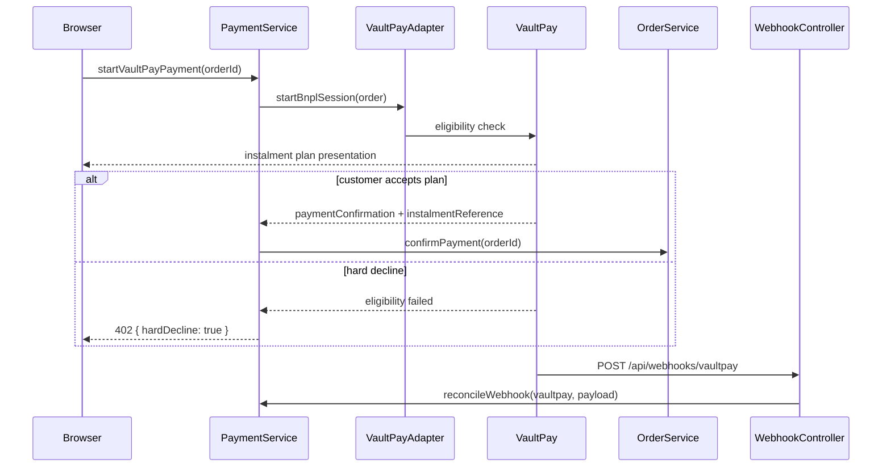
```mermaid
sequenceDiagram
    participant Browser
    participant PaymentService
    participant VaultPayAdapter
    participant VaultPay
    participant OrderService
    Browser->>PaymentService: startVaultPayPayment(orderId)
    PaymentService->>VaultPayAdapter: startBnplSession(order)
    VaultPayAdapter->>VaultPay: eligibility check
    VaultPay-->>Browser: instalment plan presentation
    alt customer accepts plan
        VaultPay-->>PaymentService: paymentConfirmation + instalmentReference
        PaymentService->>OrderService: confirmPayment(orderId)
    else hard decline
        VaultPay-->>PaymentService: eligibility failed
        PaymentService-->>Browser: 402 { hardDecline: true }
    end
    VaultPay->>WebhookController: POST /api/webhooks/vaultpay
    WebhookController->>PaymentService: reconcileWebhook(vaultpay, payload)
```

### Walkthrough Example

Scenario: Customer selects *VaultPay*, accepts *instalment plan*, order confirms.

1. **PaymentMethodSelectorPage** posts `{ vendor: 'vaultpay' }` to **PaymentController**.
2. **PaymentService.startVaultPayPayment** invokes **VaultPayAdapter.startBnplSession**.
3. **VaultPayAdapter** calls VaultPay *eligibility check*; browser displays returned *instalment plan*.
4. Customer accepts plan → VaultPay returns *payment confirmation* with instalment reference.
5. **PaymentService** records vendor = VaultPay, *vendor transaction reference*, and **InstalmentPlanReference** snapshot on **Payment**.
6. **OrderService.confirmPayment** transitions *order* to confirmed and triggers *confirmation email*.
7. On *hard decline*, **PaymentService** returns 402 — no *order* confirmation; selector shows *StripeWave* and *PayNova* (Process Buy-Now-Pay-Later via VaultPay AC #3).

```typescript
// vaultpay.adapter.ts
export class VaultPayAdapter implements IPaymentGateway {
  async startBnplSession(order: Order, prefilledIdentity?: VaultPayIdentity): Promise<BnplSessionRedirect> {
    // eligibility check — returns redirect to instalment plan UI
  }

  async completeBnplCapture(sessionId: string, acceptedPlanId: string): Promise<PaymentResult> {
    // maps VaultPay approval to domain PaymentResult with instalmentReference
  }
}
```

```typescript
class ProcessBuyNowPayLaterViaVaultPay {
  helper = new VaultPayPaymentHelper();

  async test_eligibility_failure_does_not_confirm_order() {
    await this.helper.givenOrderPendingPayment();
    await this.helper.whenVaultPayReturnsHardDecline();
    await this.helper.thenOrderStatusIs('pending_payment');
    await this.helper.thenPaymentMethodSelectorShows(['stripewave', 'paynova', 'vaultpay']);
  }
}
```

### Testing the mechanism

- **Tier:** Application (VaultPayAdapter fake), Integration (BNPL session + webhook fixtures)
- **Scenario coverage:** plan acceptance confirms order, *hard decline* no confirmation, saved VaultPay identity still requires per-transaction *eligibility check*, webhook timeout reconcile, save VaultPay *saved payment method*

**Standards:** `abd-clean-code`, `abd-acceptance-test-driven-development`

---

## Mechanism: Payment Retry Policy

### Principles & Patterns

- **Principle:** *Transient error* from any *payment vendor* triggers automatic *payment retry* within the configured *retry window* — same vendor, same *order*; *hard decline* **must never** auto-retry; exhausted retries restore full *payment method selector*; in-progress *payment retry* continues when customer navigates away.
- **Pattern:** **Scheduled retry job + attempt ledger + background worker**
  - **Options:** Immediate synchronous retry loop in HTTP handler (rejected — blocks checkout); cross-vendor auto-failover (rejected — AC requires explicit customer vendor choice after exhaustion).
  - **Benefits:** Heals network blips and vendor 503 without customer action; background continuation improves conversion on navigate-away.
  - **Trade-offs:** Requires `PaymentRetryJob` collection and idempotent attempt counting; customer notification on background success.

### File Structure

```
packages/payment/
  shared/
    PaymentRetryAttempt.ts       # attemptNumber, vendor, errorClass: transient | hard_decline
    payment-retry.schema.ts
  server/
    payment-retry.service.ts     # scheduleRetry, runDueRetries, classifyError
    payment-retry.job.ts         # background worker (node-cron or queue consumer)
    payment-retry.repository.ts
packages/notification/server/
  payment-retry-notification.ts  # email when background retry succeeds
packages/app-client/pages/
  PaymentRetryInProgressPage.tsx
  PaymentRetryExhaustedPage.tsx  # restores full selector
```

### Participants

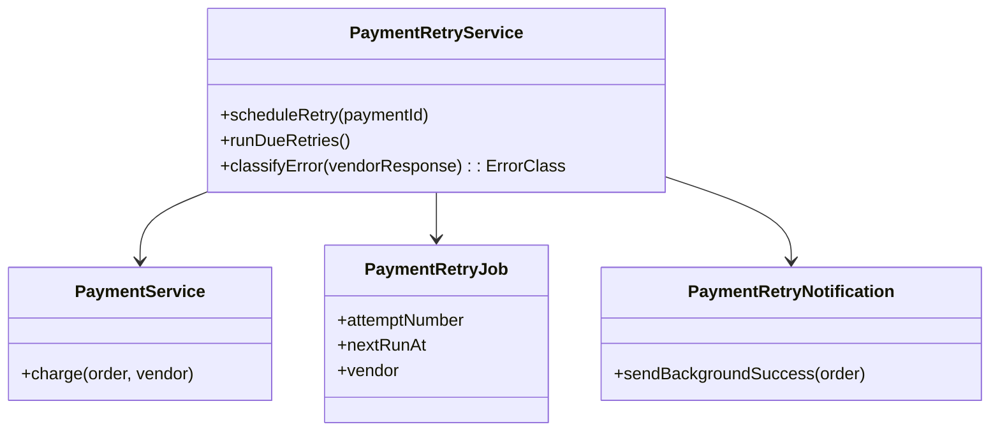
```mermaid
classDiagram
    class PaymentRetryService {
        +scheduleRetry(paymentId)
        +runDueRetries()
        +classifyError(vendorResponse): ErrorClass
    }
    class PaymentRetryJob {
        +attemptNumber
        +nextRunAt
        +vendor
    }
    class PaymentService {
        +charge(order, vendor)
    }
    class PaymentRetryNotification {
        +sendBackgroundSuccess(order)
    }
    PaymentRetryService --> PaymentService
    PaymentRetryService --> PaymentRetryJob
    PaymentRetryService --> PaymentRetryNotification
```

### Flow

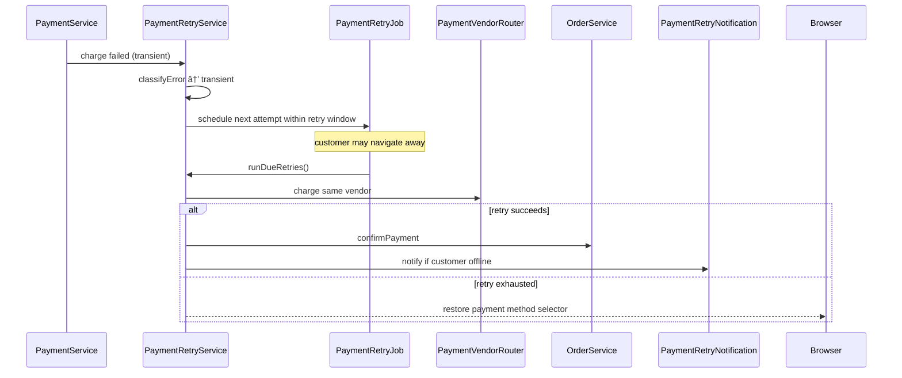
```mermaid
sequenceDiagram
    participant PaymentService
    participant PaymentRetryService
    participant PaymentRetryJob
    participant PaymentVendorRouter
    participant OrderService
    PaymentService->>PaymentRetryService: charge failed (transient)
    PaymentRetryService->>PaymentRetryService: classifyError → transient
    PaymentRetryService->>PaymentRetryJob: schedule next attempt within retry window
    Note over PaymentRetryJob: customer may navigate away
    PaymentRetryJob->>PaymentRetryService: runDueRetries()
    PaymentRetryService->>PaymentVendorRouter: charge same vendor
    alt retry succeeds
        PaymentRetryService->>OrderService: confirmPayment
        PaymentRetryService->>PaymentRetryNotification: notify if customer offline
    else retry exhausted
        PaymentRetryService-->>Browser: restore payment method selector
    end
```

### Walkthrough Example

Scenario: StripeWave returns *transient error*; automatic *payment retry* succeeds on second attempt.

1. **PaymentService.charge** calls **StripeWaveAdapter**; vendor returns retryable network fault.
2. **PaymentRetryService.classifyError** maps response to *transient error* (not *hard decline*).
3. **PaymentRetryService.scheduleRetry** writes **PaymentRetryJob** with `nextRunAt` inside *retry window* and `attemptNumber: 1`.
4. **PaymentRetryJob** worker fires → **PaymentRetryService.runDueRetries** re-invokes **PaymentService.charge** with same vendor.
5. Second attempt returns *payment confirmation* → **OrderService.confirmPayment** → *confirmation email* sent (Retry Failed Payment AC #2).
6. If customer navigated away, **PaymentRetryNotification** sends background email with *order confirmation* link (AC #5).
7. On *hard decline*, **PaymentRetryService** skips scheduling — customer sees vendor message and manual selector (AC #4).

```typescript
// payment-retry.service.ts
classifyError(result: PaymentResult): 'transient' | 'hard_decline' {
  if (result.hardDecline) return 'hard_decline';
  if (result.retryable) return 'transient';
  throw new UnclassifiedPaymentError(result);
}

async scheduleRetry(payment: Payment): Promise<void> {
  if (this.classifyError(payment.lastResult) === 'hard_decline') return;
  const attempts = await this.repository.countAttempts(payment.id);
  if (attempts >= this.maxAttemptsWithinWindow) {
    throw new PaymentRetryExhaustedError(payment.orderNumber);
  }
  await this.repository.enqueue({ paymentId: payment.id, vendor: payment.vendor, nextRunAt: this.nextBackoff(attempts) });
}
```

```typescript
class RetryFailedPayment {
  helper = new PaymentRetryHelper();

  async test_transient_error_schedules_automatic_retry_within_window() {
    await this.helper.givenStripeWaveReturnsTransientError();
    await this.helper.whenFirstChargeAttemptCompletes();
    await this.helper.thenPaymentRetryJobScheduledWithSameVendor('stripewave');
  }

  async test_hard_decline_never_schedules_automatic_retry() {
    await this.helper.givenPayNovaHardDecline();
    await this.helper.whenChargeAttemptCompletes();
    await this.helper.thenNoPaymentRetryJobExists();
  }
}
```

### Testing the mechanism

- **Tier:** Domain (classify transient vs *hard decline*), Application (PaymentRetryService + fake clock), Integration (worker run + background notification)
- **Scenario coverage:** transient auto-retry success, exhaustion restores selector, *hard decline* invariant, background retry on navigate-away, per-vendor retry isolation

**Standards:** `abd-clean-code`, `abd-acceptance-test-driven-development`

---

## Mechanism: Confirmation Email

### Principles & Patterns

- **Principle:** *Confirmation email* is **attempted for every confirmed order** but **must not block** *order confirmation page* display — delivery failure queues for retry without rolling back the order. Email includes a link to the *order status page* for guest tracking (Increment 3).
- **Pattern:** **Transactional outbox-lite (fire-and-forqueue)**
  - **Options:** Synchronous SMTP in payment path (rejected — blocks customer on email latency); skip email in Increment 2 (rejected — AC requires email).
  - **Benefits:** Customer sees *order confirmation page* immediately; staff queue works even if SMTP is down.
  - **Trade-offs:** Eventual email delivery; no marketing preferences in Increment 2.

### File Structure

```
packages/notification/
  shared/
    ConfirmationEmail.ts         # template inputs (order #, items, pickup store or shipping address, statusPageUrl)
    notification.schema.ts
  server/
    notification.service.ts      # sendConfirmationEmail, queue retry
    email.provider.ts            # SMTP / dev console adapter
    notification.repository.ts   # pending/failed email queue (Mongo)
    notification.controller.ts   # internal only — no public send API in Inc 2
    index.ts
packages/order/server/order.service.ts  # calls notification after confirmPayment
```

### Participants

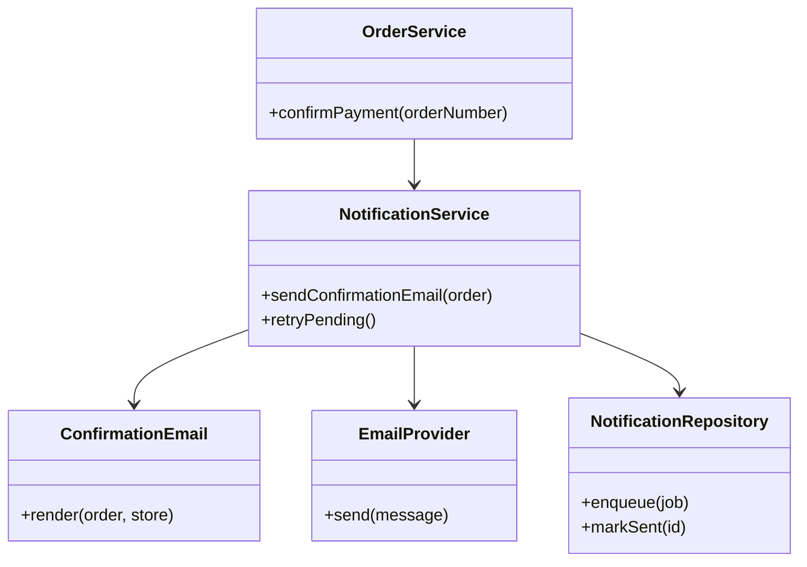
```mermaid
classDiagram
    class OrderService {
        +confirmPayment(orderNumber)
    }
    class NotificationService {
        +sendConfirmationEmail(order)
        +retryPending()
    }
    class ConfirmationEmail {
        +render(order, store)
    }
    class EmailProvider {
        +send(message)
    }
    class NotificationRepository {
        +enqueue(job)
        +markSent(id)
    }
    OrderService --> NotificationService
    NotificationService --> ConfirmationEmail
    NotificationService --> EmailProvider
    NotificationService --> NotificationRepository
```

| Class / Module | Layer | Responsibility | Collaborators |
|---|---|---|---|
| **NotificationService** | Application | Build and send *confirmation email*; queue on failure | EmailProvider, NotificationRepository |
| **ConfirmationEmail** | Domain | Template fields: order number, line items, total, masked card, pickup address + hours **or** shipping address + shipping cost; **statusPageUrl** token link | Order, Store, ShippingAddress |
| **EmailProvider** | Infrastructure | SMTP or dev console sink | — |
| **NotificationRepository** | Infrastructure | Persist retry queue | MongoDB |

### Flow

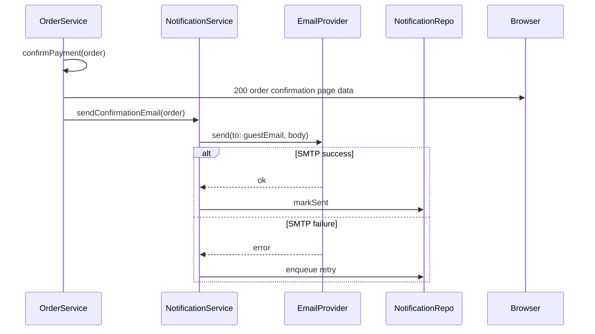
```mermaid
sequenceDiagram
    participant OrderService
    participant NotificationService
    participant EmailProvider
    participant NotificationRepo
    participant Browser
    OrderService->>OrderService: confirmPayment(order)
    OrderService->>Browser: 200 order confirmation page data
    OrderService->>NotificationService: sendConfirmationEmail(order)
    NotificationService->>EmailProvider: send(to: guestEmail, body)
    alt SMTP success
        EmailProvider-->>NotificationService: ok
        NotificationService->>NotificationRepo: markSent
    else SMTP failure
        EmailProvider-->>NotificationService: error
        NotificationService->>NotificationRepo: enqueue retry
    end
```

### Walkthrough Example

Scenario: *Payment confirmation* succeeds; customer sees confirmation page; email includes delivery details and *order status page* link.

1. **OrderService.confirmPayment** completes inventory reservation, returns DTO to client **before** awaiting email.
2. **NotificationService.sendConfirmationEmail** builds **ConfirmationEmail** from order snapshots — *pickup store* address/hours for *click-and-collect*, *shipping address* and shipping cost for *standard delivery*.
3. Template includes signed or tokenized **statusPageUrl** (`/orders/status/{orderNumber}?token=…`) so guest can track without account (Track Order Status AC #1).
4. **EmailProvider.send** targets *guest email*; masks card last-four from payment record.
5. If provider throws, job persisted with `status = pending_retry` — background retry worker re-attempts.

```typescript
// notification.service.ts — non-blocking from customer perspective
async sendConfirmationEmail(order: Order): Promise<void> {
  const message =
    order.deliveryOption.type === 'standard_delivery'
      ? ConfirmationEmail.fromShippingOrder(order)
      : ConfirmationEmail.fromPickupOrder(order, order.pickupStore);
  try {
    await this.emailProvider.send({
      to: order.guestEmail.value,
      subject: `PawPlace order ${order.orderNumber}`,
      html: message.renderHtml(),
    });
    await this.repository.markSent(order.orderNumber);
  } catch {
    await this.repository.enqueue({ orderNumber: order.orderNumber, attempts: 0 });
  }
}
```

```typescript
// notification.service.test.ts
it('queues email when provider fails without throwing to order flow', async () => {
  emailProvider.send.mockRejectedValue(new Error('SMTP down'));
  await expect(service.sendConfirmationEmail(confirmedOrder)).resolves.toBeUndefined();
  expect(repository.enqueue).toHaveBeenCalledWith(
    expect.objectContaining({ orderNumber: confirmedOrder.orderNumber }),
  );
});
```

### Testing the mechanism

- **Tier:** Application (NotificationService + fake provider), Integration (confirm order → queue row exists on SMTP failure)
- **Scenario coverage:** email body includes pickup store hours; guest email recipient; order page renders when email fails

**Standards:** `abd-clean-code`, `abd-acceptance-test-driven-development`

---

## Mechanism: Inventory Reservation

### Principles & Patterns

- **Principle:** Stock is **reserved at the fulfillment location** when payment confirms — *pickup store* for *click-and-collect*, **default fulfillment store** (warehouse) for *standard delivery* — so *available-to-sell* decreases and concurrent guests cannot oversell the same units.
- **Pattern:** **Cross-context service call with domain reserveStock**
  - **Options:** Distributed transaction across Order + Product Catalog collections (deferred — Mongo single-document updates per stock row suffice); reserve at cart add (rejected — holds inventory too long for guest sessions); per-line multi-store ship (deferred — Increment 3 uses single fulfillment store).
  - **Benefits:** Reservation aligns with `StockAvailability.reserveStock` in object model; staff queue stock warnings reflect reserved vs on-hand at fulfillment location.
  - **Trade-offs:** Failed payment after reservation requires release (not needed if reserve only on confirm); ship-to-home uses configured default store code (`FULFILLMENT_STORE_CODE`) until multi-warehouse routing ships.

### File Structure

```
packages/product-catalog/
  shared/StockAvailability.ts    # reserveStock, releaseReservedStock
  server/product-catalog.service.ts
    + reserveForOrder(sku, storeCode, qty)
    + releaseForCancelledOrder(...)
packages/order/server/order.service.ts
    # confirmPayment → catalogClient.reserveForOrder per line item
packages/product-catalog/server/product-catalog.controller.ts
    # staff stock form unchanged; queue reads availableToSell via API
```

### Participants

```mermaid
classDiagram
    class OrderService {
        +confirmPayment(order)
    }
    class ProductCatalogClient {
        <<interface>>
        +reserveForOrder(lineItems, storeCode)
    }
    class ProductCatalogService {
        +reserveForOrder(sku, storeCode, qty)
    }
    class StockAvailability {
        +reserveStock(qty)
        +releaseReservedStock(qty)
        +gateOrderFlow(qty) Boolean
    }
    class ProductCatalogRepository {
        +saveStock(stock)
    }
    OrderService --> ProductCatalogClient
    ProductCatalogService ..|> ProductCatalogClient
    ProductCatalogService --> StockAvailability
    ProductCatalogService --> ProductCatalogRepository
```

| Class / Module | Layer | Responsibility | Collaborators |
|---|---|---|---|
| **OrderService** | Application | After payment confirm, reserve each line item at fulfillment store (pickup store or default warehouse) | ProductCatalogClient |
| **ProductCatalogService** | Application | Load stock row; call domain reserve; persist | ProductCatalogRepository |
| **StockAvailability** | Domain | Increment reservedQuantity; recalc availableToSell | — |
| **ProductCatalogClient** | Integration seam | Interface consumed by Order module — no direct repo access | ProductCatalogService |

### Flow

```mermaid
sequenceDiagram
    participant PaymentService
    participant OrderService
    participant CatalogService
    participant StockDomain
    participant StockRepo
    PaymentService->>OrderService: confirmPayment(order)
    loop each order line item
        OrderService->>CatalogService: reserveForOrder(sku, fulfillmentStoreCode, qty)
        CatalogService->>StockRepo: findStock(sku, storeCode)
        StockRepo-->>CatalogService: StockAvailability
        CatalogService->>StockDomain: gateOrderFlow(qty)
        alt sufficient available
            StockDomain->>StockDomain: reserveStock(qty)
            CatalogService->>StockRepo: saveStock
        else insufficient
            CatalogService-->>OrderService: InsufficientStockError
            OrderService->>OrderService: flag order for staff manual resolution
        end
    end
```

### Walkthrough Example

Scenario: Payment confirms; two units of SKU `DOG-FOOD-5KG` reserved at fulfillment store (pickup store for click-and-collect, `FULFILLMENT_STORE_CODE` for standard delivery).

1. **OrderService.confirmPayment** resolves fulfillment store from `order.deliveryOption` — *pickup store* code or configured warehouse code.
2. **OrderService.confirmPayment** iterates *order line items*.
3. For each line, **ProductCatalogService.reserveForOrder** loads stock for `(sku, fulfillmentStoreCode)`.
4. **StockAvailability.gateOrderFlow(quantity)** returns false if `availableToSellQuantity < quantity` — order still confirmed (payment succeeded) but line flagged for staff stock warning on *order queue* detail.
5. On success, **reserveStock** increases `reservedQuantity`; customer-facing *stock availability* on product page reflects reduced available-to-sell.

```typescript
// product-catalog.service.ts
async reserveForOrder(sku: string, storeCode: string, quantity: number): Promise<void> {
  const stock = await this.repository.findStock(sku, storeCode);
  if (!stock) throw new StockNotFoundError(sku, storeCode);

  if (!stock.gateOrderFlow(quantity)) {
    throw new InsufficientStockError(sku, storeCode, quantity);
  }

  stock.reserveStock(quantity);
  await this.repository.saveStock(stock);
}
```

```typescript
// StockAvailability.test.ts
it('decreases available-to-sell when stock is reserved', () => {
  const stock = new StockAvailability({ quantityOnHand: 10, reservedQuantity: 0 });
  stock.reserveStock(3);
  expect(stock.availableToSellQuantity).toBe(7);
});
```

### Testing the mechanism

- **Tier:** Domain (reserve/release invariants), Application (OrderService confirm with fake catalog client), Integration (pay → stock row reservedQuantity updated)
- **Scenario coverage:** concurrent reservation reduces available-to-sell; staff queue stock warning when reservation failed but order confirmed; reservation scoped to fulfillment store (pickup or warehouse)

**Standards:** `abd-clean-code`, `abd-acceptance-test-driven-development`

---

## Mechanism: Click-and-Collect Fulfillment

### Principles & Patterns

- **Principle:** *Click-and-collect fulfillment* transitions a confirmed *click-and-collect* *order* through staff-prepared pickup — `confirmed` → `ready_for_pickup` → `collected` — at the selected *pickup store*; only orders with `deliveryOption = click_and_collect` may use this lifecycle.
- **Pattern:** **Order lifecycle PATCH on Order aggregate**
  - **Options:** Fulfillment via separate Fulfillment aggregate (deferred — Increment 2 uses **Order** status guards); auto-collect on prepared (rejected — AC requires explicit collected step).
  - **Benefits:** Aligns with `Order.markReadyForPickup()` / `Order.markCollected()` in `packages/order/shared/Order.ts`; staff detail page maps one-to-one to PATCH routes; Vitest coverage in `tests/click-and-collect/fulfillment/`.
  - **Trade-offs:** Staff queue list view lives in [Unified Order Queue](#mechanism-unified-order-queue) (Increment 3); this mechanism owns prepared/collected commands and domain guards only.

### File Structure

```
packages/order/
  shared/
    Order.ts                     # markReadyForPickup(), markCollected(), status guards
    order.schema.ts              # orderStatusSchema: confirmed | ready_for_pickup | collected
  server/
    order.service.ts             # markPrepared(orderNumber), markCollected(orderNumber)
    order.controller.ts          # PATCH handlers
    order.routes.ts              # /prepared, /collected
packages/app-client/src/pages/
  ClickAndCollectOrderDetailPage.tsx   # /admin/click-and-collect/:orderNumber
  ClickAndCollectQueuePage.tsx         # Inc 2 route; Inc 3 may redirect to unified queue
```

### Participants

```mermaid
classDiagram
    class OrderController {
        +markPrepared(req, res)
        +markCollected(req, res)
    }
    class OrderService {
        +markPrepared(orderNumber)
        +markCollected(orderNumber)
    }
    class OrderRepository {
        <<interface>>
        +findByOrderNumber(orderNumber)
        +save(order)
    }
    class Order {
        +markReadyForPickup()
        +markCollected()
        +deliveryOption
        +pickupStore
        +stockWarnings
    }
    class ClickAndCollectOrderDetailPage {
        +markPrepared()
        +markCollected()
    }
    OrderController --> OrderService
    OrderService --> OrderRepository
    OrderService ..> Order
    ClickAndCollectOrderDetailPage --> OrderController : HTTP PATCH
```

| Class / Module | Layer | Responsibility | Collaborators |
|---|---|---|---|
| **OrderController** | API | Staff PATCH `/prepared` and `/collected`; map domain guard failures to 400 | OrderService |
| **OrderService** | Application | Load order; invoke domain transitions; persist | OrderRepository |
| **Order** | Domain | Status guards: `confirmed` → `ready_for_pickup` → `collected`; rejects wrong prior status | — |
| **ClickAndCollectOrderDetailPage** | Presentation | Shows line items, *guest email*, *pickup store*, stock-warning banner; action buttons | order API client |

### Flow

```mermaid
sequenceDiagram
    participant StaffBrowser
    participant OrderController
    participant OrderService
    participant OrderRepo
    participant OrderDomain
    StaffBrowser->>OrderController: PATCH /api/orders/{n}/prepared
    OrderController->>OrderService: markPrepared(orderNumber)
    OrderService->>OrderRepo: findByOrderNumber
    OrderRepo-->>OrderService: Order (status=confirmed)
    OrderService->>OrderDomain: markReadyForPickup()
    OrderDomain-->>OrderService: status=ready_for_pickup
    OrderService->>OrderRepo: save(order)
    OrderService-->>StaffBrowser: 200 OrderDto
    Note over StaffBrowser: Customer collects at pickup store
    StaffBrowser->>OrderController: PATCH /api/orders/{n}/collected
    OrderController->>OrderService: markCollected(orderNumber)
    OrderService->>OrderDomain: markCollected()
    OrderDomain-->>OrderService: status=collected
    OrderService->>OrderRepo: save(order)
    OrderService-->>StaffBrowser: 200 OrderDto
```

### Walkthrough Example

Scenario: *Store employee* opens *click-and-collect order detail* from the unified *order queue* and completes pickup (Prepare Click-and-Collect Orders for Pickup AC #2; Fulfill Click-and-Collect Order AC #1).

1. Staff navigates from [Unified Order Queue](#mechanism-unified-order-queue) to **ClickAndCollectOrderDetailPage** for a *click-and-collect* row (View and Process Incoming Orders AC #1 routing).
2. Detail view shows *order line items*, *guest email*, *pickup store*, and `stockWarnings` when [Inventory Reservation](#mechanism-inventory-reservation) failed for a line (Prepare Click-and-Collect Orders for Pickup AC #3).
3. Staff taps **Mark prepared** → **OrderController** receives `PATCH /api/orders/{orderNumber}/prepared`.
4. **OrderService.markPrepared** loads order; **Order.markReadyForPickup** transitions `confirmed` → `ready_for_pickup`; invalid prior status returns **400**.
5. Customer arrives; staff taps **Mark collected** → `PATCH /api/orders/{orderNumber}/collected`.
6. **OrderService.markCollected** invokes **Order.markCollected** — `ready_for_pickup` → `collected`; order leaves active fulfillment work queue.

```typescript
// order.service.ts — aligned to packages/order/server/order.service.ts
async markPrepared(orderNumber: string): Promise<OrderDto> {
  const order = await this.requireOrder(orderNumber);
  order.markReadyForPickup();
  await this.repository.save(order);
  return toOrderDto(order);
}

async markCollected(orderNumber: string): Promise<OrderDto> {
  const order = await this.requireOrder(orderNumber);
  order.markCollected();
  await this.repository.save(order);
  return toOrderDto(order);
}
```

```typescript
// Order.ts — domain status guards
markReadyForPickup(): void {
  if (this.status !== 'confirmed') {
    throw new Error('order must be confirmed before marking prepared');
  }
  this.status = 'ready_for_pickup';
}

markCollected(): void {
  if (this.status !== 'ready_for_pickup') {
    throw new Error('order must be ready for pickup before marking collected');
  }
  this.status = 'collected';
}
```

```typescript
// prepare-click-and-collect-orders-for-pickup_server.test.ts
it('Prepare Click-and-Collect Orders for Pickup — AC 2: mark prepared', async () => {
  const orderNumber = await placeConfirmedOrder(agent);
  const prepared = await request(app).patch(`/api/orders/${orderNumber}/prepared`).expect(200);
  expect(prepared.body.status).toBe('ready_for_pickup');
});

// fulfill-click-and-collect-order_server.test.ts
it('Fulfill Click-and-Collect Order — AC 1: mark collected', async () => {
  await request(app).patch(`/api/orders/${orderNumber}/prepared`).expect(200);
  const collected = await request(app).patch(`/api/orders/${orderNumber}/collected`).expect(200);
  expect(collected.body.status).toBe('collected');
});
```

### Testing the mechanism

- **Tier:** Domain (`Order` status guards), Application (OrderService + in-memory repo), Integration (supertest PATCH prepared/collected)
- **Helper:** `ClickAndCollectServerHelper` — seed, place guest order, pay to `confirmed`
- **Scenario coverage:** prepared from confirmed; collected from ready_for_pickup; reject prepared when not confirmed; reject collected when not ready; stock-warning DTO on detail when reservation failed

**Standards:** `abd-clean-code`, `abd-acceptance-test-driven-development`

---

## Mechanism: Unified Order Queue

### Principles & Patterns

- **Principle:** Staff process confirmed *order* through a **unified *order queue*** on the *admin dashboard* — both *standard delivery* and *click-and-collect* orders appear oldest-first with a delivery-type label; selecting a row **routes** to the fulfillment detail screen for that delivery path ([Click-and-Collect Fulfillment](#mechanism-click-and-collect-fulfillment) or [Ship-to-Home Fulfillment & Tracking Number](#mechanism-ship-to-home-fulfillment--tracking-number)).
- **Pattern:** **Order read model + delivery-type discriminator + route to fulfillment mechanisms**
  - **Options:** Separate queues per delivery type (rejected — AC requires unified view); embed prepared/collected PATCH in queue page (rejected — fulfillment lifecycle belongs in Click-and-Collect Fulfillment mechanism).
  - **Benefits:** Reuses **Order** aggregate and **OrderRepository**; single staff entry point; DTO includes *guest email*, delivery type, and stock-warning flags; fulfillment commands stay in dedicated mechanism sections.
  - **Trade-offs:** Queue filter may optionally scope by store for click-and-collect; ship-to-home orders show warehouse fulfillment store; unauthenticated staff routes in Increment 2–3 spike.

### File Structure

```
packages/order/
  shared/Order.ts                      # status guards per delivery path
  shared/order.schema.ts               # queueOrderDtoSchema, deliveryTypeLabel enum
  server/order.service.ts              # listQueue(storeCode?), getOrderDetail
  server/order.controller.ts           # GET /queue?storeCode=, GET /:orderNumber
  server/order.routes.ts
  server/order.repository.ts           # findConfirmedOrders(filters)
packages/app-client/src/pages/
  OrderQueuePage.tsx                   # /admin/orders — unified queue (Inc 3)
  ClickAndCollectOrderDetailPage.tsx   # /admin/click-and-collect/:orderNumber (Inc 2, retained)
  ShipToHomeOrderDetailPage.tsx        # /admin/orders/:orderNumber/ship-to-home (Inc 3)
packages/app-client/src/pages/ClickAndCollectQueuePage.tsx  # redirect → /admin/orders
```

### Participants

```mermaid
classDiagram
    class OrderController {
        +listQueue(req, res)
        +getOrderDetail(req, res)
    }
    class OrderService {
        +listQueue(filters)
        +getOrderDetail(orderNumber)
    }
    class OrderRepository {
        <<interface>>
        +findConfirmedOrders(filters)
        +save(order)
    }
    class Order {
        +deliveryOption
        +orderStatus
        +stockWarnings
    }
    class OrderQueuePage {
        +renderQueueRows()
    }
    OrderController --> OrderService
    OrderService --> OrderRepository
    OrderQueuePage --> OrderController : HTTP
```

| Class / Module | Layer | Responsibility | Collaborators |
|---|---|---|---|
| **OrderController** | API | Staff queue GET; returns mixed delivery types | OrderService |
| **OrderService** | Application | Sort oldest-first; map delivery type label; attach stock-warning flags | OrderRepository |
| **Order** | Domain | Status guards differ by `deliveryOption` | — |
| **OrderQueuePage** | Presentation | List rows: order number, line items, delivery type label (*Standard Delivery* / *Click-and-Collect*), *guest email*; row click routes by `deliveryType` | order API client |
| **OrderRepository.findConfirmedOrders** | Infrastructure | Returns orders with `status = confirmed` OR in active fulfillment (`ready_for_pickup`, `fulfilled`) for queue visibility; optional `storeCode` filter scopes *click-and-collect* rows to *pickup store* | MongoDB |

### Flow

```mermaid
sequenceDiagram
    participant StaffBrowser
    participant OrderController
    participant OrderService
    participant OrderRepo
    StaffBrowser->>OrderController: GET /api/orders/queue
    OrderController->>OrderService: listQueue()
    OrderService->>OrderRepo: findConfirmedOrders()
    OrderRepo-->>OrderService: Order[] (standard + click-and-collect)
    OrderService->>OrderService: sort createdAt ASC, map deliveryTypeLabel
    OrderService-->>StaffBrowser: 200 queue DTOs
    alt click-and-collect row selected
        StaffBrowser->>StaffBrowser: navigate to click-and-collect detail
    else standard delivery row selected
        StaffBrowser->>StaffBrowser: navigate to ship-to-home detail
    end
```

### Walkthrough Example

Scenario: *Store employee* opens the unified *order queue* and routes to the correct fulfillment detail.

1. **OrderQueuePage** at `/admin/orders` calls `GET /api/orders/queue?storeCode=STR-001` (optional filter — View and Process Incoming Orders AC #1).
2. **OrderService.listQueue** returns all confirmed orders **oldest first** with `deliveryTypeLabel` *Standard Delivery* or *Click-and-Collect*, *guest email*, line item summary, and `orderStatus`.
3. Ship-to-home rows show warehouse fulfillment store (from `FULFILLMENT_STORE_CODE`); C&C rows show *pickup store* name; optional store filter hides C&C rows for other stores.
4. If inventory reservation failed, `stockWarning: true` on detail DTO (Prepare Click-and-Collect Orders for Pickup AC #3 pattern applies to both paths).
5. Staff selects *click-and-collect* row → navigates to `/admin/click-and-collect/{orderNumber}` → [Click-and-Collect Fulfillment](#mechanism-click-and-collect-fulfillment).
6. Staff selects *standard delivery* row → navigates to `/admin/orders/{orderNumber}/ship-to-home` → [Ship-to-Home Fulfillment & Tracking Number](#mechanism-ship-to-home-fulfillment--tracking-number).

```typescript
// order.schema.ts — queue read model
export const queueOrderDtoSchema = z.object({
  orderNumber: z.string(),
  deliveryType: z.enum(['standard_delivery', 'click_and_collect']),
  deliveryTypeLabel: z.enum(['Standard Delivery', 'Click-and-Collect']),
  guestEmail: z.string(),
  orderStatus: orderStatusSchema,
  lineItemSummary: z.string(), // e.g. '2× Dog Food 5kg, 1× Leash'
  createdAt: z.string().datetime(),
  stockWarning: z.boolean().optional(),
  fulfillmentStoreCode: z.string(),
});
```

```typescript
// order.service.ts — unified queue read model
async listQueue(storeCode?: string): Promise<QueueOrderDto[]> {
  const orders = await this.repository.findConfirmedOrders({ storeCode });
  return orders
    .sort((a, b) => a.createdAt.getTime() - b.createdAt.getTime())
    .map((order) => ({
      orderNumber: order.orderNumber,
      deliveryType: order.deliveryOption.type,
      deliveryTypeLabel:
        order.deliveryOption.type === 'standard_delivery' ? 'Standard Delivery' : 'Click-and-Collect',
      guestEmail: order.guestEmail.value,
      orderStatus: order.status,
      lineItemSummary: summarizeLineItems(order.orderLineItems),
      createdAt: order.createdAt.toISOString(),
      stockWarning: order.stockWarnings.length > 0,
      fulfillmentStoreCode:
        order.deliveryOption.type === 'click_and_collect'
          ? order.pickupStore!.storeCode
          : this.fulfillmentStoreCode,
    }));
}
```

```typescript
// OrderQueuePage.tsx — row routing (presentation)
function onSelectOrder(row: QueueOrderDto): void {
  if (row.deliveryType === 'click_and_collect') {
    navigate(`/admin/click-and-collect/${row.orderNumber}`);
  } else {
    navigate(`/admin/orders/${row.orderNumber}/ship-to-home`);
  }
}
```

```typescript
// order.service.test.ts
it('lists confirmed orders of both delivery types oldest first', async () => {
  const queue = await service.listQueue();
  expect(queue).toHaveLength(2);
  expect(queue[0].createdAt <= queue[1].createdAt).toBe(true);
  expect(queue.map((r) => r.deliveryTypeLabel)).toEqual(['Standard Delivery', 'Click-and-Collect']);
});

it('filters click-and-collect rows by pickup store when storeCode provided', async () => {
  const queue = await service.listQueue('STR-001');
  expect(queue.every((r) => r.deliveryType !== 'click_and_collect' || r.fulfillmentStoreCode === 'STR-001')).toBe(true);
});
```

### Testing the mechanism

- **Tier:** Application (OrderService + in-memory repo), Integration (supertest queue GET), E2E (Playwright staff path)
- **Scenario coverage:** mixed delivery types in one queue, oldest-first sort, delivery type label, routing to correct detail page (click-and-collect vs ship-to-home), stock warning flag on detail — fulfillment PATCH behaviour tested under Click-and-Collect and Ship-to-Home mechanism sections

**Standards:** `abd-clean-code`, `abd-acceptance-test-driven-development`

---

## Mechanism: Ship-to-Home Fulfillment & Tracking Number

### Principles & Patterns

- **Principle:** *Ship-to-home fulfillment* transitions a *standard delivery* *order* from `confirmed` → `fulfilled` → `shipped` when staff pack and dispatch; *tracking number* entry at dispatch is **recommended but not blocking** — staff may add tracking later.
- **Pattern:** **Order lifecycle PATCH + optional tracking capture**
  - **Options:** Carrier API integration for label/tracking (deferred — manual entry in Increment 3); blocking fulfillment without tracking (rejected per UL).
  - **Benefits:** Aligns with object model `Order.ship(trackingNumber)`; triggers *shipping notification* when tracking present; warning UX when omitted.
  - **Trade-offs:** Manual carrier name + tracking entry; no automated carrier link validation in Increment 3.

### File Structure

```
packages/order/
  shared/
    Order.ts                     # markFulfilled(), ship(trackingNumber, carrier, estimatedDeliveryDate)
    TrackingNumber.ts            # value object — carrier ref + carrier name
  server/
    order.service.ts             # markFulfilled, ship, addTrackingNumber
    order.controller.ts          # PATCH /fulfilled, PATCH /shipped, PATCH /tracking
packages/app-client/src/pages/
  ShipToHomeOrderDetailPage.tsx  # shipping address, pack list, tracking form
```

### Participants

```mermaid
classDiagram
    class OrderController {
        +markFulfilled(req, res)
        +ship(req, res)
        +addTrackingNumber(req, res)
    }
    class OrderService {
        +markFulfilled(orderNumber, trackingNumber?)
        +ship(orderNumber, tracking)
        +addTrackingNumber(orderNumber, tracking)
    }
    class Order {
        +markFulfilled()
        +ship(trackingNumber)
    }
    class TrackingNumber {
        +value
        +carrierName
    }
    class NotificationService {
        +sendShippingNotification(order)
    }
    OrderController --> OrderService
    OrderService --> Order
    OrderService --> NotificationService : when tracking present
```

| Class / Module | Layer | Responsibility | Collaborators |
|---|---|---|---|
| **OrderController** | API | Staff PATCH for fulfill/ship/tracking | OrderService |
| **OrderService** | Application | Status guards; invoke shipping notification when tracking added | OrderRepository, NotificationService |
| **Order** | Domain | `confirmed` → `fulfilled` → `shipped` → `delivered` lifecycle | TrackingNumber |
| **TrackingNumber** | Domain | Validates non-empty carrier reference when provided | — |

### Flow

```mermaid
sequenceDiagram
    participant StaffBrowser
    participant OrderController
    participant OrderService
    participant OrderRepo
    participant NotificationService
    StaffBrowser->>OrderController: PATCH /api/orders/{n}/fulfilled { trackingNumber?, carrierName? }
    OrderController->>OrderService: markFulfilled(orderNumber, tracking?)
    OrderService->>OrderRepo: findByOrderNumber
    OrderService->>OrderService: order.markFulfilled()
    alt trackingNumber provided
        OrderService->>OrderService: order.ship(tracking)
        OrderService->>NotificationService: sendShippingNotification(order)
    else no tracking
        OrderService-->>StaffBrowser: 200 { status: fulfilled, warning: 'No tracking — customer will not receive shipping notification' }
    end
    OrderService->>OrderRepo: save(order)
    OrderService-->>StaffBrowser: 200 { status, trackingNumber? }
```

### Walkthrough Example

Scenario: *Store employee* marks a ship-to-home *order* fulfilled with a *tracking number*.

1. **ShipToHomeOrderDetailPage** at `/admin/orders/{orderNumber}/ship-to-home` shows full *shipping address* snapshot, line items to pack, and optional order notes (View and Process Incoming Orders AC #2).
2. Staff taps **Mark as Fulfilled** → modal prompts for *carrier name* and *tracking number* (manual entry — no carrier API in Increment 3).
3. **OrderController** receives `PATCH /api/orders/{orderNumber}/fulfilled` with optional `{ carrierName, trackingNumber }`.
4. **OrderService.markFulfilled** loads order; rejects if `deliveryOption.type !== 'standard_delivery'` (**422**).
5. **Order.markFulfilled** transitions `confirmed` → `fulfilled`.
6. When tracking present: **Order.ship(TrackingNumber.create(...))** sets `status = shipped`, stores carrier ref; **NotificationService.sendShippingNotification** fires (Send Shipping Notification AC #1–2).
7. When tracking omitted: order stays `fulfilled`; response includes verbatim warning *Customer will not receive a shipping notification* (View and Process Incoming Orders AC #4); staff may use **Add tracking number** on same page later → `PATCH /api/orders/{orderNumber}/tracking` (Send Shipping Notification AC #4).

```typescript
// TrackingNumber.ts
export class TrackingNumber {
  readonly value: string;
  readonly carrierName: string;

  static create(input: { number: string; carrierName: string }): TrackingNumber {
    if (!input.number.trim()) throw new InvalidTrackingNumberError();
    return new TrackingNumber(input.number.trim(), input.carrierName.trim() || 'Carrier');
  }

  carrierTrackingUrl(): string {
    // Increment 3 — Royal Mail pattern; no validation against carrier API
    if (this.carrierName.toLowerCase().includes('royal mail')) {
      return `https://www.royalmail.com/track-your-item#/tracking-results/${encodeURIComponent(this.value)}`;
    }
    return `https://track.example.com/${encodeURIComponent(this.value)}`;
  }
}
```

```typescript
// Order.ts — ship-to-home lifecycle guards
markFulfilled(): void {
  if (this.deliveryOption.type !== 'standard_delivery') throw new WrongDeliveryOptionError();
  if (this.status !== 'confirmed') throw new Error('order must be confirmed before marking fulfilled');
  this.status = 'fulfilled';
}

ship(tracking: TrackingNumber): void {
  if (this.status !== 'fulfilled' && this.status !== 'confirmed') {
    throw new Error('order must be confirmed or fulfilled before shipping');
  }
  this.trackingNumber = tracking;
  this.shippedAt = new Date();
  this.status = 'shipped';
}
```

```typescript
// order.service.ts
async markFulfilled(orderNumber: string, tracking?: TrackingInput): Promise<FulfillResult> {
  const order = await this.requireOrder(orderNumber);
  if (order.deliveryOption.type !== 'standard_delivery') {
    throw new WrongDeliveryOptionError(orderNumber);
  }

  order.markFulfilled();
  let warning: string | undefined;

  if (tracking?.number) {
    order.ship(TrackingNumber.create(tracking));
    await this.notificationService.sendShippingNotification(order);
  } else {
    warning = 'Customer will not receive a shipping notification';
  }

  await this.repository.save(order);
  return { order: toOrderDto(order), warning };
}

async addTrackingNumber(orderNumber: string, tracking: TrackingInput): Promise<OrderDto> {
  const order = await this.requireOrder(orderNumber);
  if (order.deliveryOption.type !== 'standard_delivery') throw new WrongDeliveryOptionError(orderNumber);
  order.ship(TrackingNumber.create(tracking));
  await this.notificationService.sendShippingNotification(order);
  await this.repository.save(order);
  return toOrderDto(order);
}
```

```typescript
// ShipToHomeOrderDetailPage.tsx — fulfillment warning (presentation)
if (result.warning) {
  setFulfillmentWarning(result.warning); // aria-describedby on mark-as-fulfilled button region
}
```

```typescript
// order.service.test.ts
it('transitions to shipped and sends notification when tracking provided', async () => {
  const result = await service.markFulfilled('PP-2001', { number: 'RM123456789GB', carrierName: 'Royal Mail' });
  expect(result.order.status).toBe('shipped');
  expect(notificationService.sendShippingNotification).toHaveBeenCalledOnce();
});

it('allows fulfilled without tracking and returns warning', async () => {
  const result = await service.markFulfilled('PP-2002');
  expect(result.order.status).toBe('fulfilled');
  expect(result.warning).toBe('Customer will not receive a shipping notification');
});

it('addTrackingNumber later triggers notification without duplicate ship when already fulfilled', async () => {
  await service.markFulfilled('PP-2003');
  await service.addTrackingNumber('PP-2003', { number: 'RM999', carrierName: 'Royal Mail' });
  expect(notificationService.sendShippingNotification).toHaveBeenCalledOnce();
});
```

### Testing the mechanism

- **Tier:** Application (OrderService + fake notification), Integration (supertest PATCH fulfilled/shipped)
- **Scenario coverage:** fulfill with tracking → shipped + notification; fulfill without tracking → warning; add tracking later → notification fires; wrong delivery option rejected

**Standards:** `abd-clean-code`, `abd-acceptance-test-driven-development`

---

## Mechanism: Shipping Notification

### Principles & Patterns

- **Principle:** *Shipping notification* is sent to *guest email* when a *tracking number* is recorded — email failure **must not block** *order status* transition to `shipped` (same resilience as *confirmation email*).
- **Pattern:** **Transactional outbox-lite (fire-and-queue)**
  - **Options:** Synchronous SMTP in fulfillment path (rejected); skip notification when no tracking (required — no auto-send without tracking).
  - **Benefits:** Customer receives carrier reference and *order status page* link; staff can add tracking later to trigger retroactive send.
  - **Trade-offs:** No push notifications for status changes in Increment 3; customer checks *order status page* or waits for email.

### File Structure

```
packages/notification/
  shared/
    ShippingNotification.ts      # template inputs (order #, items, carrier, tracking, statusPageUrl)
  server/
    notification.service.ts      # sendShippingNotification, retryPending
    email.provider.ts
    notification.repository.ts
packages/order/server/order.service.ts  # invokes on ship() and addTrackingNumber()
```

### Participants

```mermaid
classDiagram
    class OrderService {
        +ship(orderNumber, tracking)
        +addTrackingNumber(orderNumber, tracking)
    }
    class NotificationService {
        +sendShippingNotification(order)
        +retryPending()
    }
    class ShippingNotification {
        +render(order, tracking)
    }
    class EmailProvider {
        +send(message)
    }
    class NotificationRepository {
        +enqueue(job)
        +markSent(id)
    }
    OrderService --> NotificationService
    NotificationService --> ShippingNotification
    NotificationService --> EmailProvider
    NotificationService --> NotificationRepository
```

| Class / Module | Layer | Responsibility | Collaborators |
|---|---|---|---|
| **NotificationService** | Application | Build and send *shipping notification*; queue on failure | EmailProvider, NotificationRepository |
| **ShippingNotification** | Domain | Template fields: order number, line items, carrier name, *tracking number*, estimated delivery window, `statusPageUrl`, `carrierTrackingUrl` | Order, TrackingNumber |
| **EmailProvider** | Infrastructure | SMTP or dev console sink | — |

### Flow

```mermaid
sequenceDiagram
    participant OrderService
    participant NotificationService
    participant EmailProvider
    participant NotificationRepo
    OrderService->>OrderService: order.ship(trackingNumber) — status=shipped
    OrderService->>NotificationService: sendShippingNotification(order)
    NotificationService->>EmailProvider: send(to: guestEmail, body)
    alt SMTP success
        EmailProvider-->>NotificationService: ok
        NotificationService->>NotificationRepo: markSent
    else SMTP failure
        EmailProvider-->>NotificationService: error
        NotificationService->>NotificationRepo: enqueue retry
    end
    Note over OrderService: order status already shipped — email failure does not rollback
```

### Walkthrough Example

Scenario: Staff enters *tracking number* at fulfillment; customer receives *shipping notification*.

1. **OrderService.ship** / **addTrackingNumber** transitions *order status* to `shipped` **before** email attempt (Send Shipping Notification AC #2–3).
2. **NotificationService.sendShippingNotification** no-ops when `order.trackingNumber` absent (Send Shipping Notification AC #4 — no auto-send without tracking).
3. **ShippingNotification.fromOrder** builds HTML with: order number, itemized lines, carrier name, *tracking number*, estimated delivery window from `DeliveryOption`, signed **statusPageUrl**, and clickable **carrierTrackingUrl** from `TrackingNumber.carrierTrackingUrl()`.
4. **EmailProvider.send** targets *guest email* on the order (not billing recipient name alone).
5. If provider throws, job enqueued with `type: 'shipping'` — *order status* remains `shipped`; retry worker re-attempts without rolling back fulfillment.

```typescript
// ShippingNotification.ts — template inputs
export class ShippingNotification {
  static fromOrder(order: Order): ShippingNotification {
    return new ShippingNotification({
      orderNumber: order.orderNumber,
      lineItems: order.orderLineItems,
      carrierName: order.trackingNumber!.carrierName,
      trackingNumber: order.trackingNumber!.value,
      carrierTrackingUrl: order.trackingNumber!.carrierTrackingUrl(),
      estimatedDelivery: order.deliveryOption.estimatedDeliveryWindow,
      statusPageUrl: OrderStatusToken.signUrl(order.orderNumber, order.guestEmail.value),
    });
  }

  renderHtml(): string {
    // includes tracking link + status page link — Send Shipping Notification AC #1
  }
}
```

```typescript
// notification.service.ts
async sendShippingNotification(order: Order): Promise<void> {
  if (!order.trackingNumber) return;

  const message = ShippingNotification.fromOrder(order);
  try {
    await this.emailProvider.send({
      to: order.guestEmail.value,
      subject: `Your PawPlace order ${order.orderNumber} has shipped`,
      html: message.renderHtml(),
    });
    await this.repository.markSent(`shipping:${order.orderNumber}`);
  } catch {
    await this.repository.enqueue({ type: 'shipping', orderNumber: order.orderNumber, attempts: 0 });
  }
}
```

```typescript
// notification.service.test.ts
it('does not send when tracking number absent', async () => {
  await service.sendShippingNotification(fulfilledOrderWithoutTracking);
  expect(emailProvider.send).not.toHaveBeenCalled();
});

it('queues shipping email when provider fails without rolling back order status', async () => {
  emailProvider.send.mockRejectedValue(new Error('SMTP down'));
  await expect(service.sendShippingNotification(shippedOrder)).resolves.toBeUndefined();
  expect(repository.enqueue).toHaveBeenCalledWith(
    expect.objectContaining({ type: 'shipping', orderNumber: shippedOrder.orderNumber }),
  );
});
```

### Testing the mechanism

- **Tier:** Application (NotificationService + fake provider), Integration (fulfill with tracking → queue row on SMTP failure)
- **Scenario coverage:** email body includes tracking + carrier link; no send without tracking; retroactive send on add-tracking; status shipped regardless of email outcome

**Standards:** `abd-clean-code`, `abd-acceptance-test-driven-development`

---

## Mechanism: Order Status Page & Guest Lookup

### Principles & Patterns

- **Principle:** The *order status page* shows current *order status*, line items, and delivery/tracking details to **guest customers** — reachable via email links or lookup by *order number* + *guest email* with **no account required** and **no data leak** on email mismatch.
- **Pattern:** **Tokenized deep link + guarded guest lookup**
  - **Options:** Public order number only (rejected — leaks order existence); authenticated *order history* supplements but does not replace guest lookup — both paths coexist in Increment 4.
  - **Benefits:** Same page serves confirmation-email links, shipping-notification links, and manual lookup; carrier tracking link when *tracking number* present.
  - **Trade-offs:** No push notifications for intermediate status changes; customer must revisit page or wait for *shipping notification*.

### File Structure

```
packages/order/
  shared/OrderStatus.ts            # read-model DTO mapper
  server/
    order.service.ts               # getOrderStatus, lookupByGuestEmail
    order.controller.ts            # GET /status/:orderNumber, POST /status/lookup
    order-status-token.ts          # signed token for email links (HMAC)
packages/app-client/src/pages/
  OrderStatusPage.tsx              # /orders/status/:orderNumber
  OrderLookupPage.tsx              # /orders/lookup — order number + guest email form
```

### Participants

```mermaid
classDiagram
    class OrderController {
        +getOrderStatus(req, res)
        +lookupOrderStatus(req, res)
    }
    class OrderService {
        +getOrderStatus(orderNumber, token?)
        +lookupByGuestEmail(orderNumber, guestEmail)
    }
    class OrderStatusToken {
        +sign(orderNumber, guestEmail)
        +verify(token)
    }
    class OrderStatusPage {
        +render(status, tracking?)
    }
    OrderController --> OrderService
    OrderService --> OrderStatusToken
    OrderStatusPage --> OrderController
```

| Class / Module | Layer | Responsibility | Collaborators |
|---|---|---|---|
| **OrderController** | API | GET status with token; POST lookup with email match guard | OrderService |
| **OrderService** | Application | Map order to status DTO; reject lookup on email mismatch | OrderRepository |
| **OrderStatusToken** | Infrastructure | HMAC-signed link in emails — optional shortcut for GET | env `ORDER_STATUS_TOKEN_SECRET` |
| **OrderStatusPage** | Presentation | Show status timeline, items, tracking link when shipped | order API client |

### Flow

```mermaid
sequenceDiagram
    participant Browser
    participant OrderController
    participant OrderService
    participant OrderRepo
    alt email link with token
        Browser->>OrderController: GET /api/orders/status/{n}?token=...
        OrderController->>OrderService: getOrderStatus(orderNumber, token)
        OrderService->>OrderService: verify token
    else manual lookup
        Browser->>OrderController: POST /api/orders/status/lookup { orderNumber, guestEmail }
        OrderController->>OrderService: lookupByGuestEmail(orderNumber, guestEmail)
        OrderService->>OrderRepo: findByOrderNumber
        OrderService->>OrderService: compare guestEmail — fail closed on mismatch
    end
    OrderRepo-->>OrderService: Order
    OrderService-->>Browser: 200 OrderStatusDto (or 404 generic error)
```

### Walkthrough Example

Scenario: Guest follows link from *confirmation email* and later checks status after shipment.

1. **ConfirmationEmail** and **ShippingNotification** embed `statusPageUrl` via **OrderStatusToken.sign(orderNumber, guestEmail)** — e.g. `/orders/status/ORD-123456?token=…` (Track Order Status AC #1).
2. **OrderStatusPage** at `/orders/status/:orderNumber` calls `GET /api/orders/status/{orderNumber}?token=…` on mount — no session required.
3. **OrderStatusDto** maps domain status to presentation labels: ship-to-home `confirmed` → *Confirmed*, `fulfilled` → *Fulfilled*, `shipped` → *Shipped*, `delivered` → *Delivered*; click-and-collect uses *Ready for pickup* / *Collected* equivalents.
4. DTO includes line items, path-appropriate delivery block (*shipping address* snapshot or *pickup store*), and tracking section:
   - Pre-ship (`confirmed`, `fulfilled`): verbatim *Tracking will be available once your order ships* (Track Order Status AC #4).
   - Post-ship: *tracking number* as external carrier link, `shippedAt`, `estimatedDeliveryDate` (Track Order Status AC #2).
5. Manual lookup: **OrderLookupPage** at `/orders/lookup` POSTs `{ orderNumber, guestEmail }` → **OrderService.lookupByGuestEmail** — mismatch returns generic **404** *We couldn't find an order matching those details* without leaking existence (Track Order Status AC #3).
6. Status refresh on revisit only — no push notification UI (Track Order Status AC #5).

```typescript
// order-status-token.ts
export class OrderStatusToken {
  static sign(orderNumber: string, guestEmail: string): string {
    const payload = `${orderNumber}:${guestEmail}`;
    return createHmac('sha256', process.env.ORDER_STATUS_TOKEN_SECRET!).update(payload).digest('hex');
  }

  static verify(orderNumber: string, guestEmail: string, token: string): boolean {
    return timingSafeEqual(Buffer.from(this.sign(orderNumber, guestEmail)), Buffer.from(token));
  }

  static signUrl(orderNumber: string, guestEmail: string): string {
    return `/orders/status/${orderNumber}?token=${this.sign(orderNumber, guestEmail)}`;
  }
}
```

```typescript
// order.schema.ts — guest-facing read model
export const orderStatusDtoSchema = z.object({
  orderNumber: z.string(),
  statusLabel: z.string(), // presentation label — Confirmed | Fulfilled | Shipped | ...
  deliveryOptionLabel: z.string(),
  lineItems: z.array(orderLineItemSchema),
  shippingAddress: shippingAddressSchema.optional(),
  pickupStore: z.object({ storeName: z.string(), addressLineOne: z.string(), city: z.string(), postcode: z.string() }).optional(),
  tracking: z.object({
    number: z.string(),
    carrierName: z.string(),
    carrierTrackingUrl: z.string().url(),
    shippedAt: z.string().datetime(),
    estimatedDeliveryDate: z.string().optional(),
  }).optional(),
  trackingPendingMessage: z.string().optional(), // 'Tracking will be available once your order ships'
});
```

```typescript
// order.service.ts
async getOrderStatus(orderNumber: string, token?: string): Promise<OrderStatusDto> {
  const order = await this.requireOrder(orderNumber);
  if (token && !OrderStatusToken.verify(orderNumber, order.guestEmail.value, token)) {
    throw new OrderNotFoundError();
  }
  return toOrderStatusDto(order);
}

async lookupByGuestEmail(orderNumber: string, guestEmail: string): Promise<OrderStatusDto> {
  const order = await this.repository.findByOrderNumber(orderNumber);
  if (!order || order.guestEmail.value !== guestEmail) {
    throw new OrderNotFoundError(); // generic — no email mismatch leak
  }
  return toOrderStatusDto(order);
}
```

```typescript
// OrderLookupPage.tsx — fail-closed presentation
catch (err) {
  setLookupError("We couldn't find an order matching those details");
}
```

```typescript
// order.service.test.ts
it('rejects lookup when guest email does not match', async () => {
  await expect(
    service.lookupByGuestEmail('PP-1001', 'wrong@example.com'),
  ).rejects.toThrow(OrderNotFoundError);
});

it('includes trackingPendingMessage when status is confirmed on standard delivery', async () => {
  const dto = await service.getOrderStatus('PP-1001', validToken);
  expect(dto.tracking).toBeUndefined();
  expect(dto.trackingPendingMessage).toBe('Tracking will be available once your order ships');
});
```

### Testing the mechanism

- **Tier:** Application (OrderService lookup guards), Integration (supertest status GET/POST), E2E (Playwright guest status path)
- **Scenario coverage:** token link access, email mismatch fails closed, tracking link when shipped, no tracking when confirmed/fulfilled, status refresh on revisit

**Standards:** `abd-clean-code`, `abd-acceptance-test-driven-development`

---

## Mechanism: Authentication

### Principles & Patterns

- **Principle:** *Customer account* identity is established through **email + password credentials only** — registration creates an unverified account; *account verification status* must become verified before account-only features unlock; credential errors are **enumeration-safe** at every boundary.
- **Pattern:** **Local credential store with signed one-time tokens for verification and reset**
  - **Options:** OAuth/social login (deferred — email + password only per Increment 4 scope); magic-link-only login (rejected — password required per PO chat).
  - **Benefits:** Self-contained auth without third-party identity vendor; *verification link* and password-reset link share the same token infrastructure; domain services receive explicit `CustomerAccountId` — no ambient request context.
  - **Trade-offs:** Password hashing and token expiry must be maintained in-house; staff role claims deferred to a later increment.

### File Structure

```
packages/customer-account/
  shared/
    CustomerAccount.ts           # aggregate — email, password hash, verification status
    AccountVerificationStatus.ts # unverified | verified enum
    VerificationLink.ts          # one-time token value object
    PasswordResetLink.ts
    customer-account.schema.ts   # Zod DTOs for register/login/reset
  server/
    auth.service.ts              # register, login, verifyEmail, requestPasswordReset, resetPassword
    auth.controller.ts
    auth.routes.ts               # POST /register, /login, /verify, /password-reset/*
    password-hasher.ts           # bcrypt adapter
    verification-token.repository.ts
    customer-account.repository.ts
    customer-account.mongo-repository.ts
    index.ts                     # createCustomerAccountModule()
packages/notification/server/
  verification-email.ts          # Send Email Verification template + queue
packages/app-client/src/pages/
  RegisterPage.tsx               # /register
  RegistrationConfirmationPage.tsx  # /register/confirmation
  LoginPage.tsx                  # /login
  VerifyEmailPage.tsx            # /verify-email/success · /verify-email/expired
  ResetPasswordRequestPage.tsx   # /reset-password
  ResetPasswordSetPage.tsx       # /reset-password/set
packages/app-server/index.ts     # mounts authRouter + session middleware (see Customer Session)
```

### Participants

```mermaid
classDiagram
    class AuthController {
        +register(req, res)
        +login(req, res)
        +verifyEmail(req, res)
        +requestPasswordReset(req, res)
        +resetPassword(req, res)
    }
    class AuthService {
        +register(email, password)
        +login(email, password)
        +verifyEmail(token)
        +requestPasswordReset(email)
        +resetPassword(token, newPassword)
    }
    class CustomerAccount {
        +register(email, passwordHash)
        +markVerified()
        +changePassword(newHash)
    }
    class VerificationLink {
        +isExpired()
        +isConsumed()
        +consume()
    }
    class PasswordHasher {
        +hash(plain)
        +verify(plain, hash)
    }
    class VerificationEmail {
        +send(account, link)
    }
    AuthController --> AuthService
    AuthService --> CustomerAccount
    AuthService --> PasswordHasher
    AuthService --> VerificationEmail
    AuthService --> VerificationLink
```

| Class / Module | Layer | Responsibility | Collaborators |
|---|---|---|---|
| **AuthController** | API | Map HTTP bodies to service calls; generic errors on login/reset request | AuthService |
| **AuthService** | Application | Orchestrate registration, verification, login gate, password reset | CustomerAccountRepository, VerificationTokenRepository |
| **CustomerAccount** | Domain | Enforce unique email, verification gate, password change invalidates sessions | AccountVerificationStatus |
| **VerificationLink** | Domain | One-time-use, time-limited token invariants | — |
| **PasswordHasher** | Infrastructure | bcrypt cost factor from config | — |
| **VerificationEmail** | Application (peer) | Queue verification email on register/resend | NotificationService |

### Flow

```mermaid
sequenceDiagram
    participant Browser
    participant AuthController
    participant AuthService
    participant AccountRepo
    participant Notification
    Browser->>AuthController: POST /api/auth/register { email, password }
    AuthController->>AuthService: register(email, password)
    AuthService->>AccountRepo: findByEmail
    AuthService->>AuthService: hash password; create CustomerAccount (unverified)
    AuthService->>AccountRepo: save(account)
    AuthService->>Notification: sendVerificationEmail(account, link)
    AuthService-->>Browser: 201 { message: check your email }
    Browser->>AuthController: GET /api/auth/verify?token=...
    AuthController->>AuthService: verifyEmail(token)
    AuthService->>AuthService: link.consume(); account.markVerified()
    AuthService-->>Browser: 200 redirect to verify success page
```

### Walkthrough Example

Scenario: Customer registers, receives *email verification*, clicks *verification link*, then logs in.

1. **RegisterPage** at `/register` shows password requirements before submit (Register Account AC #1 — *minimum 8 characters*, *at least one uppercase letter*, *at least one digit*, *at least one special character*).
2. **AuthController** receives `POST /api/auth/register` — **registerSchema** Zod `.parse()` at boundary; **AuthService** delegates to **CustomerAccount.registerViaEmailAndPassword** (CRC) before persistence (Register Account AC #2).
3. **AuthService** rejects duplicate email with `409` body `{ error: 'This email is already in use', loginUrl: '/login' }` — response does **not** reveal *account verification status* (Register Account AC #3).
4. Password policy failure surfaces unmet requirement verbatim from spec-by-example — e.g. *minimum 8 characters* (Register Account Scenario Outline 1).
5. **EmailVerification.sendVerificationEmail** queues **Notification** with unique time-limited **VerificationLink**; **RegistrationConfirmationPage** shows *check your email to verify* (Send Email Verification AC #1).
6. If SMTP delivery fails, **Notification** marks `deliveryStatus: queued` for retry — registration confirmation still shown; *account verification status* remains *unverified* (Send Email Verification AC #3).
7. Customer clicks valid link → **EmailVerification.transitionAccountVerificationStatus** marks account verified → redirect `/verify-email/success` with *you're verified* (Verify Email Address AC #1).
8. Used link on verified account → idempotent *already verified* message + login link (Verify Email Address AC #2).
9. Expired link → `/verify-email/expired` with *This verification link has expired* + resend (Verify Email Address AC #3 · Send Email Verification AC #2).
10. **AuthController** `POST /api/auth/login` — unverified account → `403` *please verify your email first* + `resendAvailable: true`; no account-only session (Log In AC #3).
11. Verified login succeeds → delegates to **Customer Session** for session creation and cart merge (Log In AC #1 · #4).
12. **ResetPasswordRequestPage** — `POST /api/auth/password-reset/request` returns same *check your email* confirmation whether account exists (Reset Password Scenario Outline 1).
13. Used reset link → *link already used* + *Request new reset* action (Reset Password Scenario Outline 2 row 2).

```typescript
// customer-account.schema.ts — registration (messages from increment-4-specification-by-example)
const passwordSchema = z.string()
  .min(8, 'minimum 8 characters')
  .regex(/[A-Z]/, 'at least one uppercase letter')
  .regex(/\d/, 'at least one digit')
  .regex(/[^A-Za-z0-9]/, 'at least one special character');

export const registerSchema = z.object({
  email: z.string().email(),
  password: passwordSchema,
  passwordConfirmation: z.string(),
  firstName: z.string().min(1),
  lastName: z.string().min(1),
}).refine((d) => d.password === d.passwordConfirmation, {
  message: 'Passwords do not match',
  path: ['passwordConfirmation'],
});

export const loginSchema = z.object({
  email: z.string().email(),
  password: z.string().min(1),
});
```

```typescript
// CustomerAccount.ts — CRC-aligned registration (domain)
static registerViaEmailAndPassword(
  emailAddress: EmailAddress,
  passwordHash: string,
  name: CustomerName,
): CustomerAccount {
  return new CustomerAccount({
    emailAddress,
    passwordHash,
    name,
    accountVerificationStatus: AccountVerificationStatus.unverified(),
  });
}
```

```typescript
// auth.service.ts
async register(input: RegisterInput): Promise<void> {
  if (await this.accounts.existsByEmail(input.email)) {
    throw new EmailAlreadyRegisteredError(); // maps to 409 + loginUrl — no status leak
  }
  const account = CustomerAccount.registerViaEmailAndPassword(
    EmailAddress.of(input.email),
    await this.hasher.hash(input.password),
    CustomerName.of(input.firstName, input.lastName),
  );
  await this.accounts.save(account);
  const verification = EmailVerification.forAccount(account);
  await EmailVerification.sendVerificationEmail(verification, account);
  await this.profileService.linkGuestOrdersOnRegister(account.id, input.email);
}
```

```typescript
// auth.service.test.ts
class RegisterAccountFailures {
  helper = new AuthServiceHelper();

  async test_duplicate_email_does_not_reveal_verification_status() {
    await this.helper.givenVerifiedAccount('existing@example.com');
    await this.helper.whenCustomerRegisters('existing@example.com', 'ValidPass1!');
    await this.helper.thenResponseIs409WithMessage('This email is already in use');
    await this.helper.thenResponseDoesNotRevealVerificationStatus();
  }

  async test_reset_request_same_confirmation_for_unknown_email() {
    await this.helper.whenPasswordResetRequested('unknown@example.com');
    await this.helper.thenResponseShowsCheckYourEmail();
  }
}
```

### Testing the mechanism

- **Tier:** Domain (CustomerAccount, VerificationLink expiry/consumption), Application (AuthService with in-memory repos), Integration (supertest register/verify/login)
- **Scenario coverage:** password policy reject (each outline row), duplicate email, expired/used verification link, already-verified idempotent link, unverified login block, enumeration-safe reset request (known + unknown email), used reset link rejection, password reset invalidates sessions (cross-ref Customer Session)

**Standards:** `abd-clean-code`, `abd-acceptance-test-driven-development`

---

## Mechanism: Customer Session

### Principles & Patterns

- **Principle:** A *customer session* binds a browser to a verified *customer account* — **multiple concurrent sessions** per account are allowed; session state is **never** the source of truth for *shopping cart* (cart persists on account); password reset and *log out everywhere* **invalidate all sessions**.
- **Pattern:** **Server-side session record with httpOnly cookie and MongoDB session store**
  - **Options:** Stateless JWT in localStorage (rejected — XSS exposure; cart merge needs server session anyway); single-session-only (rejected — UL requires multi-device).
  - **Benefits:** Reuses express-session infrastructure from guest cart; explicit session id in repository enables per-device logout and global invalidation; cart merge runs once at login boundary.
  - **Trade-offs:** Session store must be shared across app-server instances before horizontal scale; inactivity timeout configuration required.

### File Structure

```
packages/customer-account/
  server/
    session.service.ts           # createSession, invalidate, invalidateAllForAccount
    session.repository.ts        # CustomerSession records in MongoDB
    session.middleware.ts        # requireVerifiedCustomer, attach principal to req
    auth.controller.ts           # POST /logout, POST /logout-everywhere
packages/cart/server/
  cart.service.ts                # mergeGuestCartIntoAccount(sessionId, accountId)
  cart.account-repository.ts     # account-persisted cart (Increment 4)
  cart.session-repository.ts     # guest cart (Increment 2 — unchanged)
packages/app-client/src/context/
  AuthContext.tsx                # current customer, verification status, login state, logout actions
  ProtectedRoute.tsx             # requireVerifiedCustomer — redirect /login or verification prompt
packages/app-server/index.ts     # session middleware order: session → auth attachPrincipal → routes
```

### Participants

```mermaid
classDiagram
    class SessionMiddleware {
        +requireVerifiedCustomer(req, res, next)
        +attachPrincipal(req)
    }
    class SessionService {
        +createSession(accountId, sessionId)
        +invalidate(sessionId)
        +invalidateAllForAccount(accountId)
    }
    class CartService {
        +mergeGuestCartIntoAccount(sessionId, accountId)
        +getCartForAccount(accountId)
    }
    class CustomerSession {
        +accountId
        +expiresAt
        +isActive()
    }
    SessionMiddleware --> SessionService
    SessionService --> CustomerSession
    AuthService ..> SessionService : on login
    CartService ..> SessionService : after login merge
```

| Class / Module | Layer | Responsibility | Collaborators |
|---|---|---|---|
| **SessionMiddleware** | API | Reject unauthenticated/unverified callers on protected routes; inject `CustomerPrincipal` | SessionService |
| **SessionService** | Application | Create/destroy session records; enforce inactivity timeout | SessionRepository |
| **CartService** | Application (peer) | Merge guest session cart into account cart on login | CartSessionRepository, CartAccountRepository |
| **CustomerSession** | Domain | Session lifecycle — active until logout, timeout, or password reset | CustomerAccountId |

### Flow

```mermaid
sequenceDiagram
    participant Browser
    participant AuthController
    participant SessionService
    participant CartService
    participant SessionStore
    Browser->>AuthController: POST /api/auth/login { email, password }
    AuthController->>SessionService: createSession(accountId, sessionId)
    SessionService->>SessionStore: save CustomerSession
    AuthController->>CartService: mergeGuestCartIntoAccount(sessionId, accountId)
    CartService->>CartService: sum duplicate SKU quantities
    CartService-->>Browser: 200 { cart merged }
    Note over Browser,SessionStore: Later — session expiry
    Browser->>SessionMiddleware: GET /api/cart (expired cookie)
    SessionMiddleware-->>Browser: 401 → redirect login (cart preserved on account)
```

### Walkthrough Example

Scenario: Customer logs in on a second device while a guest cart exists on the first browser session.

1. **AuthService.login** succeeds for verified account → **CustomerSession.createOnSuccessfulLogin** (CRC) writes a new **CustomerSession** row — prior device sessions remain active (Maintain Session Across Devices AC #1 · Log Out AC #1).
2. **AccountVerificationStatus.gateCustomerSessionAccess** passed before session creation — unverified credentials never reach this step (Log In AC #3).
3. **CartService.mergeGuestCartIntoAccount** loads guest cart from **CartSessionRepository** and account cart from **CartAccountRepository** — duplicate SKUs sum quantities (Log In AC #4–5 · Reorder AC #4).
4. **AccountDashboardPage** `/account` exposes *Log Out* (current device) and *Log out everywhere* (Log Out AC #2).
5. **SessionService.invalidate** on single logout — other devices stay signed in (Log Out AC #1).
6. **SessionService.invalidateAllForAccount** on log-out-everywhere and successful password reset (Reset Password AC #3 · Maintain Session AC #3).
7. **ProtectedRoute** on `/account/*`, `/wishlist` — expired session redirects to `/login?returnUrl=…`; **CartAccountRepository** cart unchanged (Maintain Session AC #2).
8. **SESSION_INACTIVITY_MINUTES** env — middleware returns `401` when `CustomerSession.isActive()` false; client preserves cart via account scope.

```typescript
// session.middleware.ts — verification gate
requireVerifiedCustomer(req: Request, res: Response, next: NextFunction): void {
  const session = this.sessionService.requireActiveSession(req.sessionID);
  const account = this.accounts.findById(session.accountId);
  if (!AccountVerificationStatus.gateCustomerSessionAccess(account.accountVerificationStatus)) {
    res.status(403).json({ error: 'Please verify your email first', resendAvailable: true });
    return;
  }
  req.principal = CustomerPrincipal.verified(account.id, session.sessionId);
  next();
}
```

```typescript
// session.service.ts
async createSession(accountId: CustomerAccountId, sessionId: string): Promise<void> {
  await this.repository.save(
    CustomerSession.start(accountId, sessionId, this.clock.now(), this.inactivityMinutes),
  );
}

async invalidateAllForAccount(accountId: CustomerAccountId): Promise<void> {
  await this.repository.deleteAllForAccount(accountId);
}
```

```typescript
// cart.service.ts
async mergeGuestCartIntoAccount(sessionId: string, accountId: CustomerAccountId): Promise<CartDto> {
  const guestCart = await this.sessionRepository.load(sessionId);
  const accountCart = await this.accountRepository.load(accountId);
  accountCart.mergeFrom(guestCart); // sums duplicate SKU quantities
  await this.accountRepository.save(accountId, accountCart);
  await this.sessionRepository.clear(sessionId);
  return toCartDto(accountCart);
}
```

```typescript
// session.service.test.ts
class MaintainSessionAcrossDevices {
  helper = new SessionServiceHelper();

  async test_expired_session_preserves_account_cart() {
    await this.helper.givenAccountCartWithSku('SKU-1', 2);
    await this.helper.whenSessionExpires();
    await this.helper.whenCustomerReauthenticates();
    await this.helper.thenAccountCartStillContains('SKU-1', 2);
  }
}
```

### Testing the mechanism

- **Tier:** Application (SessionService + CartService merge), Integration (multi-session login/logout), E2E (login with pre-seeded guest cart)
- **Scenario coverage:** concurrent sessions, single-device logout, log out everywhere, password reset invalidates all, session expiry preserves account cart

**Standards:** `abd-clean-code`, `abd-acceptance-test-driven-development`

---

## Mechanism: Customer Profile & Account

### Principles & Patterns

- **Principle:** A verified *customer account* exposes **account settings**, ***order history***, and ***reorder*** — past *guest checkout* *order* with matching email are **retroactively linked** on registration; profile reads never mutate checkout snapshots on historical *order*.
- **Pattern:** **Account read-model over Order aggregate with guest-order linking on register**
  - **Options:** Duplicate order rows per account (rejected — single Order aggregate with optional `customerAccountId`); separate order-history collection (rejected — read from Order repository by account id + email match job).
  - **Benefits:** *Order history* reuses existing Order domain types; *reorder* delegates to CartService; guest *order status page* path unchanged for non-account holders.
  - **Trade-offs:** Email-match linking runs asynchronously on register — brief window where history is incomplete until job completes.

### File Structure

```
packages/customer-account/
  server/
    profile.service.ts           # getAccountDashboard, linkGuestOrdersByEmail
    profile.controller.ts
    profile.routes.ts            # GET /api/account, GET /api/account/orders
packages/order/
  server/
    order.service.ts             # listOrdersForAccount, getOrderDetailForAccount, buildReorderLines
    order.repository.ts          # findByCustomerAccountId, linkGuestOrdersToAccount
    order-history.dto.ts         # orderHistorySummarySchema, orderDetailSchema (Increment 4)
packages/app-client/src/pages/
  AccountDashboardPage.tsx
  OrderHistoryPage.tsx
  OrderHistoryDetailPage.tsx
packages/app-client/src/components/
  ReorderButton.tsx
```

### Participants

```mermaid
classDiagram
    class ProfileController {
        +getDashboard(req, res)
        +listOrderHistory(req, res)
        +getOrderDetail(req, res)
        +reorder(req, res)
    }
    class ProfileService {
        +getDashboard(accountId)
        +linkGuestOrdersOnRegister(accountId, email)
    }
    class OrderService {
        +listOrdersForAccount(accountId)
        +buildReorderLines(orderId)
    }
    class CartService {
        +addReorderLines(accountId, lines)
    }
    ProfileController --> ProfileService
    ProfileController --> OrderService
    OrderService --> CartService
```

| Class / Module | Layer | Responsibility | Collaborators |
|---|---|---|---|
| **ProfileController** | API | Authenticated account routes — dashboard, history, reorder | ProfileService, OrderService, CartService |
| **ProfileService** | Application | Account dashboard DTO; trigger guest-order linking | CustomerAccountRepository, OrderRepository |
| **OrderService** | Application (peer) | Query orders by account; map to history DTO; extract line items for reorder | OrderRepository, ProductCatalogService |
| **CartService** | Application (peer) | Merge reorder lines into account cart with stock warnings | StockAvailability |

### Flow

```mermaid
sequenceDiagram
    participant Browser
    participant ProfileController
    participant OrderService
    participant CartService
    participant CatalogService
    Browser->>ProfileController: GET /api/account/orders
    ProfileController->>OrderService: listOrdersForAccount(accountId)
    OrderService-->>Browser: 200 [ order summaries most recent first ]
    Browser->>ProfileController: POST /api/account/orders/{id}/reorder
    ProfileController->>OrderService: buildReorderLines(orderId)
    OrderService->>CatalogService: resolve SKU availability
    OrderService-->>ProfileController: ReorderResult (added, skipped, warnings)
    ProfileController->>CartService: addReorderLines(accountId, added)
    CartService-->>Browser: 200 { cart, partialReorderMessage? }
```

### Walkthrough Example

Scenario: Logged-in customer views *order history* and *reorder* a ship-to-home *order* with one delisted SKU.

1. **OrderHistoryPage** at `/account/orders` — `GET /api/account/orders` returns **orderHistorySummarySchema** DTOs sorted most-recent-first: order number, date, item count, total, *order status* label (View Order History AC #1).
2. Empty collection → *start shopping* CTA (View Order History AC #3).
3. Customer selects row → **OrderHistoryDetailPage** `/account/orders/:orderNumber` — `GET /api/account/orders/:orderId` returns line-item snapshots, *shipping address*, billing, *delivery option*, masked payment last-four, *tracking number* when shipped (View Order History AC #2).
4. On register, **ProfileService.linkGuestOrdersOnRegister** sets `customerAccountId` on prior *guest checkout* *order* where *guest email* matches — appears after verify (View Order History AC #4).
5. **ReorderButton** → `POST /api/account/orders/:orderId/reorder` — **OrderService.buildReorderLines** skips delisted SKUs with reason message listing SKU (Reorder AC #2).
6. Out-of-stock SKU added with *stock availability* warning — cart line shows proceed/remove (Reorder AC #3).
7. **CartService.addReorderLines** merges into account cart — duplicate SKUs sum quantities; navigates to `/cart` with partial-success banner when skips occurred (Reorder AC #1 · #4).

```typescript
// order-history.dto.ts
export const orderHistorySummarySchema = z.object({
  orderNumber: z.string(),
  placedAt: z.string().datetime(),
  itemCount: z.number().int().positive(),
  totalPence: z.number().int(),
  statusLabel: z.string(), // presentation maps domain status → Confirmed · Shipped · etc.
});

export const reorderResultSchema = z.object({
  added: z.array(cartLineSchema),
  skipped: z.array(z.object({ sku: z.string(), reason: z.string() })),
  partialMessage: z.string().optional(),
});
```

```typescript
// order.service.ts
async buildReorderLines(orderId: OrderId, accountId: CustomerAccountId): Promise<ReorderResult> {
  const order = await this.requireOrderOwnedByAccount(orderId, accountId);
  const result = ReorderResult.empty();
  for (const line of order.lineItems) {
    const product = await this.catalog.findBySku(line.sku);
    if (!product) {
      result.skip(line, 'Product no longer available');
      continue;
    }
    const stock = await this.catalog.getStockAvailability(line.sku);
    result.add(line, stock);
  }
  return result;
}

async linkGuestOrdersToAccount(accountId: CustomerAccountId, email: string): Promise<number> {
  return this.repository.linkGuestOrdersByEmail(accountId, email);
}
```

```typescript
// order.service.test.ts
class ReorderPreviousPurchase {
  helper = new OrderServiceHelper();

  async test_reorder_skips_delisted_product_with_message() {
    const result = await this.helper.whenCustomerReorders(orderWithDelistedSku);
    await this.helper.thenSkippedContains('SKU-DISCONTINUED', 'Product no longer available');
    await this.helper.thenAddedCountIs(2);
  }

  async test_guest_order_appears_after_registration_with_matching_email() {
    await this.helper.givenGuestOrder('guest@example.com');
    await this.helper.whenCustomerRegistersAndVerifies('guest@example.com');
    await this.helper.thenOrderHistoryContainsGuestOrder();
  }
}
```

### Testing the mechanism

- **Tier:** Application (OrderService reorder + linking), Integration (authenticated history/reorder routes), E2E (register after guest order → history shows linked order)
- **Scenario coverage:** empty history state, detail view fields, guest-order linking, partial reorder, out-of-stock warning, cart merge on reorder

**Standards:** `abd-clean-code`, `abd-acceptance-test-driven-development`

---

## Mechanism: Wishlist

### Principles & Patterns

- **Principle:** The *wishlist* is a **verified-account-only** curated list of *product* — guests see a **dismissible login prompt** without navigation away; adding to *shopping cart* from a *wishlist item* **does not remove** the wishlist entry.
- **Pattern:** **Account-scoped Wishlist aggregate with catalog read-through for price and stock**
  - **Options:** Session-scoped wishlist (rejected — UL requires persistence on *customer account*); auto-remove on add-to-cart (rejected — Manage Wishlist AC #3).
  - **Benefits:** Simple SKU list aggregate; product page toggle reflects membership via GET membership check; stock/price always current from Product Catalog.
  - **Trade-offs:** Wishlist is not shared across family members; no public wishlists.

### File Structure

```
packages/customer-account/
  shared/
    Wishlist.ts                  # aggregate — wishlist items by SKU
    WishlistItem.ts
  server/
    wishlist.service.ts
    wishlist.controller.ts
    wishlist.routes.ts           # GET/POST/DELETE /api/wishlist
    wishlist.repository.ts
packages/product-catalog/client/
  ProductPage.tsx                # add to wishlist / remove toggle
packages/app-client/src/pages/
  WishlistPage.tsx
  WishlistGuestPromptModal.tsx
```

### Participants

```mermaid
classDiagram
    class WishlistController {
        +list(req, res)
        +addItem(req, res)
        +removeItem(req, res)
    }
    class WishlistService {
        +getWishlist(accountId)
        +addProduct(accountId, sku)
        +removeProduct(accountId, sku)
        +contains(accountId, sku)
    }
    class Wishlist {
        +addItem(productSku)
        +removeItem(productSku)
    }
    class ProductCatalogService {
        +getProductBySku(sku)
        +getStockAvailability(sku)
    }
    WishlistController --> WishlistService
    WishlistService --> Wishlist
    WishlistService ..> ProductCatalogService
```

| Class / Module | Layer | Responsibility | Collaborators |
|---|---|---|---|
| **WishlistController** | API | Protected routes; 401 triggers client guest prompt on product page | WishlistService |
| **WishlistService** | Application | Persist wishlist mutations; enrich items with live price/stock | WishlistRepository, ProductCatalogService |
| **Wishlist** | Domain | One entry per SKU; idempotent add | WishlistItem |
| **ProductCatalogService** | Application (peer) | Current price and *stock availability* for display | — |

### Flow

```mermaid
sequenceDiagram
    participant Browser
    participant WishlistController
    participant WishlistService
    participant CatalogService
    alt guest — add to wishlist
        Browser->>WishlistController: POST /api/wishlist { sku }
        WishlistController-->>Browser: 401
        Browser->>Browser: show dismissible guest prompt modal
    else verified customer
        Browser->>WishlistController: POST /api/wishlist { sku }
        WishlistController->>WishlistService: addProduct(accountId, sku)
        WishlistService->>CatalogService: getProductBySku(sku)
        WishlistService-->>Browser: 201 { wishlist }
    end
    Browser->>WishlistController: POST /api/wishlist/{sku}/add-to-cart
    WishlistController->>CartService: addItem(accountId, sku, 1)
    Note over WishlistService: wishlist entry unchanged
```

### Walkthrough Example

Scenario: Verified customer adds a *product* to *wishlist*, later adds it to *shopping cart* from the wishlist page.

1. **ProductPage** `/products/:sku` — verified customer `POST /api/wishlist { sku }` → **WishlistService.addProduct** → **Wishlist.addItem** (CRC); control toggles to *Remove from Wishlist* (Manage Wishlist AC #1).
2. Guest click → **WishlistController** returns `401`; **WishlistGuestPromptModal** overlay shows login/register — dismissible, product page stays visible (Manage Wishlist AC #5).
3. Unverified logged-in customer → `403` verification gate — same resend pattern as login (email verification gate).
4. **WishlistPage** `/wishlist` — `GET /api/wishlist` enriches items with name, image, price, *stock availability* from **ProductCatalogService** read-through (Manage Wishlist AC #2).
5. `POST /api/wishlist/:sku/add-to-cart` → **CartService.addItem** for account cart — **Wishlist** unchanged (Manage Wishlist AC #3).
6. `DELETE /api/wishlist/:sku` → SKU removed; **ProductPage** membership check resets toggle (Manage Wishlist AC #4).

```typescript
// wishlist.schema.ts
export const wishlistItemDtoSchema = z.object({
  sku: z.string(),
  productName: z.string(),
  imageUrl: z.string().url(),
  pricePence: z.number().int(),
  stockAvailabilityLabel: z.string(), // e.g. In stock · Low stock · Out of stock
});

export const addWishlistItemSchema = z.object({ sku: z.string().min(1) });
```

```typescript
// wishlist.service.ts
async addProduct(accountId: CustomerAccountId, sku: string): Promise<WishlistDto> {
  const wishlist = await this.repository.load(accountId);
  const product = await this.catalog.getProductBySku(sku);
  if (!product) throw new ProductNotFoundError(sku);
  wishlist.addItem(WishlistItem.forProduct(product.sku)); // CRC — one entry per SKU
  await this.repository.save(accountId, wishlist);
  return this.toEnrichedDto(wishlist);
}
```

```typescript
// wishlist.service.test.ts
class ManageWishlist {
  helper = new WishlistServiceHelper();

  async test_add_to_cart_does_not_remove_wishlist_item() {
    await this.helper.givenWishlistContains('SKU-1');
    await this.helper.whenCustomerAddsWishlistItemToCart('SKU-1');
    await this.helper.thenWishlistStillContains('SKU-1');
  }

  async test_guest_add_returns_401_and_shows_prompt() {
    await this.helper.whenGuestAddsToWishlist('SKU-1');
    await this.helper.thenResponseIs401();
  }
}
```

### Testing the mechanism

- **Tier:** Domain (Wishlist invariants), Application (WishlistService + catalog enrichment), E2E (guest prompt, add/remove toggle)
- **Scenario coverage:** guest 401 prompt, duplicate add idempotent, add-to-cart preserves item, remove resets product page state

**Standards:** `abd-clean-code`, `abd-acceptance-test-driven-development`

---

## Mechanism: Saved Entities

### Principles & Patterns

- **Principle:** *Saved address* and *saved payment method* live in the ***address book*** and payment-method collection on a *customer account* — only **vendor tokens** for payment (never raw PAN or wallet secrets); ***default address*** and ***default payment method*** pre-select at checkout; guests always use **manual entry** with optional save-after-checkout for logged-in customers. **Increment 5:** *saved payment method* supports *StripeWave*, *PayNova*, and *VaultPay* tokens — each row carries `vendor` discriminator; VaultPay saved identity pre-fills BNPL flow but still requires per-transaction *eligibility check*.
- **Pattern:** **Account-owned entity collections with default-pointer and checkout selection by id**
  - **Options:** Store encrypted card numbers (rejected — UL and PCI scope); single saved address only (rejected — multiple entries per AC).
  - **Benefits:** Checkout POST references entity ids — server resolves snapshots onto *order*; StripeWave token lifecycle handled at payment boundary; first saved entity auto-becomes default.
  - **Trade-offs:** Expired/revoked StripeWave tokens must be pruned or dimmed in UI — never charged silently (Select Saved Payment Method AC #4).

### File Structure

```
packages/customer-account/
  shared/
    AddressBook.ts               # collection of SavedAddress
    SavedAddress.ts
    DefaultAddress.ts            # pointer value object
    saved-address.schema.ts
  server/
    address-book.service.ts
    address-book.controller.ts   # CRUD /api/account/addresses
    saved-address.repository.ts
packages/payment/
  shared/
    SavedPaymentMethod.ts        # vendorToken, lastFour, cardType, expiry
    DefaultPaymentMethod.ts
  server/
    saved-payment-method.service.ts
    saved-payment-method.controller.ts  # /api/account/payment-methods
    stripewave-token.adapter.ts  # create/validate/revoke tokens
packages/order/server/
  order.service.ts               # resolve savedAddressId → snapshot on placeOrder
packages/app-client/src/pages/
  AddressBookPage.tsx
  EditSavedAddressPage.tsx
  SavedPaymentMethodsPage.tsx
  LoggedInCheckoutSavedAddressPage.tsx
  LoggedInCheckoutSavedPaymentPage.tsx
```

### Participants

```mermaid
classDiagram
    class AddressBookService {
        +list(accountId)
        +add(accountId, address)
        +setDefault(accountId, addressId)
        +delete(accountId, addressId)
    }
    class SavedPaymentMethodService {
        +list(accountId)
        +saveFromCheckout(accountId, stripeToken)
        +remove(accountId, methodId)
        +chargeWithSavedToken(order, methodId)
    }
    class AddressBook {
        +add(address)
        +remove(id)
        +defaultAddressId
    }
    class SavedPaymentMethod {
        +vendorToken
        +isExpired()
    }
    class OrderService {
        +placeAuthenticatedOrder(input)
    }
    AddressBookService --> AddressBook
    SavedPaymentMethodService --> SavedPaymentMethod
    OrderService ..> AddressBookService
    OrderService ..> SavedPaymentMethodService
```

| Class / Module | Layer | Responsibility | Collaborators |
|---|---|---|---|
| **AddressBookService** | Application | CRUD *saved address*; maintain *default address* pointer | SavedAddressRepository |
| **SavedPaymentMethodService** | Application | Token storage per *payment vendor*; expiry detection | StripeWaveAdapter, PayNovaAdapter, VaultPayAdapter |
| **AddressBook** | Domain | Multiple addresses; deleting default requires new default when others remain | SavedAddress |
| **SavedPaymentMethod** | Domain | Display metadata only — charge uses vendor token via **PaymentVendorRouter** | StripeWave, PayNova, VaultPay |
| **OrderService** | Application (peer) | Snapshot selected entities onto *order* at placement | AddressBookService, SavedPaymentMethodService |

### Flow

```mermaid
sequenceDiagram
    participant Browser
    participant AddressBookController
    participant OrderController
    participant OrderService
    participant PaymentService
    Browser->>AddressBookController: GET /api/account/addresses
    AddressBookController-->>Browser: 200 [ addresses, default flagged ]
    Browser->>OrderController: POST /api/orders { savedAddressId, savedPaymentMethodId, ... }
    OrderController->>OrderService: placeAuthenticatedOrder(principal, input)
    OrderService->>OrderService: snapshot SavedAddress onto order
    OrderService->>PaymentService: charge(savedPaymentMethod.vendorToken)
    PaymentService-->>OrderService: PaymentConfirmation
    OrderService-->>Browser: 201 { orderNumber }
```

### Walkthrough Example

Scenario: Logged-in customer checks out using *default address* and *default payment method*, saving a new address from manual entry on a later order.

1. **ShippingAddressPage** logged-in branch at `/checkout/shipping` — `GET /api/account/addresses` returns entries with `isDefault` flag; *default address* pre-selected in listbox (Select Saved Address AC #1).
2. Customer selects *saved address* → preview auto-fills; *Continue* advances without manual entry (Select Saved Address AC #2).
3. *Use a different address* reveals manual form + *save this address for future orders* checkbox — on submit **AddressBookService.add** via **Address Book.save delivery address on opt-in** (CRC); first address auto-default (Save Delivery Address AC #2).
4. Guest on same route sees manual entry only + optional login/register prompt — no saved-entity listbox (Select Saved Address AC #4 · guest checkout preserved).
5. **PaymentPage** logged-in branch — `GET /api/account/payment-methods`; *default payment method* pre-selected; charge uses `vendorToken` only (Select Saved Payment Method AC #1–2).
6. Expired token row: `isExpired: true`, dimmed in UI, excluded from **listSelectableForCheckout** (Select Saved Payment Method AC #4).
7. **AddressBookPage** `/account/addresses` — delete *default address* when others remain prompts inline modal to pick new default (Manage Saved Addresses AC #3).
8. **OrderService.placeAuthenticatedOrder** snapshots selected **SavedAddress** onto *order* — later edits to *address book* do not mutate past *order* rows.

```typescript
// saved-address.schema.ts
export const savedAddressSchema = z.object({
  recipientName: z.string().min(1, 'Recipient name is required'),
  addressLine1: z.string().min(1, 'Address line 1 is required'),
  addressLine2: z.string().optional(),
  city: z.string().min(1, 'City is required'),
  countyOrRegion: z.string().optional(),
  postcode: z.string().min(1, 'Postcode is required'),
  country: z.string().min(1, 'Country is required'),
  label: z.string().optional(), // e.g. Home · Work
});

export const savedAddressDtoSchema = savedAddressSchema.extend({
  id: z.string().uuid(),
  isDefault: z.boolean(),
});

export const savedPaymentMethodDtoSchema = z.object({
  id: z.string().uuid(),
  lastFour: z.string().length(4),
  cardType: z.string(),
  expiryMonth: z.number().int(),
  expiryYear: z.number().int(),
  isDefault: z.boolean(),
  isExpired: z.boolean(),
});
```

```typescript
// address-book.service.ts
async add(accountId: CustomerAccountId, input: SavedAddressInput): Promise<SavedAddressDto> {
  const book = await this.repository.load(accountId);
  const address = SavedAddress.create(input);
  book.add(address); // Address Book CRUD — CRC
  if (book.addressCount === 1) {
    book.assignDefault(address.id); // first saved address auto-default
  }
  await this.repository.save(accountId, book);
  return toDto(address, book.isDefault(address.id));
}

async delete(accountId: CustomerAccountId, addressId: string, newDefaultId?: string): Promise<void> {
  const book = await this.repository.load(accountId);
  if (book.isDefault(addressId) && book.addressCount > 1 && !newDefaultId) {
    throw new DefaultAddressDeletionRequiresReplacementError();
  }
  book.remove(addressId, newDefaultId);
  await this.repository.save(accountId, book);
}
```

```typescript
// saved-payment-method.service.test.ts
class SelectSavedPaymentMethodAtCheckout {
  helper = new SavedPaymentMethodServiceHelper();

  async test_expired_token_is_not_offered_for_checkout_charge() {
    await this.helper.givenExpiredSavedMethod();
    const selectable = await this.helper.whenListingSelectableMethods();
    await this.helper.thenExpiredMethodIsExcluded(selectable);
  }

  async test_charge_uses_vendor_token_not_pan() {
    await this.helper.whenCustomerPaysWithSavedMethod(defaultMethodId);
    await this.helper.thenStripeWaveReceivedVendorTokenOnly();
  }
}
```

### Testing the mechanism

- **Tier:** Domain (AddressBook default invariants, SavedPaymentMethod expiry), Application (services), Integration (checkout with saved entity ids), E2E (logged-in checkout path from lo-fi)
- **Scenario coverage:** first address auto-default, delete default prompts new default, save-from-checkout checkbox, guest manual-only path preserved, expired token dimmed

**Standards:** `abd-clean-code`, `abd-acceptance-test-driven-development`

---


## Mechanism: Pet Catalog

### Principles & Patterns

- **Principle:** *Pet* data lives in its own bounded context (`packages/pet/`) — the e-commerce catalog (`packages/product-catalog/`) and the pet catalog never share collections or repositories.
- **Pattern: Domain-Owned Pet Entity with Status Transition Guard** — `Pet` is a domain entity (has identity via `PetId`). `PetStatus` is a value object that permits only one forward transition (`Available → Adopted`). Attempts to adopt an already-adopted pet throw `PetAlreadyAdoptedError` without changing state. `TemperamentNotes` and `Species` are value objects with no identity. `PetPhotoGallery` is a value object wrapping an ordered list of photo URLs — additive by default, items removed only on explicit staff action.
  - *Options:* embed adoption state in a flag vs a typed enum — typed enum chosen so downstream code (notification trigger, "Book a Visit" gate) can pattern-match exhaustively.
  - *Benefits:* AC invariant ("status progresses from available to adopted; adopted is terminal") is enforced once in the domain entity, not repeated in every controller or service.
  - *Trade-offs:* Staff must mark adoption explicitly — no automated adoption from `Record Visit Outcome: Adopted` without an application-service bridge (see Staff Appointment Workflow mechanism).
- **Pattern: Store Distance Reuse (Increment 1 Locator)** — `PetService.getProfile(petId, customerLocation?)` calls the existing `StoreLocatorService.distanceFromCustomer(storeCode, customerLocation)` distance calculation. No new distance logic; a `null` customer location simply omits the distance field from the DTO.

### File Structure

```
packages/pet/
  shared/
    Pet.ts                      # entity: id, name, species, breed, age, temperament, photos, status, storeCode
    PetStatus.ts                # value object: 'available' | 'adopted'; markAdopted() guard
    Species.ts                  # value object: string enum (dog|cat|reptile|small_mammal|...)
    TemperamentNotes.ts         # value object: optional string <= 1000 chars
    PetPhotoGallery.ts          # value object: ordered URL list; addPhoto(), removePhoto()
    PetId.ts                    # branded string id
    PetErrors.ts                # PetAlreadyAdoptedError, PetNotFoundError
  server/
    pet.service.ts              # listBySpecies(), getProfile(), updateProfile(), markAdopted()
    pet.controller.ts           # GET /api/pets, GET /api/pets/:petId, PATCH .../status, PATCH .../profile
    pet.schema.ts               # Zod: petFilterSchema, petProfileUpdateSchema, adoptPetSchema
    pet.mongo-repository.ts     # IPetRepository implementation
    pet.routes.ts               # Express router
  client/
    PetGalleryPage.tsx          # species filter bar + pet card grid
    PetProfilePage.tsx          # full profile, photo gallery, Book-a-Visit CTA (available) or Adopted badge
    PetCard.tsx                 # photo, name, breed, species, store name
    SpeciesFilterBar.tsx        # filter chips; active state
    PetPhotoGallery.tsx         # photo carousel / grid
```

### Participants

| Class / Module | Layer | Responsibility | Collaborators |
|---|---|---|---|
| `PetGalleryPage` | Presentation | Species filter + card grid, empty-state messaging | `SpeciesFilterBar`, `PetCard`, `GET /api/pets?species=` |
| `PetProfilePage` | Presentation | Full profile, photo gallery, Book-a-Visit CTA or Adopted badge, store distance | `PetPhotoGallery`, store section (reuses Store component Inc 1) |
| `PetController` | API | HTTP mapping — list by species, get profile, update profile, mark adopted | `PetService` |
| `PetService` | Application | listBySpecies — filter + map to DTO; getProfile — entity + distance call; updateProfile — gallery/field mutation; markAdopted — status transition + downstream notification trigger | `IPetRepository`, `StoreLocatorService` (distance), `AppointmentNotificationService` (on adoption) |
| `Pet` | Domain | Entity — carries status guard, gallery mutations, invariants | `PetStatus`, `PetPhotoGallery`, `TemperamentNotes` |
| `PetStatus` | Domain | Value object — `Available` / `Adopted`; `markAdopted()` throws `PetAlreadyAdoptedError` if already adopted | — |
| `PetMongoRepository` | Infrastructure | MongoDB CRUD for Pet documents | `Pet` mapping |

### Flow

```mermaid
sequenceDiagram
    participant Customer as Customer (browser)
    participant Gallery as PetGalleryPage
    participant PetCtrl as PetController
    participant PetSvc as PetService
    participant PetRepo as PetMongoRepository
    participant LocSvc as StoreLocatorService

    Customer->>Gallery: opens Pet Gallery (optional species filter)
    Gallery->>PetCtrl: GET /api/pets?species=Dog
    PetCtrl->>PetSvc: listBySpecies('Dog')
    PetSvc->>PetRepo: findBySpecies('Dog')
    PetRepo-->>PetSvc: Pet[]
    PetSvc-->>PetCtrl: PetCardDto[]
    PetCtrl-->>Gallery: 200 [PetCardDto]
    Gallery-->>Customer: renders pet cards (filtered by species)

    Customer->>Gallery: selects PET-001 card
    Gallery->>PetCtrl: GET /api/pets/PET-001
    PetCtrl->>PetSvc: getProfile('PET-001', customerLocation?)
    PetSvc->>PetRepo: findById('PET-001')
    PetRepo-->>PetSvc: Pet
    PetSvc->>LocSvc: distanceFromCustomer(pet.storeCode, customerLocation)
    LocSvc-->>PetSvc: distanceKm (or null)
    PetSvc-->>PetCtrl: PetProfileDto (with distance)
    PetCtrl-->>Gallery: 200 PetProfileDto
    Gallery-->>Customer: renders Pet Profile Page with "Book a Visit" CTA
```

### Walkthrough Example

1. **Customer** opens the *Pet Gallery* URL; `PetGalleryPage` renders `SpeciesFilterBar` defaulting to "All".
2. **Customer** selects the "Dog" species filter chip; `PetGalleryPage` calls `GET /api/pets?species=Dog`.
3. **PetController** receives the request, validates `petFilterSchema` (species is optional enum), and delegates to `PetService.listBySpecies('Dog')`.
4. **PetService** calls `PetMongoRepository.findAll({ species: 'Dog' })` — returns pets of **all statuses** (available and adopted); the client renders adopted pets with an *Adopted* badge and no *Book a Visit* CTA.
5. **PetService** maps entities to `PetCardDto[]` (id, name, breed, species, store name, thumbnail URL) and returns to controller.
6. **PetController** responds `200` with the DTO array; `PetGalleryPage` re-renders cards; `SpeciesFilterBar` shows "Dog" chip as selected.
7. **Customer** clicks PET-001 card; `PetGalleryPage` navigates to `PetProfilePage`.
8. **PetController** receives `GET /api/pets/PET-001`; `PetService.getProfile('PET-001', customerLocation?)` loads the entity and calls `StoreLocatorService.distanceFromCustomer(pet.storeCode, customerLocation)`.
9. **PetService** returns `PetProfileDto` including distance; `PetProfilePage` renders photo gallery, temperament notes, store section with distance, and "Book a Visit" CTA (status is Available).

```typescript
// pet.service.ts
export class PetService {
  constructor(
    private readonly petRepository: IPetRepository,
    private readonly storeLocatorService: StoreLocatorService,
    private readonly notificationService: AppointmentNotificationService,
  ) {}

  async listBySpecies(species?: Species): Promise<PetCardDto[]> {
    const pets = await this.petRepository.findAll(species); // Returns all statuses; client renders adopted pets with an 'Adopted' badge and no booking CTA
    return pets.map(toPetCardDto);
  }

  async getProfile(petId: PetId, customerLocation?: CustomerLocation): Promise<PetProfileDto> {
    const pet = await this.petRepository.findById(petId);
    if (!pet) throw new PetNotFoundError(petId);
    const distance = customerLocation
      ? await this.storeLocatorService.distanceFromCustomer(pet.storeCode, customerLocation)
      : null;
    return toPetProfileDto(pet, distance);
  }

  async markAdopted(petId: PetId): Promise<void> {
    const pet = await this.petRepository.findById(petId);
    if (!pet) throw new PetNotFoundError(petId);
    pet.markAdopted();
    await this.petRepository.save(pet);
    await this.notificationService.notifyPendingAppointmentsOfAdoption(petId);
  }
}
```

```typescript
// pet.service.test.ts  (abd-acceptance-test-driven-development)
class MarkPetAsAdoptedBehaviours {
  helper = new PetServiceHelper();

  async test_adopted_pet_status_transitions_to_adopted() {
    await this.helper.givenAvailablePet('PET-001');
    await this.helper.whenStaffMarksAsAdopted('PET-001');
    await this.helper.thenPetStatusIsAdopted('PET-001');
  }

  async test_already_adopted_pet_throws_domain_error() {
    await this.helper.givenAdoptedPet('PET-002');
    await this.helper.thenMarkingAdoptedThrows('PET-002', PetAlreadyAdoptedError);
  }
}
```

### Testing the Mechanism

- **Domain tier:** `Pet.markAdopted()` invariant (already-adopted throws), `PetStatus` transition guard, `PetPhotoGallery` additive behaviour (add does not replace existing), `TemperamentNotes` length constraint.
- **Application tier:** `PetService.listBySpecies` — filters, empty-species returns empty array; `getProfile` — distance present when location provided, absent when not; `markAdopted` — triggers notification side-effect.
- **Integration tier:** `GET /api/pets?species=` filters correctly against seeded MongoDB fixture; `GET /api/pets/:petId` returns 404 for unknown id.
- **E2E tier:** customer browses gallery, filters by species, opens profile, sees distance and Book-a-Visit CTA.

**Standards:** `abd-clean-code`, `abd-acceptance-test-driven-development`

---

## Mechanism: Adoption Appointment Lifecycle

### Principles & Patterns

- **Principle:** A *Time Slot* is a scarce resource — only one customer may hold and then confirm it; the domain must enforce this without relying on application-layer optimistic locking alone.
- **Pattern: Temporary Slot Hold + First-Confirm-Wins** — Before entering the confirmation step, the application creates a `SlotHold` document with a TTL (configurable `APPOINTMENT_HOLD_MINUTES`). The hold is linked to one `customerAccountId` and one `timeSlotId`. On `POST /api/appointments` (confirm), `AppointmentService.confirmBooking` loads the hold, checks it is still valid (not expired, not superseded by a prior confirm), atomically transitions the *Time Slot* to `booked`, and deletes the hold. If the hold is expired or the slot is already booked, the service throws `SlotNoLongerAvailableError` and the customer must re-select.
  - *Options:* optimistic-lock version field on slot document vs TTL hold collection — TTL hold chosen because MongoDB TTL indexes auto-expire holds without a background sweep, and the hold is explicit in the domain model.
  - *Benefits:* Double-booking is impossible — the slot is marked `booked` atomically on first confirm; second confirmers see the `SlotNoLongerAvailableError` without a race window.
  - *Trade-offs:* Holds require a separate collection and TTL index; abandoned holds expire automatically but the `AppointmentCalendar` must poll or re-query after hold expiry to show the slot as available again.
- **Principle:** *Appointment booking* is *customer-account*-only — guests are blocked at the API and UI layers, with the hold preserved during the sign-in flow so the customer does not lose their slot.
- **Pattern: Account Gate with Hold Preservation** — `SessionMiddleware.requireVerifiedCustomer` guards `POST /api/appointments` and `POST /api/pets/:petId/slot-holds`. If the customer is not logged in, the UI intercepts at `/pets/:petId/book` and redirects to the sign-in page with the return URL; the hold `holdId` is stored in client session state so it can be passed on return.

### File Structure

```
packages/appointment/
  shared/
    Appointment.ts              # entity: id, petId, storeCode, customerId, timeSlot, visitNote, status
    AppointmentStatus.ts        # value object: confirmed|checked_in|outcome_recorded|no_show|cancelled
    TimeSlot.ts                 # value object: storeCode, startAt, endAt; conflict check
    SlotHold.ts                 # value object: holdId, customerId, petId, timeSlotId, expiresAt
    VisitNote.ts                # value object: optional string <= 500 chars
    AppointmentErrors.ts        # SlotNoLongerAvailableError, SlotHoldExpiredError, AppointmentNotFoundError
    AppointmentId.ts            # branded string id
  server/
    appointment.service.ts      # listSlots(), createHold(), confirmBooking(), cancelAppointment()
    appointment.controller.ts   # GET time-slots, POST slot-hold, DELETE slot-hold, POST appointment, DELETE appointment
    appointment.schema.ts       # Zod: slotQuerySchema, createHoldSchema, confirmBookingSchema
    appointment.mongo-repository.ts   # IAppointmentRepository
    slot-hold.mongo-repository.ts     # ISlotHoldRepository (TTL index on expiresAt)
    appointment.routes.ts
  client/
    BookAppointmentPage.tsx     # wizard: slot selection -> visit note + confirm
    AppointmentCalendar.tsx     # date picker + time slot grid; held-slot timer countdown
    AppointmentConfirmationPage.tsx
    AppointmentListPage.tsx     # upcoming + past; adopted badge; cancel + browse CTA
```

### Participants

| Class / Module | Layer | Responsibility | Collaborators |
|---|---|---|---|
| `BookAppointmentPage` | Presentation | Multi-step wizard (slot -> note -> confirm); holds timer; guest auth gate redirect | `AppointmentCalendar`, `POST /api/pets/:petId/slot-holds`, `POST /api/appointments` |
| `AppointmentCalendar` | Presentation | Available slot grid; highlights selected; shows slot-released notice on hold expiry | `GET /api/pets/:petId/time-slots` |
| `AppointmentListPage` | Presentation | Upcoming + past tabs; "pet adopted" badge; Cancel + Browse other pets actions | `GET /api/account/appointments`, `DELETE /api/appointments/:id` |
| `AppointmentController` | API | HTTP mapping — list slots, create/delete hold, confirm booking, cancel, list for account | `AppointmentService` |
| `AppointmentService` | Application | listSlots — available only; createHold — check availability + insert TTL doc; confirmBooking — validate hold, atomic slot transition, emit confirmation email; cancelAppointment — release slot | `IAppointmentRepository`, `ISlotHoldRepository`, `AppointmentNotificationService` |
| `Appointment` | Domain | Entity — status lifecycle; visit note; notification status tracking | `AppointmentStatus`, `VisitNote`, `TimeSlot` |
| `SlotHold` | Domain | Value object — TTL-bounded hold; `isExpired()` predicate | — |
| `TimeSlot` | Domain | Value object — `storeCode + startAt + endAt`; `conflictsWith(other)` guard | — |
| `SlotHoldMongoRepository` | Infrastructure | Insert hold with TTL index on `expiresAt`; findActiveHold | — |
| `AppointmentMongoRepository` | Infrastructure | Persist appointment; findById, findByAccount, findByPetAndStatus | — |

### Flow

```mermaid
sequenceDiagram
    participant Cust as Customer (logged in)
    participant BookPage as BookAppointmentPage
    participant ApptCtrl as AppointmentController
    participant ApptSvc as AppointmentService
    participant HoldRepo as SlotHoldMongoRepository
    participant ApptRepo as AppointmentMongoRepository
    participant NotifSvc as AppointmentNotificationService

    Cust->>BookPage: selects time slot (10:00 - 10:30 on 28 May)
    BookPage->>ApptCtrl: POST /api/pets/PET-001/slot-holds { timeSlotId }
    ApptCtrl->>ApptSvc: createHold(petId, timeSlotId, customerId)
    ApptSvc->>HoldRepo: findActiveHold(timeSlotId)
    HoldRepo-->>ApptSvc: null (slot free)
    ApptSvc->>HoldRepo: insert SlotHold (TTL = APPOINTMENT_HOLD_MINUTES)
    HoldRepo-->>ApptSvc: holdId
    ApptSvc-->>ApptCtrl: { holdId, expiresAt }
    ApptCtrl-->>BookPage: 201 { holdId, expiresAt }
    BookPage-->>Cust: shows confirmation step with countdown timer

    Cust->>BookPage: enters optional Visit Note, clicks Confirm
    BookPage->>ApptCtrl: POST /api/appointments { holdId, visitNote }
    ApptCtrl->>ApptSvc: confirmBooking(holdId, customerId, visitNote)
    ApptSvc->>HoldRepo: findHold(holdId)
    HoldRepo-->>ApptSvc: SlotHold (not expired)
    ApptSvc->>ApptRepo: isSlotBooked(timeSlotId)
    ApptRepo-->>ApptSvc: false
    ApptSvc->>ApptRepo: insert Appointment (status: confirmed)
    ApptSvc->>HoldRepo: delete hold
    ApptSvc->>NotifSvc: sendConfirmationEmail(appointment)
    NotifSvc-->>ApptSvc: queued
    ApptSvc-->>ApptCtrl: Appointment
    ApptCtrl-->>BookPage: 201 { appointmentId }
    BookPage-->>Cust: navigates to Appointment Confirmation Page
```

### Walkthrough Example

1. **Customer** selects a *Time Slot* on `AppointmentCalendar`; `BookAppointmentPage` calls `POST /api/pets/PET-001/slot-holds` with the chosen `timeSlotId`.
2. **AppointmentController** validates `createHoldSchema` and delegates to `AppointmentService.createHold(petId, timeSlotId, customerId)`.
3. **AppointmentService** calls `SlotHoldMongoRepository.findActiveHold(timeSlotId)` — if a hold already exists (another customer is in the booking flow), throws `SlotNoLongerAvailableError`; controller returns `409`; `BookAppointmentPage` shows slot-released notice and prompts re-selection.
4. **AppointmentService** inserts a `SlotHold` document with `expiresAt = now + APPOINTMENT_HOLD_MINUTES`; MongoDB TTL index auto-deletes when expired. Returns `{ holdId, expiresAt }`.
5. **BookAppointmentPage** shows the confirmation step with a countdown timer. If the timer reaches zero, calls `DELETE /api/pets/PET-001/slot-holds/:holdId` and shows the slot-released notice.
6. **Customer** enters optional *Visit Note* (<=500 chars) and clicks Confirm; `BookAppointmentPage` calls `POST /api/appointments { holdId, visitNote }`.
7. **AppointmentController** delegates to `AppointmentService.confirmBooking(holdId, customerId, visitNote)`.
8. **AppointmentService** loads the hold — if expired, throws `SlotHoldExpiredError` -> `409`; if slot already booked by a concurrent confirmer, throws `SlotNoLongerAvailableError` -> `409`.
9. **AppointmentService** inserts the `Appointment` (status `confirmed`), deletes the hold, then calls `AppointmentNotificationService.sendConfirmationEmail(appointment)` (non-blocking queue enqueue).
10. **AppointmentController** returns `201 { appointmentId }`; `BookAppointmentPage` navigates to `AppointmentConfirmationPage`.

```typescript
// appointment.service.ts
export class AppointmentService {
  constructor(
    private readonly appointmentRepository: IAppointmentRepository,
    private readonly holdRepository: ISlotHoldRepository,
    private readonly notificationService: AppointmentNotificationService,
  ) {}

  async createHold(petId: PetId, timeSlotId: string, customerId: CustomerAccountId): Promise<SlotHoldDto> {
    const existing = await this.holdRepository.findActiveHold(timeSlotId);
    if (existing) throw new SlotNoLongerAvailableError(timeSlotId);
    const isBooked = await this.appointmentRepository.isSlotBooked(timeSlotId);
    if (isBooked) throw new SlotNoLongerAvailableError(timeSlotId);
    const hold = SlotHold.create({ petId, timeSlotId, customerId, holdMinutes: this.holdMinutes });
    await this.holdRepository.insert(hold);
    return toSlotHoldDto(hold);
  }

  async confirmBooking(holdId: string, customerId: CustomerAccountId, visitNote?: VisitNote): Promise<Appointment> {
    const hold = await this.holdRepository.findById(holdId);
    if (!hold) throw new SlotHoldExpiredError(holdId);
    if (hold.isExpired()) throw new SlotHoldExpiredError(holdId);
    const alreadyBooked = await this.appointmentRepository.isSlotBooked(hold.timeSlotId);
    if (alreadyBooked) throw new SlotNoLongerAvailableError(hold.timeSlotId);
    const appointment = Appointment.create({ ...hold, visitNote });
    await this.appointmentRepository.save(appointment);
    await this.holdRepository.delete(holdId);
    await this.notificationService.sendConfirmationEmail(appointment);
    return appointment;
  }
}
```

```typescript
// appointment.service.test.ts
class ConfirmAppointmentBookingBehaviours {
  helper = new AppointmentServiceHelper();

  async test_confirmation_creates_appointment_and_sends_email() {
    await this.helper.givenAvailableSlotHeld('PET-001', 'SLOT-A', 'CUST-1');
    const appt = await this.helper.whenCustomerConfirmsBooking('HOLD-1', 'CUST-1');
    await this.helper.thenAppointmentStatusIs(appt.id, 'confirmed');
    await this.helper.thenConfirmationEmailQueued(appt.id);
  }

  async test_expired_hold_throws_slot_hold_expired_error() {
    await this.helper.givenExpiredHold('HOLD-2');
    await this.helper.thenConfirmingThrows('HOLD-2', 'CUST-1', SlotHoldExpiredError);
  }

  async test_concurrent_confirm_second_sees_slot_unavailable() {
    await this.helper.givenSlotAlreadyBooked('SLOT-B');
    await this.helper.thenConfirmingThrows('HOLD-3', 'CUST-2', SlotNoLongerAvailableError);
  }
}
```

### Testing the Mechanism

- **Domain tier:** `SlotHold.isExpired()`, `Appointment` status lifecycle invariants (no forward-skip), `VisitNote` length constraint, `TimeSlot.conflictsWith()`.
- **Application tier:** `AppointmentService.createHold` — slot already held -> 409; `confirmBooking` — expired hold -> 409, concurrent confirm -> 409, happy path -> appointment + email.
- **Integration tier:** `POST /api/pets/:petId/slot-holds` against seeded MongoDB; MongoDB TTL index drops hold after `expiresAt`; `POST /api/appointments` idempotency (duplicate confirm on same holdId).
- **E2E tier:** customer books appointment end-to-end; guest prompt intercepts and preserves hold during sign-in; concurrent booking race (two customers same slot — first wins, second re-selects).

**Standards:** `abd-clean-code`, `abd-acceptance-test-driven-development`

---

## Mechanism: Staff Appointment Workflow

### Principles & Patterns

- **Principle:** Staff workflow mutates appointment state forward through a fixed lifecycle — no arbitrary status jumps and no silent overwrites of existing terminal data.
- **Pattern: Status-Guarded Command Methods on Appointment Entity** — Each staff action (check-in, record outcome, record no-show, set follow-up) is a command method on `Appointment` that validates the current status before transitioning. `checkIn()` only succeeds when `status === 'confirmed'`; attempting it on `checked_in` throws `AppointmentAlreadyCheckedInError` (idempotency guard); attempting it on `cancelled` throws `AppointmentCancelledError`. `recordNoShow()` throws `AlreadyCheckedInError` when status is `checked_in`. These guards encode the AC invariants once, at the domain level.
  - *Benefits:* Staff UI does not need to manage the legal transition table — if the command method is callable, the transition is legal; the error message is the AC text.
  - *Trade-offs:* Outcome override (AC: "override option if correction authority") requires a separate `overrideOutcome()` method with an explicit authority parameter — not a re-call of `recordOutcome()` — to keep the guard logic clean.
- **Pattern: Pet Adoption Triggers Notification Fan-Out** — When `PetService.markAdopted()` is called (either from the staff Mark-as-Adopted action or from `AppointmentService` when `Record Visit Outcome: Adopted` is selected), it atomically transitions `Pet.status` and calls `AppointmentNotificationService.notifyPendingAppointmentsOfAdoption(petId)` which queries for all `status: confirmed` appointments for the pet and enqueues a *Pet Adopted Before Visit Notification* for each affected customer.

### File Structure

```
packages/appointment/
  shared/
    Appointment.ts              # checkIn(), recordOutcome(), recordNoShow(), setFollowUp(), overrideOutcome()
    VisitOutcome.ts             # value object: 'adopted'|'interested_returning'|'not_a_fit'|'browsing_only'
    StaffVisitNotes.ts          # value object: optional string <= 2000 chars
    FollowUpAction.ts           # value object: 'none'|'schedule_return_visit'|'hold_pet'|'send_adoption_paperwork'
    FollowUpDate.ts             # value object: future date; triggers notification job
    NoShowRecord.ts             # value object: recordedBy, recordedAt
    CheckInRecord.ts            # value object: checkedInBy, checkedInAt
    AppointmentErrors.ts        # AppointmentAlreadyCheckedInError, AppointmentCancelledError,
                                # AlreadyCheckedInError (no-show block), OutcomeAlreadyRecordedError
  server/
    appointment.service.ts      # checkIn(), recordOutcome(), recordNoShow(), setFollowUp(), listIncoming()
    pet.service.ts              # markAdopted() (fan-out); updateProfile() (photo + fields)
  client/
    StaffAppointmentsPage.tsx   # incoming appointments list; check-in / record outcome / no-show CTAs
    StaffPetManagementPage.tsx  # pet profile editor; Mark as Adopted button
```

### Participants

| Class / Module | Layer | Responsibility | Collaborators |
|---|---|---|---|
| `StaffAppointmentsPage` | Presentation | Sorted incoming list; check-in / outcome / no-show actions; adopted badge + notification status | `GET /api/staff/appointments`, `PATCH .../check-in`, `PATCH .../outcome`, `PATCH .../no-show`, `PATCH .../follow-up` |
| `StaffPetManagementPage` | Presentation | Pet profile edit; Mark as Adopted; idempotency message on re-adopt | `PATCH /api/pets/:petId/profile`, `PATCH /api/pets/:petId/status` |
| `AppointmentController` | API | Staff PATCH routes — check-in, outcome, no-show, follow-up | `AppointmentService` |
| `PetController` | API | Staff PATCH routes — profile update, mark adopted | `PetService` |
| `AppointmentService` | Application | checkIn / recordOutcome / recordNoShow / setFollowUp — load entity, call command method, save, trigger side-effects | `IAppointmentRepository`, `AppointmentNotificationService`, `PetService` (on Adopted outcome) |
| `PetService` | Application | markAdopted — status transition + adoption fan-out | `IPetRepository`, `AppointmentNotificationService` |
| `Appointment` | Domain | Command methods with status guards | `CheckInRecord`, `VisitOutcome`, `StaffVisitNotes`, `NoShowRecord`, `FollowUpAction`, `FollowUpDate` |
| `AppointmentNotificationService` | Application | notifyPendingAppointmentsOfAdoption; sendFollowUpNotification | `IAppointmentRepository`, email queue |

### Flow

```mermaid
sequenceDiagram
    participant Staff as Store Employee (browser)
    participant StaffPage as StaffAppointmentsPage
    participant ApptCtrl as AppointmentController
    participant ApptSvc as AppointmentService
    participant Appt as Appointment (entity)
    participant ApptRepo as AppointmentMongoRepository
    participant NotifSvc as AppointmentNotificationService

    Staff->>StaffPage: opens Incoming Appointments for store STR-001
    StaffPage->>ApptCtrl: GET /api/staff/appointments?storeCode=STR-001
    ApptCtrl->>ApptSvc: listIncoming('STR-001')
    ApptSvc->>ApptRepo: findConfirmedByStore('STR-001')
    ApptRepo-->>ApptSvc: Appointment[]
    ApptSvc-->>ApptCtrl: AppointmentListItemDto[]
    ApptCtrl-->>StaffPage: 200 [AppointmentListItemDto]
    StaffPage-->>Staff: renders list (sorted by date/time)

    Staff->>StaffPage: clicks "Check In" on appointment APPT-1
    StaffPage->>ApptCtrl: PATCH /api/appointments/APPT-1/check-in { staffId }
    ApptCtrl->>ApptSvc: checkIn('APPT-1', staffId)
    ApptSvc->>ApptRepo: findById('APPT-1')
    ApptRepo-->>ApptSvc: Appointment (status: confirmed)
    ApptSvc->>Appt: checkIn(staffId, now)
    Appt-->>ApptSvc: CheckInRecord recorded; status -> checked_in
    ApptSvc->>ApptRepo: save(Appointment)
    ApptSvc-->>ApptCtrl: updated Appointment
    ApptCtrl-->>StaffPage: 200 { status: checked_in, checkedInAt }
    StaffPage-->>Staff: row updates to show checked-in status
```

### Walkthrough Example

1. **Store Employee** opens the *Incoming Appointments* view; `StaffAppointmentsPage` calls `GET /api/staff/appointments?storeCode=STR-001`.
2. **AppointmentService.listIncoming** returns appointments in `confirmed` or `checked_in` status, sorted by slot start time. Appointments with an adopted pet show the "pet adopted" badge and notification status from the entity.
3. **Store Employee** clicks "Check In" on APPT-1; `StaffAppointmentsPage` calls `PATCH /api/appointments/APPT-1/check-in { staffId }`.
4. **AppointmentController** delegates to `AppointmentService.checkIn('APPT-1', staffId)`.
5. **AppointmentService** loads the entity and calls `appointment.checkIn(staffId, now)`. If `status === 'checked_in'` the entity throws `AppointmentAlreadyCheckedInError` -> controller returns `409` with the original checked-in time (idempotency AC). If `status === 'cancelled'` the entity throws `AppointmentCancelledError` -> `422`.
6. **AppointmentService** saves the updated entity; returns the DTO.
7. **Store Employee** selects "Record Outcome" -> picks "Adopted" -> `AppointmentService.recordOutcome('APPT-1', 'adopted', staffVisitNotes)` calls `appointment.recordOutcome('adopted')`, transitions status to `outcome_recorded`, then delegates to `PetService.markAdopted(appointment.petId)` which triggers the notification fan-out.
8. **Store Employee** sets follow-up action "Hold Pet" with a *Follow-Up Date*; `AppointmentService.setFollowUp` stores `FollowUpAction` and `FollowUpDate` on the entity. A scheduled job fires `notifyFollowUp` on that date.

```typescript
// appointment.ts (domain entity command methods)
checkIn(staffId: StaffId, at: Date): void {
  if (this.status === AppointmentStatus.CheckedIn) {
    throw new AppointmentAlreadyCheckedInError(this.id, this.checkInRecord?.checkedInAt);
  }
  if (this.status === AppointmentStatus.Cancelled) {
    throw new AppointmentCancelledError(this.id);
  }
  this.checkInRecord = CheckInRecord.create(staffId, at);
  this.status = AppointmentStatus.CheckedIn;
}

recordOutcome(outcome: VisitOutcome, notes?: StaffVisitNotes): void {
  if (this.status === AppointmentStatus.OutcomeRecorded && !this.canOverrideOutcome) {
    throw new OutcomeAlreadyRecordedError(this.id);
  }
  this.visitOutcome = outcome;
  this.staffVisitNotes = notes;
  this.status = AppointmentStatus.OutcomeRecorded;
}
```

```typescript
// appointment.service.test.ts
class CheckInCustomerBehaviours {
  helper = new AppointmentServiceHelper();

  async test_check_in_transitions_status_to_checked_in() {
    await this.helper.givenConfirmedAppointment('APPT-1');
    await this.helper.whenStaffChecksIn('APPT-1', 'STAFF-1');
    await this.helper.thenAppointmentStatusIs('APPT-1', 'checked_in');
  }

  async test_check_in_already_checked_in_returns_original_time() {
    await this.helper.givenCheckedInAppointment('APPT-2', checkedInAt);
    await this.helper.thenCheckInReturnsOriginalTime('APPT-2', checkedInAt);
  }

  async test_check_in_cancelled_throws_domain_error() {
    await this.helper.givenCancelledAppointment('APPT-3');
    await this.helper.thenCheckInThrows('APPT-3', AppointmentCancelledError);
  }
}
```

### Testing the Mechanism

- **Domain tier:** All `Appointment` command methods — idempotency guards (`checkIn` on already-checked-in), illegal transitions (`recordNoShow` on `checked_in`), outcome override requires authority flag, `FollowUpDate` must be future.
- **Application tier:** `AppointmentService.recordOutcome('adopted')` triggers `PetService.markAdopted` and notification fan-out; `AppointmentService.recordNoShow` triggers follow-up notification.
- **Integration tier:** `PATCH` routes against seeded MongoDB; concurrent check-in race (two staff same appointment — idempotency).
- **E2E tier:** staff opens incoming appointments -> checks in customer -> records outcome -> marks follow-up.

**Standards:** `abd-clean-code`, `abd-acceptance-test-driven-development`

---

## Mechanism: Transactional Appointment Notification

### Principles & Patterns

- **Principle:** Appointment-related notifications are transactional — each is triggered by a domain event, enqueued for delivery, and retried on transient failure; none blocks the triggering action.
- **Pattern: Non-Blocking Email Queue with Retry (reuses Increment 2 pattern)** — `AppointmentNotificationService` enqueues all appointment emails via the existing `EmailProvider` queue. If email delivery fails transiently, the queue retries within a window. Permanent delivery failure is logged but does not roll back the appointment state. This matches the AC invariants: "booking is still created" (Confirm Appointment Booking AC #4), "appointment still shows the badge" (Pet Adopted Before Visit Notification AC #4).
- **Pattern: Scheduled-Job Notification for Time-Based Triggers** — *Appointment Reminder* and *Visit Follow-Up Notification* are time-based: reminder fires 24 hours before the appointment slot; follow-up fires on `FollowUpDate`. Both use a scheduled-job pattern: a background job queries `AppointmentRepository` for upcoming appointments within the trigger window and enqueues reminders; a second job queries appointments with `followUpDate = today` and enqueues follow-up notifications. Notifications are suppressed if the appointment is `cancelled` or `no_show`, or if the pet has been adopted (adoption notification takes precedence).
- **Pattern: Adoption Fan-Out** — When `PetService.markAdopted()` fires, `AppointmentNotificationService.notifyPendingAppointmentsOfAdoption(petId)` queries all `status: confirmed` appointments for the pet, enqueues a `PetAdoptedNotification` per affected customer, and records `notificationStatus: notified` on each appointment so the staff *Incoming Appointments* view can display the notification status.

### File Structure

```
packages/notification/
  shared/
    AppointmentConfirmationEmail.ts   # template: pet name, store, date/time, visit note
    AppointmentReminderEmail.ts       # template: same fields + "your visit is tomorrow"
    PetAdoptedNotification.ts         # template: pet name, adopted status, cancel/browse CTA
    VisitFollowUpNotification.ts      # template: pet name, store, follow-up context
  server/
    appointment-notification.service.ts  # sendConfirmationEmail, sendReminder,
                                         # notifyPendingAppointmentsOfAdoption, sendFollowUp
    appointment-reminder.job.ts          # scheduled: query appointments T-24h, enqueue reminders;
                                         # suppress cancelled/no-show/adopted
    follow-up-notification.job.ts        # scheduled: query appointments where followUpDate = today,
                                         # enqueue follow-up
```

### Participants

| Class / Module | Layer | Responsibility | Collaborators |
|---|---|---|---|
| `AppointmentNotificationService` | Application | sendConfirmationEmail, sendReminder, notifyPendingAppointmentsOfAdoption, sendFollowUpNotification — enqueue via `EmailProvider` | `EmailProvider`, `IAppointmentRepository` |
| `AppointmentReminderJob` | Infrastructure | Scheduled: find appointments with `startAt` between `now` and `now + 24h`; suppress cancelled/no-show/pet-adopted; enqueue reminder | `AppointmentNotificationService`, `IAppointmentRepository` |
| `FollowUpNotificationJob` | Infrastructure | Scheduled: find appointments with `followUpDate = today` and `followUpAction != none`; suppress if pet adopted; enqueue follow-up | `AppointmentNotificationService`, `IAppointmentRepository` |
| `AppointmentConfirmationEmail` | Domain | Email template — pet, store, date/time, visit note | — |
| `AppointmentReminderEmail` | Domain | Email template — reminder copy + same fields | — |
| `PetAdoptedNotification` | Domain | Email template — adoption alert, cancel / browse CTA | — |
| `VisitFollowUpNotification` | Domain | Email template — follow-up context (e.g. "We're holding Bella for you") | — |
| `EmailProvider` | Infrastructure | SMTP / queue (existing Increment 2 provider) | — |

### Flow

```mermaid
sequenceDiagram
    participant PetSvc as PetService
    participant NotifSvc as AppointmentNotificationService
    participant ApptRepo as AppointmentMongoRepository
    participant EmailQ as EmailProvider (queue)
    participant ReminderJob as AppointmentReminderJob
    participant Customer as Customer (email)

    Note over PetSvc,EmailQ: Adoption fan-out (triggered by markAdopted or Record Outcome: Adopted)
    PetSvc->>NotifSvc: notifyPendingAppointmentsOfAdoption(petId)
    NotifSvc->>ApptRepo: findConfirmedByPet(petId)
    ApptRepo-->>NotifSvc: [APPT-1, APPT-2]
    NotifSvc->>EmailQ: enqueue PetAdoptedNotification(APPT-1.customerId)
    NotifSvc->>EmailQ: enqueue PetAdoptedNotification(APPT-2.customerId)
    NotifSvc->>ApptRepo: setNotificationStatus([APPT-1, APPT-2], 'notified')
    EmailQ-->>Customer: PetAdoptedNotification email (cancel / browse CTA)

    Note over ReminderJob,Customer: Reminder job (runs on schedule; T-24h window)
    ReminderJob->>ApptRepo: findDue({ from: now, to: now+24h, reminderSent: false })
    ApptRepo-->>ReminderJob: [APPT-3]
    ReminderJob->>NotifSvc: sendReminder(APPT-3)
    NotifSvc->>EmailQ: enqueue AppointmentReminderEmail
    NotifSvc->>ApptRepo: setReminderSent(APPT-3)
    EmailQ-->>Customer: Appointment Reminder email
```

### Walkthrough Example

1. **Store Employee** marks PET-001 as Adopted; `PetService.markAdopted()` transitions status and calls `AppointmentNotificationService.notifyPendingAppointmentsOfAdoption('PET-001')`.
2. **AppointmentNotificationService** queries `AppointmentMongoRepository.findConfirmedByPet('PET-001')` — finds two pending appointments (APPT-1 for CUST-1, APPT-2 for CUST-2).
3. **AppointmentNotificationService** enqueues one `PetAdoptedNotification` per customer via `EmailProvider`; the notification includes pet name, adopted status, and "cancel / browse other pets" CTAs.
4. **AppointmentNotificationService** calls `appointmentRepository.setNotificationStatus([APPT-1, APPT-2], 'notified')` — the staff *Incoming Appointments* view now shows "notified" alongside the "pet adopted" badge for each entry.
5. If `EmailProvider` is temporarily unavailable, the enqueue call retries — the appointment status badge is unaffected (AC #4 — email failure does not suppress the badge).
6. **AppointmentReminderJob** runs on schedule; queries appointments with `startAt in [now, now+24h]` and `reminderSent = false`; skips any with `status in [cancelled, no_show]` or pet `status = adopted`. Calls `AppointmentNotificationService.sendReminder(appointment)` which enqueues an `AppointmentReminderEmail`.
7. **FollowUpNotificationJob** runs on schedule; queries appointments with `followUpDate = today` and `followUpAction != 'none'`; skips if pet adopted. Calls `sendFollowUpNotification(appointment)` — enqueues `VisitFollowUpNotification` with the follow-up context from `FollowUpAction`.

```typescript
// appointment-notification.service.ts
export class AppointmentNotificationService {
  constructor(
    private readonly emailProvider: EmailProvider,
    private readonly appointmentRepository: IAppointmentRepository,
  ) {}

  async notifyPendingAppointmentsOfAdoption(petId: PetId): Promise<void> {
    const pending = await this.appointmentRepository.findConfirmedByPet(petId);
    await Promise.all(pending.map(async (appointment) => {
      await this.emailProvider.enqueue(new PetAdoptedNotification(appointment));
    }));
    await this.appointmentRepository.setNotificationStatus(
      pending.map(a => a.id),
      'notified',
    );
  }

  async sendConfirmationEmail(appointment: Appointment): Promise<void> {
    await this.emailProvider.enqueue(new AppointmentConfirmationEmail(appointment));
  }
}
```

```typescript
// appointment-notification.service.test.ts
class PetAdoptedBeforeVisitNotificationBehaviours {
  helper = new AppointmentNotificationHelper();

  async test_all_pending_appointments_notified_on_adoption() {
    await this.helper.givenPendingAppointments('PET-001', ['APPT-1', 'APPT-2']);
    await this.helper.whenPetIsMarkedAdopted('PET-001');
    await this.helper.thenNotificationsEnqueuedFor(['APPT-1', 'APPT-2']);
    await this.helper.thenNotificationStatusIsNotified(['APPT-1', 'APPT-2']);
  }

  async test_no_notification_when_no_pending_appointments() {
    await this.helper.givenPetWithNoConfirmedAppointments('PET-002');
    await this.helper.whenPetIsMarkedAdopted('PET-002');
    await this.helper.thenNoNotificationEnqueued();
  }

  async test_reminder_suppressed_for_cancelled_appointment() {
    await this.helper.givenCancelledAppointmentDueTomorrow('APPT-3');
    await this.helper.whenReminderJobRuns();
    await this.helper.thenNoReminderEnqueuedFor('APPT-3');
  }
}
```

### Testing the Mechanism

- **Domain tier:** `PetAdoptedNotification` template renders all required fields; `AppointmentReminderEmail` includes pet name, store, date/time, visit note.
- **Application tier:** `notifyPendingAppointmentsOfAdoption` — enqueues per affected appointment, sets `notified` status, handles empty list (no notification); `sendConfirmationEmail` — email failure does not throw; `sendReminder` — suppressed for cancelled/no-show/adopted.
- **Scheduled-job tier:** `AppointmentReminderJob` — only picks up appointments in T-24h window with `reminderSent = false`; `FollowUpNotificationJob` — only picks up appointments with `followUpAction != none` and `followUpDate = today`; both suppress adopted-pet cases.
- **E2E tier:** confirm booking -> confirmation email enqueued; adoption -> fan-out emails enqueued for all affected customers; reminder job fires -> email enqueued; no double-reminder on rerun.

**Standards:** `abd-clean-code`, `abd-acceptance-test-driven-development`

---

## Mechanism: Return Lifecycle

### Principles & Patterns

- **Principle:** A *return* is initiated by the customer from *order history* and gated by *return eligibility* (within *return window*, item condition, no duplicate return); *return label* and *return QR code* generation are **non-blocking side-effects** — label service failure does not cancel the return. Partial returns are supported: items already returned are excluded; remaining eligible items are still returnable.
- **Pattern:** **Eligibility-gated request + side-effect label generation + status-lifecycle tracking**
  - **Options:** Return as a separate aggregate with its own collection (chosen — *return* carries its own lifecycle, reference to originating *order*); return as sub-document on Order (rejected — bloats Order document, partial returns are complex to query); synchronous label generation blocking return creation (rejected — AC explicitly requires return to proceed when label service is unavailable).
  - **Benefits:** *Return* tracks its own status lifecycle independently; *return eligibility* is a pure domain rule testable without HTTP; label/QR generation failure is recoverable without losing the return record.
  - **Trade-offs:** Cross-aggregate reference (Return → Order → Payment) for refund routing; label generation needs a background retry path; *return status* updates require coordination between warehouse events and vendor refund callbacks.

### File Structure

```
packages/return/
  shared/
    Return.ts                    # entity: returnId, orderNumber, returnedItems, returnReason, returnStatus, returnLabel, returnQrCode
    ReturnRequest.ts             # value object: items, quantities, reason, itemCondition
    ReturnEligibility.ts         # domain rule: within returnWindow, item not already returned, condition check
    ReturnStatus.ts              # enum lifecycle: initiated, label_generated, shipped_back, received, inspected, refund_processing, completed
    ReturnWindow.ts              # configurable time period after delivery
    return.schema.ts             # Zod DTOs for create/get return
  server/
    return.service.ts            # initiateReturn, getReturnStatus, updateReturnStatus, checkEligibility
    return.repository.ts         # MongoDB return collection
    return-label.service.ts      # generateLabel, generateQrCode (calls external label provider)
    return-label.provider.ts     # ILabelProvider adapter (PDF generation + QR encoding)
    return.controller.ts         # POST /api/account/orders/:orderNumber/returns, GET returns
    return.routes.ts
    index.ts
packages/app-client/
  pages/
    InitiateReturnPage.tsx       # item selection, reason, condition, submit
    ReturnConfirmationPage.tsx   # label/QR display, next steps
  components/
    ReturnStatusBadge.tsx        # status display on order detail
    ReturnEligibilityGate.tsx    # shows/hides Return button on order
```

### Participants

```mermaid
classDiagram
    class ReturnController {
        +initiateReturn(req, res)
        +getReturn(req, res)
    }
    class ReturnService {
        +initiateReturn(orderNumber, returnRequest)
        +checkEligibility(orderNumber)
        +updateStatus(returnId, newStatus)
    }
    class ReturnEligibility {
        +isEligible(order, items): EligibilityResult
    }
    class Return {
        +returnId
        +orderNumber
        +returnedItems
        +returnStatus
        +initiate(request)
        +transitionStatus(newStatus)
    }
    class ReturnLabelService {
        +generateLabel(return)
        +generateQrCode(return)
    }
    class ReturnRepository {
        +save(return)
        +findByOrderNumber(orderNumber)
    }
    ReturnController --> ReturnService
    ReturnService --> ReturnEligibility
    ReturnService --> Return
    ReturnService --> ReturnLabelService
    ReturnService --> ReturnRepository
```

| Class / Module | Layer | Responsibility | Collaborators |
|---|---|---|---|
| **ReturnController** | API | Validate request shape; map domain errors to HTTP status | ReturnService |
| **ReturnService** | Application | Orchestrate eligibility check, create return, trigger label generation | ReturnEligibility, Return, ReturnLabelService, ReturnRepository |
| **ReturnEligibility** | Domain | Evaluate return window, item condition, duplicate-return guard | Order (read), ReturnWindow config |
| **Return** | Domain | Entity: lifecycle state machine, returned items, link to order | — |
| **ReturnLabelService** | Application | Generate PDF label and QR code; queue retry on provider failure | ReturnLabelProvider |
| **ReturnLabelProvider** | Infrastructure | External label/QR generation adapter | — |
| **ReturnRepository** | Infrastructure | Persist return records to MongoDB | — |

### Flow

```mermaid
sequenceDiagram
    participant Customer
    participant ReturnController
    participant ReturnService
    participant ReturnEligibility
    participant Return
    participant ReturnLabelService
    participant ReturnRepository
    Customer->>ReturnController: POST /returns (items, reason, condition)
    ReturnController->>ReturnService: initiateReturn(orderNumber, request)
    ReturnService->>ReturnEligibility: isEligible(order, items)
    ReturnEligibility-->>ReturnService: eligible
    ReturnService->>Return: initiate(request)
    Return-->>ReturnService: return (status: initiated)
    ReturnService->>ReturnRepository: save(return)
    ReturnService->>ReturnLabelService: generateLabel(return)
    alt label service available
        ReturnLabelService-->>ReturnService: label + QR code
        ReturnService->>Return: transitionStatus(label_generated)
        ReturnService->>ReturnRepository: save(return)
    else label service unavailable
        ReturnLabelService-->>ReturnService: queue for retry
        Note over ReturnService: return still created; customer told to check back
    end
    ReturnService-->>ReturnController: return DTO
    ReturnController-->>Customer: 201 return confirmation
```

### Walkthrough Example

Scenario: Customer initiates a *return* for two items from a delivered order; label generates successfully.

1. **Customer** selects "Return" on an eligible order in *order history*; chooses 2 of 4 items, selects reason "wrong size", marks condition "unopened".
2. **ReturnController** validates request body shape via Zod schema; passes to **ReturnService.initiateReturn**.
3. **ReturnService** loads the order and calls **ReturnEligibility.isEligible** — checks *return window* (order delivered 5 days ago, within 30-day window), items not already returned, condition acceptable.
4. **ReturnEligibility** returns eligible; **ReturnService** calls **Return.initiate** — creates return entity with `status: initiated`, links *returned items* to *order line items*.
5. **ReturnRepository.save** persists the return record.
6. **ReturnLabelService.generateLabel** calls the external provider — returns PDF bytes and QR data; **Return.transitionStatus** moves to `label_generated`.
7. **ReturnController** responds **201** with return DTO including label download URL and QR code data (Initiate Return AC #1, #2).
8. If **ReturnLabelProvider** throws, the return record is already saved — customer sees "label pending" and is told to check back or contact support (Generate Return Label AC #4).

```typescript
// return.service.ts
async initiateReturn(orderNumber: string, request: ReturnRequest): Promise<Return> {
  const order = await this.orderRepository.findByNumber(orderNumber);
  const eligibility = this.returnEligibility.isEligible(order, request.items);
  if (!eligibility.eligible) {
    throw new ReturnIneligibleError(orderNumber, eligibility.reason);
  }

  const returnEntity = Return.initiate({
    orderNumber,
    returnedItems: request.items,
    returnReason: request.reason,
    itemCondition: request.itemCondition,
  });
  await this.returnRepository.save(returnEntity);

  try {
    const { label, qrCode } = await this.returnLabelService.generateLabel(returnEntity);
    returnEntity.attachLabel(label, qrCode);
    returnEntity.transitionStatus(ReturnStatus.LabelGenerated);
    await this.returnRepository.save(returnEntity);
  } catch {
    await this.returnLabelService.queueRetry(returnEntity.returnId);
  }

  return returnEntity;
}
```

```typescript
class TestInitiateReturnFromOrderHistory {
  helper = new ReturnHelper();

  async test_eligible_order_creates_return_with_label() {
    await this.helper.givenDeliveredOrderWithinReturnWindow('ORD-100');
    await this.helper.whenCustomerInitiatesReturnForItems(['SKU-A', 'SKU-B'], 'wrong size', 'unopened');
    await this.helper.thenReturnCreatedWithStatus('label_generated');
    await this.helper.thenReturnLabelAndQrCodeGenerated();
  }

  async test_ineligible_order_rejects_return() {
    await this.helper.givenOrderOutsideReturnWindow('ORD-200');
    await this.helper.whenCustomerAttemptsReturn(['SKU-A']);
    await this.helper.thenReturnRejectedWithReason('return window expired');
  }

  async test_label_failure_does_not_cancel_return() {
    await this.helper.givenDeliveredOrderWithinReturnWindow('ORD-300');
    await this.helper.givenLabelServiceUnavailable();
    await this.helper.whenCustomerInitiatesReturnForItems(['SKU-A'], 'changed mind', 'unopened');
    await this.helper.thenReturnCreatedWithStatus('initiated');
    await this.helper.thenLabelRetryQueued();
  }
}
```

### Testing the Mechanism

- **Domain tier:** ReturnEligibility — window expired rejects, already-returned items excluded, partial return arithmetic; Return entity — status transitions enforce lifecycle order.
- **Application tier:** ReturnService + in-memory repository — initiate creates record, label failure queues retry without throwing, duplicate return items rejected.
- **Integration tier:** POST /returns with seeded order — 201 with label; POST on expired order — 400 with reason; POST on items already returned — 409.
- **E2E tier:** Order history → Return button → select items → submit → confirmation page with label/QR.

**Standards:** `abd-clean-code`, `abd-acceptance-test-driven-development`

---

## Mechanism: Refund Routing

### Principles & Patterns

- **Principle:** Every *refund* **must** route through the *original payment vendor* that captured the charge — the *vendor-routing invariant*. The customer never sees "refund failed"; transient vendor errors trigger automatic *refund retry*; exhausted retries escalate to "requires review". *Refund status* is a customer-visible lifecycle: processing → completed | requires review.
- **Pattern:** **Vendor-routing invariant + per-vendor refund adapter + retry-with-escalation**
  - **Options:** Single refund endpoint that ignores original vendor (rejected — violates vendor-routing invariant; card refunds cannot go through wallet APIs); immediate synchronous refund in return flow (rejected — vendor latency blocks customer); manual-only refund (rejected — AC requires automatic routing on return completion).
  - **Benefits:** Reuses the existing **PaymentVendorRouter** to resolve the correct `IPaymentGateway`; *refund retry* reuses the same retry-job pattern from Increment 5 *payment retry*; each vendor adapter owns its own refund API shape (StripeWave card refund, PayNova wallet credit, VaultPay instalment adjustment).
  - **Trade-offs:** Three vendor refund API integrations; *refund retry* is a separate job collection from *payment retry* (different lifecycle trigger — post-return vs checkout); webhook reconciliation for async refund confirmation from some vendors.

### File Structure

```
packages/payment/
  shared/
    Refund.ts                    # entity: refundId, orderNumber, returnId, vendor, amount, refundStatus
    RefundStatus.ts              # enum: processing, completed, requires_review
    refund.schema.ts             # Zod DTOs
  server/
    refund.service.ts            # initiateRefund, reconcileRefundWebhook, checkRefundStatus
    refund-retry.service.ts      # scheduleRefundRetry, runDueRefundRetries, classifyRefundError
    refund-retry.job.ts          # background worker for refund retries
    refund-retry.repository.ts   # pending refund retry queue (Mongo)
    refund.repository.ts         # refund records
    stripewave.adapter.ts        # +refund(paymentRef, amount) method added
    paynova.adapter.ts           # +refund(walletSessionRef, amount) method added
    vaultpay.adapter.ts          # +refund(instalmentPlanRef, amount) method added
    payment-gateway.ts           # IPaymentGateway interface gains refund()
    refund.controller.ts         # GET /api/account/orders/:orderNumber/refund-status
packages/app-client/
  components/
    RefundStatusDisplay.tsx      # processing / completed / requires review on order detail
```

### Participants

```mermaid
classDiagram
    class RefundService {
        +initiateRefund(return, order)
        +reconcileRefundWebhook(payload)
        +getRefundStatus(orderNumber)
    }
    class PaymentVendorRouter {
        +resolve(vendor): IPaymentGateway
    }
    class IPaymentGateway {
        <<interface>>
        +refund(paymentRef, amount)
    }
    class StripeWaveAdapter {
        +refund(paymentRef, amount)
    }
    class PayNovaAdapter {
        +refund(walletSessionRef, amount)
    }
    class VaultPayAdapter {
        +refund(instalmentPlanRef, amount)
    }
    class RefundRetryService {
        +scheduleRefundRetry(refundId)
        +runDueRefundRetries()
        +classifyRefundError(vendorResponse)
    }
    class Refund {
        +refundId
        +refundStatus
        +vendor
        +amount
        +transitionStatus(newStatus)
    }
    RefundService --> PaymentVendorRouter
    RefundService --> Refund
    PaymentVendorRouter --> StripeWaveAdapter
    PaymentVendorRouter --> PayNovaAdapter
    PaymentVendorRouter --> VaultPayAdapter
    StripeWaveAdapter ..|> IPaymentGateway
    PayNovaAdapter ..|> IPaymentGateway
    VaultPayAdapter ..|> IPaymentGateway
    RefundService --> RefundRetryService
```

| Class / Module | Layer | Responsibility | Collaborators |
|---|---|---|---|
| **RefundService** | Application | Determine original vendor from order payment; invoke vendor refund; manage refund lifecycle | PaymentVendorRouter, Refund, RefundRetryService |
| **PaymentVendorRouter** | Application | Resolve `IPaymentGateway` by *payment vendor* enum | Vendor adapters |
| **StripeWaveAdapter** | Infrastructure | StripeWave card refund API | — |
| **PayNovaAdapter** | Infrastructure | PayNova wallet credit API | — |
| **VaultPayAdapter** | Infrastructure | VaultPay instalment plan adjustment API | — |
| **RefundRetryService** | Application | Classify vendor errors; schedule retry; escalate on exhaustion | RefundRetryJob |
| **Refund** | Domain | Entity: refund lifecycle, vendor-routing invariant, amount validation | — |

### Flow

```mermaid
sequenceDiagram
    participant ReturnService
    participant RefundService
    participant PaymentVendorRouter
    participant VendorAdapter
    participant RefundRetryService
    participant NotificationService
    ReturnService->>RefundService: initiateRefund(return, order)
    RefundService->>RefundService: resolve original vendor from order.payment
    RefundService->>PaymentVendorRouter: resolve(vendor)
    PaymentVendorRouter-->>RefundService: IPaymentGateway
    RefundService->>VendorAdapter: refund(paymentRef, amount)
    alt vendor success
        VendorAdapter-->>RefundService: refund confirmed
        RefundService->>RefundService: refund.transitionStatus(completed)
        RefundService->>NotificationService: sendRefundCompletedNotification
    else vendor transient error
        VendorAdapter-->>RefundService: transient error
        RefundService->>RefundRetryService: scheduleRefundRetry(refundId)
        Note over RefundRetryService: customer sees "processing"
    else retry exhausted
        RefundRetryService-->>RefundService: exhausted
        RefundService->>RefundService: refund.transitionStatus(requires_review)
        RefundService->>NotificationService: sendRefundUnderReviewNotification
    end
```

### Walkthrough Example

Scenario: Return is received and inspected; original payment was via PayNova; refund routes through PayNova wallet credit API.

1. **ReturnService** transitions *return status* to "inspected" — triggers **RefundService.initiateRefund** with the return and originating order.
2. **RefundService** reads `order.payment.vendor` → `paynova`; reads `order.payment.vendorTransactionReference` for the wallet session reference.
3. **PaymentVendorRouter.resolve('paynova')** returns the **PayNovaAdapter**.
4. **RefundService** creates a **Refund** entity with `status: processing`, `vendor: paynova`, `amount` matching *returned items* value.
5. **PayNovaAdapter.refund(walletSessionRef, amount)** calls PayNova's refund API — returns success.
6. **Refund.transitionStatus(completed)** — *refund status* visible to customer updates.
7. **NotificationService.sendRefundCompletedNotification** queues email with refunded amount and "PayNova wallet" as the payment method (Track Refund AC #2, Send Notification AC #2).

```typescript
// refund.service.ts
async initiateRefund(returnEntity: Return, order: Order): Promise<Refund> {
  const vendor = order.payment.vendor;
  const gateway = this.vendorRouter.resolve(vendor);
  const amount = returnEntity.returnedItemsValue();

  const refund = Refund.create({
    orderNumber: order.orderNumber,
    returnId: returnEntity.returnId,
    vendor,
    amount,
  });
  await this.refundRepository.save(refund);

  try {
    await gateway.refund(order.payment.vendorTransactionReference, amount);
    refund.transitionStatus(RefundStatus.Completed);
    await this.refundRepository.save(refund);
    await this.notificationService.sendRefundCompletedNotification(order, refund);
  } catch (error) {
    const errorClass = this.refundRetryService.classifyRefundError(error);
    if (errorClass === 'transient') {
      await this.refundRetryService.scheduleRefundRetry(refund.refundId);
    } else {
      refund.transitionStatus(RefundStatus.RequiresReview);
      await this.refundRepository.save(refund);
      await this.notificationService.sendRefundUnderReviewNotification(order, refund);
    }
  }

  return refund;
}
```

```typescript
class TestRouteRefundThroughOriginalPaymentVendor {
  helper = new RefundRoutingHelper();

  async test_stripewave_order_refunds_through_stripewave() {
    await this.helper.givenCompletedReturnForStripeWaveOrder('ORD-100');
    await this.helper.whenRefundIsInitiated();
    await this.helper.thenRefundRoutedThroughVendor('stripewave');
    await this.helper.thenRefundStatusIs('completed');
  }

  async test_paynova_order_refunds_through_paynova_wallet() {
    await this.helper.givenCompletedReturnForPayNovaOrder('ORD-200');
    await this.helper.whenRefundIsInitiated();
    await this.helper.thenRefundRoutedThroughVendor('paynova');
  }

  async test_vaultpay_order_adjusts_instalment_plan() {
    await this.helper.givenCompletedReturnForVaultPayOrder('ORD-300');
    await this.helper.whenRefundIsInitiated();
    await this.helper.thenRefundRoutedThroughVendor('vaultpay');
    await this.helper.thenInstalmentPlanAdjusted();
  }

  async test_transient_vendor_error_schedules_retry() {
    await this.helper.givenPayNovaReturnsTransientError();
    await this.helper.whenRefundIsInitiated();
    await this.helper.thenRefundRetryScheduled();
    await this.helper.thenRefundStatusIs('processing');
  }

  async test_exhausted_retries_escalate_to_requires_review() {
    await this.helper.givenRefundRetryExhausted('REFUND-500');
    await this.helper.whenRetryJobRuns();
    await this.helper.thenRefundStatusIs('requires_review');
    await this.helper.thenRefundUnderReviewNotificationSent();
  }
}
```

### Testing the Mechanism

- **Domain tier:** Refund entity — vendor-routing invariant (cannot create refund with mismatched vendor), amount must match returned items, status transitions enforce lifecycle.
- **Application tier:** RefundService + fake gateway — routes to correct vendor adapter; RefundRetryService — transient classified and scheduled, hard error escalates immediately.
- **Integration tier:** Return completion triggers refund creation via RefundService; webhook reconciliation updates refund status.
- **E2E tier:** Complete return → refund status shows "processing" → vendor confirms → status shows "completed" + notification sent.

**Standards:** `abd-clean-code`, `abd-acceptance-test-driven-development`

---

## Mechanism: In-Store Return

### Principles & Patterns

- **Principle:** *In-store return* follows the same *refund* routing invariant as online returns — the only difference is the initiation channel (staff via order lookup vs customer via *order history*). *Manager override* allows returns that fail standard *return eligibility* (outside window, wrong condition) but only with explicit manager approval. Guest *order* returns work identically using order number and guest email.
- **Pattern:** **Staff-initiated return + eligibility override + shared refund path**
  - **Options:** Separate return entity type for in-store (rejected — AC says "same routing invariant"; would duplicate refund logic); in-store return as a flag on the existing Return entity (chosen — same lifecycle, different initiator channel); manager override as a separate approval workflow (rejected — too heavy for the AC scope; a single approval flag suffices).
  - **Benefits:** Single Return aggregate handles both online and in-store channels; *manager override* is a recorded audit field, not a separate workflow; refund routing is identical regardless of channel.
  - **Trade-offs:** Staff dashboard needs order lookup by number/email; manager override audit trail adds fields to the Return entity; guest-order returns cannot appear in an "account" (no account exists).

### File Structure

```
packages/return/
  shared/
    InStoreReturn.ts             # extends Return with: initiatedBy (staff), storeCode, managerOverride
    ManagerOverride.ts           # value object: approvingManager, overrideReason, approvedAt
  server/
    in-store-return.service.ts   # lookupOrder, initiateInStoreReturn, applyManagerOverride
    in-store-return.controller.ts # POST /api/staff/returns, GET /api/staff/orders/lookup
    in-store-return.routes.ts
packages/app-client/
  pages/
    StaffReturnLookupPage.tsx    # order number / customer email search
    StaffReturnProcessPage.tsx   # item selection, condition, manager override button
```

### Participants

```mermaid
classDiagram
    class InStoreReturnController {
        +lookupOrder(req, res)
        +initiateInStoreReturn(req, res)
    }
    class InStoreReturnService {
        +lookupOrder(orderNumber, email)
        +initiateInStoreReturn(order, request, staffId)
        +applyManagerOverride(returnId, managerApproval)
    }
    class ReturnEligibility {
        +isEligible(order, items): EligibilityResult
    }
    class ManagerOverride {
        +approvingManager
        +overrideReason
        +approvedAt
    }
    class Return {
        +initiate(request)
        +applyOverride(managerOverride)
    }
    class RefundService {
        +initiateRefund(return, order)
    }
    InStoreReturnController --> InStoreReturnService
    InStoreReturnService --> ReturnEligibility
    InStoreReturnService --> Return
    InStoreReturnService --> RefundService
    Return --> ManagerOverride
```

| Class / Module | Layer | Responsibility | Collaborators |
|---|---|---|---|
| **InStoreReturnController** | API | Staff order lookup; initiate in-store return; validate staff request shape | InStoreReturnService |
| **InStoreReturnService** | Application | Lookup order by number/email; check eligibility or accept override; create return; trigger refund | ReturnEligibility, Return, RefundService |
| **ReturnEligibility** | Domain | Same eligibility rules as online — reused without modification | Order, ReturnWindow |
| **ManagerOverride** | Domain | Value object: approving manager identity, reason, timestamp for audit | — |
| **Return** | Domain | Entity: accepts in-store initiation with `channel: in_store`; records override when applied | ManagerOverride |
| **RefundService** | Application | Shared refund routing — same vendor-routing invariant regardless of channel | PaymentVendorRouter |

### Flow

```mermaid
sequenceDiagram
    participant StaffBrowser
    participant InStoreReturnController
    participant InStoreReturnService
    participant ReturnEligibility
    participant Return
    participant RefundService
    StaffBrowser->>InStoreReturnController: GET /staff/orders/lookup?orderNumber=&email=
    InStoreReturnController->>InStoreReturnService: lookupOrder(orderNumber, email)
    InStoreReturnService-->>InStoreReturnController: order DTO
    InStoreReturnController-->>StaffBrowser: order with "Start Return" action
    StaffBrowser->>InStoreReturnController: POST /staff/returns (items, condition)
    InStoreReturnController->>InStoreReturnService: initiateInStoreReturn(order, request, staffId)
    InStoreReturnService->>ReturnEligibility: isEligible(order, items)
    alt eligible
        InStoreReturnService->>Return: initiate(request, channel: in_store)
        InStoreReturnService->>RefundService: initiateRefund(return, order)
    else ineligible + manager override
        InStoreReturnService-->>StaffBrowser: ineligible (reason)
        StaffBrowser->>InStoreReturnController: POST with managerOverride
        InStoreReturnService->>Return: initiate + applyOverride(managerOverride)
        InStoreReturnService->>RefundService: initiateRefund(return, order)
    end
    InStoreReturnService-->>StaffBrowser: return created + refund initiated
```

### Walkthrough Example

Scenario: Customer brings an item to the store; item is outside *return window*; *store employee* applies *manager override* and processes the return.

1. **Store employee** enters order number on the staff dashboard; **InStoreReturnController** calls **InStoreReturnService.lookupOrder** — order found, "Start Return" action displayed (Process In-Store Return AC #1).
2. Staff selects items and submits; **InStoreReturnService** calls **ReturnEligibility.isEligible** — fails with reason "return window expired".
3. **InStoreReturnController** responds with ineligibility reason and "Manager Override" action (AC #4).
4. Manager approves; staff resubmits with **ManagerOverride** (approvingManager, overrideReason, timestamp).
5. **InStoreReturnService** calls **Return.initiate** with `channel: in_store` and **Return.applyOverride** — records the override for audit.
6. **RefundService.initiateRefund** routes through the *original payment vendor* — same invariant as online returns (AC #2).
7. Return appears in the customer's *order history* under order detail (AC #2); if guest order, return is recorded but not visible in an "account" (AC #3).

```typescript
// in-store-return.service.ts
async initiateInStoreReturn(
  order: Order,
  request: ReturnRequest,
  staffId: string,
  managerOverride?: ManagerOverride,
): Promise<Return> {
  const eligibility = this.returnEligibility.isEligible(order, request.items);

  if (!eligibility.eligible && !managerOverride) {
    throw new ReturnIneligibleError(order.orderNumber, eligibility.reason);
  }

  const returnEntity = Return.initiate({
    orderNumber: order.orderNumber,
    returnedItems: request.items,
    returnReason: request.reason,
    itemCondition: request.itemCondition,
    channel: 'in_store',
    initiatedBy: staffId,
  });

  if (managerOverride) {
    returnEntity.applyOverride(managerOverride);
  }

  await this.returnRepository.save(returnEntity);
  await this.refundService.initiateRefund(returnEntity, order);

  return returnEntity;
}
```

```typescript
class TestProcessInStoreReturn {
  helper = new InStoreReturnHelper();

  async test_eligible_item_creates_return_and_triggers_refund() {
    await this.helper.givenOrderLookupByNumber('ORD-100');
    await this.helper.whenStaffInitiatesReturn(['SKU-A'], 'customer request');
    await this.helper.thenReturnCreatedWithChannel('in_store');
    await this.helper.thenRefundInitiatedThroughOriginalVendor();
  }

  async test_ineligible_item_requires_manager_override() {
    await this.helper.givenOrderOutsideReturnWindow('ORD-200');
    await this.helper.whenStaffAttemptsReturnWithoutOverride(['SKU-A']);
    await this.helper.thenReturnRejectedWithIneligibilityReason();
  }

  async test_manager_override_allows_ineligible_return() {
    await this.helper.givenOrderOutsideReturnWindow('ORD-200');
    await this.helper.whenStaffInitiatesReturnWithManagerOverride(['SKU-A'], 'manager-01', 'customer loyalty');
    await this.helper.thenReturnCreatedWithOverrideRecorded('manager-01');
    await this.helper.thenRefundInitiatedThroughOriginalVendor();
  }

  async test_guest_order_return_works_with_order_number_and_email() {
    await this.helper.givenGuestOrderLookupByNumberAndEmail('ORD-300', 'guest@example.com');
    await this.helper.whenStaffInitiatesReturn(['SKU-B'], 'defective');
    await this.helper.thenReturnCreatedForGuestOrder();
    await this.helper.thenRefundRoutedThroughOriginalVendor();
  }
}
```

### Testing the Mechanism

- **Domain tier:** ManagerOverride value object construction; Return.applyOverride records audit fields; ReturnEligibility reused identically for both channels.
- **Application tier:** InStoreReturnService — eligible path skips override; ineligible without override throws; ineligible with override creates return; guest email lookup returns correct order.
- **Integration tier:** Staff POST /staff/returns — 201 with refund triggered; POST on ineligible without override — 400 with reason and override prompt; staff order lookup by email — 200 or 404 (generic, no leak).
- **E2E tier:** Staff dashboard → order lookup → start return → ineligible → manager override → return created → refund processing.

**Standards:** `abd-clean-code`, `abd-acceptance-test-driven-development`

---

## Mechanism: Return & Refund Notification

### Principles & Patterns

- **Principle:** Transactional notifications fire at three lifecycle transition points: *return received* (warehouse receipt), *refund completed* (vendor confirmation), and *refund under review* (retry exhaustion). Notifications **must not block** return or refund processing — email delivery failure queues for retry; status transitions proceed regardless. Notifications deliver to *customer account* email or *guest email* depending on order type.
- **Pattern:** **Event-triggered transactional notification + fire-and-forqueue (reuses Increment 2–6 notification pattern)**
  - **Options:** Inline notification in refund service (rejected — couples refund lifecycle to email latency); polling-based "check your status" only (rejected — AC requires proactive notification at each transition); single generic "status changed" email (rejected — AC specifies distinct content per transition type).
  - **Benefits:** Reuses existing `NotificationService` queue/retry infrastructure; each notification type has its own template with distinct content; recipient resolution handles both account and guest paths.
  - **Trade-offs:** Three notification templates to maintain; recipient resolution must handle guest orders (no account email, use order guest email); "refund under review" must not fire while retry is still active (timing guard).

### File Structure

```
packages/notification/
  shared/
    ReturnReceivedNotification.ts     # template: order number, returned items summary, "processing underway"
    RefundCompletedNotification.ts    # template: refunded amount, payment method (masked), "credit issued"
    RefundUnderReviewNotification.ts  # template: order/return reference, "contact support" guidance
    notification.schema.ts            # extended with return/refund notification types
  server/
    notification.service.ts           # +sendReturnReceivedNotification, +sendRefundCompletedNotification, +sendRefundUnderReviewNotification
    email.provider.ts                 # existing SMTP adapter (unchanged)
    notification.repository.ts        # existing queue (unchanged — new notification types enqueue the same way)
```

### Participants

```mermaid
classDiagram
    class NotificationService {
        +sendReturnReceivedNotification(order, return)
        +sendRefundCompletedNotification(order, refund)
        +sendRefundUnderReviewNotification(order, refund)
        +retryPending()
    }
    class ReturnReceivedNotification {
        +render(order, return)
    }
    class RefundCompletedNotification {
        +render(order, refund)
    }
    class RefundUnderReviewNotification {
        +render(order, refund)
    }
    class EmailProvider {
        +send(message)
    }
    class NotificationRepository {
        +enqueue(job)
        +markSent(id)
    }
    NotificationService --> ReturnReceivedNotification
    NotificationService --> RefundCompletedNotification
    NotificationService --> RefundUnderReviewNotification
    NotificationService --> EmailProvider
    NotificationService --> NotificationRepository
```

| Class / Module | Layer | Responsibility | Collaborators |
|---|---|---|---|
| **NotificationService** | Application | Build and send return/refund notifications; queue on failure; resolve recipient (account email or guest email) | EmailProvider, NotificationRepository |
| **ReturnReceivedNotification** | Domain | Template: order number, returned items list, "inspection and refund processing underway" | Return, Order |
| **RefundCompletedNotification** | Domain | Template: refunded amount, masked payment method (card last-four / wallet / BNPL), "credit issued" | Refund, Order |
| **RefundUnderReviewNotification** | Domain | Template: order/return reference, "contact support" guidance, support contact details | Refund, Order |
| **EmailProvider** | Infrastructure | SMTP or dev console sink (unchanged) | — |
| **NotificationRepository** | Infrastructure | Persist retry queue (same collection as order/shipping notifications) | MongoDB |

### Flow

```mermaid
sequenceDiagram
    participant ReturnService
    participant RefundService
    participant NotificationService
    participant EmailProvider
    participant NotificationRepo
    Note over ReturnService: return status → received
    ReturnService->>NotificationService: sendReturnReceivedNotification(order, return)
    NotificationService->>EmailProvider: send(to: customerOrGuestEmail)
    alt email success
        EmailProvider-->>NotificationService: ok
        NotificationService->>NotificationRepo: markSent
    else email failure
        EmailProvider-->>NotificationService: error
        NotificationService->>NotificationRepo: enqueue retry
    end
    Note over RefundService: refund status → completed
    RefundService->>NotificationService: sendRefundCompletedNotification(order, refund)
    NotificationService->>EmailProvider: send(refunded amount + payment method)
    Note over RefundService: refund status → requires_review
    RefundService->>NotificationService: sendRefundUnderReviewNotification(order, refund)
    NotificationService->>EmailProvider: send(contact support guidance)
```

### Walkthrough Example

Scenario: Return is received at warehouse; refund completes via StripeWave; customer receives both notifications.

1. **ReturnService** transitions *return status* to "received" — calls **NotificationService.sendReturnReceivedNotification** with order and return details.
2. **NotificationService** resolves recipient: order has a *customer account* → uses account email; if guest order → uses `order.guestEmail`.
3. **ReturnReceivedNotification.render** builds email: order number, list of returned items, message "your return has been received and inspection is underway" (Send Notification AC #1).
4. **EmailProvider.send** succeeds — **NotificationRepository.markSent**.
5. Later, **RefundService** completes the refund — calls **NotificationService.sendRefundCompletedNotification**.
6. **RefundCompletedNotification.render** builds email: refunded amount "$45.99", payment method "Visa ending 4242", message "your refund has been processed" (Send Notification AC #2).
7. If email provider is down at step 4 or 6, notification is queued for retry — return/refund status still transitions (Send Notification AC #4).

```typescript
// notification.service.ts — return/refund notifications
async sendReturnReceivedNotification(order: Order, returnEntity: Return): Promise<void> {
  const recipient = order.customerAccountEmail ?? order.guestEmail.value;
  const message = ReturnReceivedNotification.render(order, returnEntity);
  try {
    await this.emailProvider.send({
      to: recipient,
      subject: `PawPlace return received — order ${order.orderNumber}`,
      html: message.renderHtml(),
    });
    await this.repository.markSent(returnEntity.returnId, 'return_received');
  } catch {
    await this.repository.enqueue({
      referenceId: returnEntity.returnId,
      type: 'return_received',
      attempts: 0,
    });
  }
}

async sendRefundCompletedNotification(order: Order, refund: Refund): Promise<void> {
  const recipient = order.customerAccountEmail ?? order.guestEmail.value;
  const message = RefundCompletedNotification.render(order, refund);
  try {
    await this.emailProvider.send({
      to: recipient,
      subject: `PawPlace refund completed — ${refund.amount.formatted()}`,
      html: message.renderHtml(),
    });
    await this.repository.markSent(refund.refundId, 'refund_completed');
  } catch {
    await this.repository.enqueue({
      referenceId: refund.refundId,
      type: 'refund_completed',
      attempts: 0,
    });
  }
}
```

```typescript
class TestSendReturnAndRefundStatusUpdate {
  helper = new ReturnNotificationHelper();

  async test_return_received_sends_notification_to_account_email() {
    await this.helper.givenReturnReceivedForAccountOrder('ORD-100');
    await this.helper.whenReturnStatusTransitionsToReceived();
    await this.helper.thenReturnReceivedNotificationSentTo('customer@example.com');
    await this.helper.thenNotificationContainsReturnedItemsSummary();
  }

  async test_refund_completed_sends_notification_with_amount_and_method() {
    await this.helper.givenRefundCompletedViaStripeWave('ORD-100', 45.99);
    await this.helper.whenRefundStatusTransitionsToCompleted();
    await this.helper.thenRefundCompletedNotificationSentWithAmount('$45.99');
    await this.helper.thenNotificationContainsPaymentMethod('Visa ending 4242');
  }

  async test_refund_under_review_sends_support_guidance() {
    await this.helper.givenRefundRetryExhausted('ORD-200');
    await this.helper.whenRefundStatusTransitionsToRequiresReview();
    await this.helper.thenRefundUnderReviewNotificationSent();
    await this.helper.thenNotificationContainsSupportContactGuidance();
  }

  async test_email_failure_does_not_block_status_transition() {
    await this.helper.givenEmailProviderUnavailable();
    await this.helper.givenReturnReceivedForAccountOrder('ORD-300');
    await this.helper.whenReturnStatusTransitionsToReceived();
    await this.helper.thenReturnStatusIsReceived();
    await this.helper.thenNotificationQueuedForRetry('return_received');
  }

  async test_guest_order_notification_uses_guest_email() {
    await this.helper.givenRefundCompletedForGuestOrder('ORD-400', 'guest@example.com');
    await this.helper.whenRefundStatusTransitionsToCompleted();
    await this.helper.thenRefundCompletedNotificationSentTo('guest@example.com');
  }
}
```

### Testing the Mechanism

- **Domain tier:** Each notification template renders all required fields; RefundCompletedNotification includes masked payment method per vendor type (card last-four, wallet name, BNPL plan reference).
- **Application tier:** NotificationService — email failure queues without throwing; recipient resolution picks account email over guest email; "refund under review" notification does not fire while retry is still active (timing guard).
- **Integration tier:** Return status transition → notification row in queue; refund completion → notification sent with correct amount.
- **E2E tier:** Complete return → "return received" email; refund completes → "refund completed" email; retry exhaustion → "under review" email with support guidance.

**Standards:** `abd-clean-code`, `abd-acceptance-test-driven-development`

---


## API Surface (Increments 2–7)

REST endpoints for checkout, fulfillment, guest order tracking, customer account features, multi-vendor payment, and pet-visits adoption. Cart and checkout routes require session cookie except webhook, guest status lookup, and public auth register/verify/reset paths. Pet catalog browse is public; appointment booking, account appointment list, and cancellation require a verified *customer account* session.

| Method | Path | Mechanism | Client screen / component |
|---|---|---|---|
| `GET` | `/api/cart` | Cart Session | Cart badge (`CartContext`) |
| `POST` | `/api/cart/items` | Cart Session | Add to Cart on product page |
| `PATCH` | `/api/cart/items/:sku` | Cart Session | Update Cart Quantity |
| `DELETE` | `/api/cart/items/:sku` | Cart Session | Remove Product from Cart |
| `GET` | `/api/stores` | Communication (reuse Inc 1) | Pickup store selection · delivery option C&C list |
| `POST` | `/api/orders` | Order Placement | Guest checkout · logged-in checkout with saved entities |
| `GET` | `/api/orders/:orderNumber` | Order Placement | Order confirmation page |
| `POST` | `/api/orders/:orderNumber/pay` | Payment | Payment — vendor-specific body (`cardToken`, `savedPaymentMethodId`, or `{ vendor: paynova \| vaultpay }`) |
| `GET` | `/api/orders/:orderNumber/payment-methods` | Payment | *payment method selector* — available vendors + saved methods |
| `POST` | `/api/webhooks/stripewave` | Payment (webhook) | *(server-only — no UI)* |
| `POST` | `/api/webhooks/paynova` | PayNova Digital Wallet Payment | *(server-only — no UI)* |
| `POST` | `/api/webhooks/vaultpay` | VaultPay Buy-Now-Pay-Later Payment | *(server-only — no UI)* |
| `GET` | `/api/payment-retries/:orderNumber/status` | Payment Retry Policy | retry in progress · background notification poll |
| `GET` | `/api/orders/queue?storeCode=` | Unified Order Queue | `OrderQueuePage` — `/admin/orders` |
| `PATCH` | `/api/orders/:orderNumber/prepared` | Click-and-Collect Fulfillment | `ClickAndCollectOrderDetailPage` |
| `PATCH` | `/api/orders/:orderNumber/collected` | Click-and-Collect Fulfillment | `ClickAndCollectOrderDetailPage` |
| `PATCH` | `/api/orders/:orderNumber/fulfilled` | Ship-to-Home Fulfillment | `ShipToHomeOrderDetailPage` |
| `PATCH` | `/api/orders/:orderNumber/tracking` | Ship-to-Home Fulfillment | `ShipToHomeOrderDetailPage` |
| `GET` | `/api/orders/status/:orderNumber?token=` | Order Status Page | `OrderStatusPage` — guest + logged-in |
| `POST` | `/api/orders/status/lookup` | Order Status Page | `OrderLookupPage` — guest lookup |
| `POST` | `/api/auth/register` | Authentication | `RegisterPage` |
| `POST` | `/api/auth/login` | Authentication · Customer Session | `LoginPage` |
| `POST` | `/api/auth/logout` | Customer Session | account dashboard header |
| `POST` | `/api/auth/logout-everywhere` | Customer Session | account dashboard |
| `GET` | `/api/auth/verify` | Authentication | `VerifyEmailPage` — token query param |
| `POST` | `/api/auth/password-reset/request` | Authentication | `ResetPasswordRequestPage` |
| `POST` | `/api/auth/password-reset/confirm` | Authentication | `ResetPasswordSetPage` |
| `GET` | `/api/account` | Customer Profile & Account | `AccountDashboardPage` |
| `GET` | `/api/account/orders` | Customer Profile & Account | `OrderHistoryPage` |
| `GET` | `/api/account/orders/:orderId` | Customer Profile & Account | `OrderHistoryDetailPage` |
| `POST` | `/api/account/orders/:orderId/reorder` | Customer Profile & Account | `ReorderButton` |
| `GET` | `/api/wishlist` | Wishlist | `WishlistPage` |
| `POST` | `/api/wishlist` | Wishlist | product page — add to wishlist |
| `DELETE` | `/api/wishlist/:sku` | Wishlist | product page · wishlist page |
| `POST` | `/api/wishlist/:sku/add-to-cart` | Wishlist · Cart Session | wishlist page |
| `GET` | `/api/account/addresses` | Saved Entities | address book · checkout saved address |
| `POST` | `/api/account/addresses` | Saved Entities | edit saved address · checkout save checkbox |
| `PATCH` | `/api/account/addresses/:id` | Saved Entities | `EditSavedAddressPage` |
| `DELETE` | `/api/account/addresses/:id` | Saved Entities | address book |
| `PATCH` | `/api/account/addresses/:id/default` | Saved Entities | set as default address |
| `GET` | `/api/account/payment-methods` | Saved Entities | saved payment methods · checkout |
| `POST` | `/api/account/payment-methods` | Saved Entities | checkout save payment checkbox |
| `DELETE` | `/api/account/payment-methods/:id` | Saved Entities | saved payment methods |
| `PATCH` | `/api/account/payment-methods/:id/default` | Saved Entities | set as default payment method |
| `GET` | `/api/pets?species=` | Pet Catalog | `PetGalleryPage` — public (unauthenticated) |
| `GET` | `/api/pets/:petId` | Pet Catalog | `PetProfilePage` — public; includes distance if location header present |
| `PATCH` | `/api/pets/:petId/status` | Staff Appointment Workflow | `StaffPetManagementPage` — mark adopted |
| `PATCH` | `/api/pets/:petId/profile` | Staff Appointment Workflow | `StaffPetManagementPage` — update profile / photos |
| `GET` | `/api/pets/:petId/time-slots?from=&to=` | Adoption Appointment Lifecycle | `AppointmentCalendar` — available slots |
| `POST` | `/api/pets/:petId/slot-holds` | Adoption Appointment Lifecycle | `BookAppointmentPage` — create slot hold |
| `DELETE` | `/api/pets/:petId/slot-holds/:holdId` | Adoption Appointment Lifecycle | `BookAppointmentPage` — release hold on expiry/cancel |
| `POST` | `/api/appointments` | Adoption Appointment Lifecycle | `BookAppointmentPage` — confirm booking (requires verified account) |
| `GET` | `/api/account/appointments` | Adoption Appointment Lifecycle | `AppointmentListPage` — upcoming + past |
| `GET` | `/api/account/appointments/:appointmentId` | Adoption Appointment Lifecycle | `AppointmentConfirmationPage` |
| `DELETE` | `/api/appointments/:appointmentId` | Adoption Appointment Lifecycle | `AppointmentListPage` — customer cancellation |
| `GET` | `/api/staff/appointments?storeCode=` | Staff Appointment Workflow | `StaffAppointmentsPage` — incoming appointments |
| `PATCH` | `/api/appointments/:appointmentId/check-in` | Staff Appointment Workflow | `StaffAppointmentsPage` — check in customer |
| `PATCH` | `/api/appointments/:appointmentId/outcome` | Staff Appointment Workflow | `StaffAppointmentsPage` — record visit outcome |
| `PATCH` | `/api/appointments/:appointmentId/no-show` | Staff Appointment Workflow | `StaffAppointmentsPage` — record no-show |
| `PATCH` | `/api/appointments/:appointmentId/follow-up` | Staff Appointment Workflow | `StaffAppointmentsPage` — set follow-up action + date |
| `POST` | `/api/account/orders/:orderNumber/returns` | Return Lifecycle | `InitiateReturnPage` — submit return request |
| `GET` | `/api/account/orders/:orderNumber/returns` | Return Lifecycle | `OrderHistoryDetailPage` — return status display |
| `GET` | `/api/account/orders/:orderNumber/returns/:returnId/label` | Return Lifecycle | `ReturnConfirmationPage` — download label PDF |
| `GET` | `/api/account/orders/:orderNumber/refund-status` | Refund Routing | `OrderHistoryDetailPage` — refund status display |
| `GET` | `/api/staff/orders/lookup?orderNumber=&email=` | In-Store Return | `StaffReturnLookupPage` — order lookup |
| `POST` | `/api/staff/returns` | In-Store Return | `StaffReturnProcessPage` — initiate in-store return |

**Notification** has no public REST endpoint — **NotificationService** is invoked internally from **OrderService** (confirmation) and ship/tracking paths (shipping notification). **AppointmentNotificationService** is similarly internal — triggered from `AppointmentService` (confirmation email, adoption fan-out) and scheduled jobs (reminder, follow-up). **ReturnNotificationService** is triggered internally from **ReturnService** (return received) and **RefundService** (refund completed, refund under review).

**Status codes (Increments 2–3):**

| Condition | Status | Body |
|---|---|---|
| Out of stock on cart add | 409 | `{ error: 'Out of stock' }` |
| Empty cart at checkout | 400 | `{ error: 'Cart is empty' }` |
| Incomplete shipping address | 400 | `{ error: 'Shipping address incomplete' }` |
| Card declined | 402 | `{ error, retryAllowed: true }` |
| StripeWave unavailable | 503 | `{ error, retryAfterMs }` |
| Webhook signature invalid | 401 | `{ error: 'Invalid signature' }` |
| Guest lookup email mismatch | 404 | `{ error: 'Order not found' }` *(client shows: We couldn't find an order matching those details)* |
| Fulfillment action on wrong delivery type | 422 | `{ error: 'Invalid delivery option for action' }` |
| Invalid order status token | 404 | `{ error: 'Order not found' }` |
| Unverified login attempt | 403 | `{ error: 'Please verify your email first', resendAvailable: true }` |
| Invalid credentials | 401 | `{ error: 'Invalid email or password' }` |
| Duplicate registration email | 409 | `{ error: 'This email is already in use', loginUrl: '/login' }` |
| Wishlist / account route without session | 401 | `{ error: 'Authentication required' }` |
| Expired saved payment token at checkout | 422 | `{ error: 'Payment method expired', code: 'SAVED_PAYMENT_EXPIRED' }` |
| PayNova / VaultPay *hard decline* | 402 | `{ error, hardDecline: true, retryAllowed: false }` |
| *Payment retry* exhausted | 409 | `{ error: 'Payment retry exhausted', restoreSelector: true }` |
| PayNova / VaultPay webhook signature invalid | 401 | `{ error: 'Invalid signature' }` |
| Pet not found | 404 | `{ error: 'Pet not found' }` |
| Pet already adopted (re-adopt attempt) | 409 | `{ error: 'Pet is already adopted' }` |
| Slot already held or booked | 409 | `{ error: 'Time slot is no longer available' }` |
| Slot hold expired on confirm | 409 | `{ error: 'Slot hold expired — please re-select a time slot' }` |
| Appointment booking without session | 401 | `{ error: 'Authentication required' }` (guest; hold is preserved) |
| Check in already-checked-in appointment | 409 | `{ error: 'Already checked in', checkedInAt }` |
| Check in cancelled appointment | 422 | `{ error: 'This appointment was cancelled' }` |
| No-show on checked-in appointment | 422 | `{ error: 'Customer was already checked in' }` |
| Outcome already recorded (no override authority) | 409 | `{ error: 'Outcome already recorded', outcome }` |
| Return window expired | 400 | `{ error: 'Return window expired', returnWindowDays: 30 }` |
| Items already returned | 409 | `{ error: 'Items already have a return in progress' }` |
| In-store return ineligible (no override) | 400 | `{ error: 'Item not eligible for return', reason, overrideAvailable: true }` |
| Staff order lookup email mismatch | 404 | `{ error: 'Order not found' }` *(same generic response as guest lookup)* |
| Refund vendor transient error (internal) | *(no client-facing status)* | Customer sees `refundStatus: 'processing'` |

---

## Security

Increment 1 is **unauthenticated** for catalog browse and store locator. Increments 2–3 add guest checkout, StripeWave webhook verification, and guest order status lookup. **Increment 4** adds authenticated customer routes:

- **Guest checkout preserved** — *guest checkout* requires no login; session cookie identifies guest cart; manual address/payment entry only for guests.
- **Authentication middleware** — `SessionMiddleware.requireVerifiedCustomer` guards `/api/account/*`, `/api/wishlist`, and logged-in checkout mutations; domain services receive explicit `CustomerPrincipal` — no ambient `req.user` reads inside shared packages.
- **Enumeration-safe auth** — login, registration duplicate email, and password-reset request return generic messages; reset request shows same confirmation whether account exists (Reset Password AC #1).
- **Verification gate** — unverified *customer account* cannot obtain account-only session access (Log In AC #3); *wishlist* and saved-entity routes require verified status.
- **StripeWave webhook verification** — `WebhookController` validates HMAC signature using `STRIPEWAVE_WEBHOOK_SECRET` before processing; rejects unsigned payloads with 401.
- **PayNova webhook verification** — same pattern with `PAYNOVA_WEBHOOK_SECRET` on `POST /api/webhooks/paynova`.
- **VaultPay webhook verification** — same pattern with `VAULTPAY_WEBHOOK_SECRET` on `POST /api/webhooks/vaultpay`.
- **Payment secrets** — vendor API keys and webhook secrets loaded at AppServerHost bootstrap only; *saved payment method* stores vendor tokens only — never raw PAN or wallet credentials.
- **Guest order status lookup** — `POST /api/orders/status/lookup` returns generic 404 on email mismatch; tokenized GET links use HMAC (`ORDER_STATUS_TOKEN_SECRET`).
- **Staff order queue** — unauthenticated in Increment 2–4 spike; role-based gate deferred to staff-identity increment per blueprint §3.1.
- **Session invalidation** — password reset and *log out everywhere* invalidate all *customer session* records server-side.
- **Appointment booking account gate** — `POST /api/appointments` and `POST /api/pets/:petId/slot-holds` require `SessionMiddleware.requireVerifiedCustomer`; unverified or unauthenticated requests receive `401`; the UI preserves the `holdId` in client state during the sign-in redirect so the slot hold survives authentication.
- **Pet catalog public** — `GET /api/pets` and `GET /api/pets/:petId` are unauthenticated (same as store locator and product catalog in Increment 1); no PII is exposed.
- **Staff appointment and pet-management routes** — currently unauthenticated (same spike deferral as order queue); role-based staff-identity gate deferred to staff-identity increment.

- **Return initiation account-gated** — `POST /api/account/orders/:orderNumber/returns` requires `SessionMiddleware.requireVerifiedCustomer`; only the order owner (or guest via in-store path) can initiate a return.
- **Staff return routes** — `GET /api/staff/orders/lookup` and `POST /api/staff/returns` are currently unauthenticated (same spike deferral as order queue and appointment staff routes); role-based staff-identity gate deferred.
- **Staff order lookup enumeration-safe** — `GET /api/staff/orders/lookup` returns generic 404 on email mismatch (same pattern as guest order status lookup); no information leak about whether an order exists.
- **Refund status account-scoped** — `GET /api/account/orders/:orderNumber/refund-status` returns refund data only for the authenticated customer's own orders.
- **Return label download scoped** — `GET /api/account/orders/:orderNumber/returns/:returnId/label` requires session and ownership validation; label PDFs are not publicly accessible.

*See Mechanism: Authentication and Mechanism: Customer Session for middleware sequence and session store layout.*

---

## Logging & Observability

Structured console logging at API entry, payment charge attempts, webhook receipt, and email queue events. Checkout requires **correlation id** propagated from `POST /api/orders/:orderNumber/pay` through payment and webhook reconcile paths (header `x-correlation-id` or generated UUID). Increment 3 adds log points for ship-to-home fulfillment transitions, tracking capture, and guest status lookups. OpenTelemetry export remains planned before production traffic.

Key log points: cart mutation, order state transition, StripeWave request/response (no PAN), PayNova/VaultPay session start and capture (no wallet credentials), webhook idempotency key per vendor (`stripewave` / `paynova` / `vaultpay`), *payment retry* attempt number and classification (`transient` vs `hard_decline`), confirmation/shipping/payment-retry notification send/queue, tracking number entry. Increment 6 adds: slot hold creation/expiry/deletion (petId, slotId, holdId, customerId — no PII beyond ids), appointment lifecycle transitions (appointmentId, status, actor — staff or customer), adoption fan-out dispatch count, notification job run (reminders enqueued, follow-ups enqueued, suppressed counts). Increment 7 adds: return initiation (returnId, orderNumber, items count, channel — `online` or `in_store`), return status transitions (returnId, previousStatus → newStatus), return label generation result (returnId, success/queued-for-retry), refund routing vendor resolution (refundId, vendor, amount — no PAN or wallet credentials), refund retry attempt number and classification (`transient` vs `hard_decline`), refund status transition (refundId, previousStatus → newStatus), manager override audit (returnId, approvingManager, overrideReason), staff order lookup (orderNumber — no email logged), return/refund notification send/queue (type: `return_received` / `refund_completed` / `refund_under_review`, recipient masked).

---

## Configuration

Configuration is read at process startup from environment variables. Domain and shared packages do not read `process.env` directly — only AppServerHost and infrastructure adapters do.

| Variable | Consumer | Increment |
|---|---|---|
| `MONGODB_URI` | AppServerHost | 1 |
| `PORT` | AppServerHost | 1 |
| `SESSION_SECRET` | express-session middleware | 2 |
| `STRIPEWAVE_API_KEY` | StripeWaveAdapter | 2 |
| `STRIPEWAVE_WEBHOOK_SECRET` | WebhookController | 2 |
| `SMTP_URL` / `EMAIL_FROM` | EmailProvider | 2 (dev: console sink) |
| `FULFILLMENT_STORE_CODE` | OrderService (inventory reservation for ship-to-home) | 3 |
| `ORDER_STATUS_TOKEN_SECRET` | OrderStatusToken (email deep links) | 3 |
| `STANDARD_DELIVERY_COST_PENCE` | DeliveryOption.standardDelivery | 3 |
| `BCRYPT_ROUNDS` | PasswordHasher | 4 |
| `VERIFICATION_LINK_TTL_HOURS` | VerificationLink expiry | 4 |
| `PASSWORD_RESET_LINK_TTL_HOURS` | PasswordResetLink expiry | 4 |
| `SESSION_INACTIVITY_MINUTES` | CustomerSession timeout | 4 |
| `PAYNOVA_API_KEY` | PayNovaAdapter | 5 |
| `PAYNOVA_WEBHOOK_SECRET` | WebhookController (PayNova) | 5 |
| `VAULTPAY_API_KEY` | VaultPayAdapter | 5 |
| `VAULTPAY_WEBHOOK_SECRET` | WebhookController (VaultPay) | 5 |
| `PAYMENT_RETRY_MAX_ATTEMPTS` | PaymentRetryService | 5 |
| `PAYMENT_RETRY_WINDOW_MINUTES` | PaymentRetryService *retry window* | 5 |
| `APPOINTMENT_HOLD_MINUTES` | AppointmentService (slot hold TTL) | 6 |
| `APPOINTMENT_LOOKAHEAD_DAYS` | AppointmentService (available slot window) | 6 |
| `APPOINTMENT_REMINDER_HOURS_BEFORE` | AppointmentReminderJob (default: 24) | 6 |
| `RETURN_WINDOW_DAYS` | ReturnEligibility (default: 30) | 7 |
| `LABEL_PROVIDER_URL` | ReturnLabelProvider (external label/QR service) | 7 |
| `REFUND_RETRY_MAX_ATTEMPTS` | RefundRetryService | 7 |
| `REFUND_RETRY_WINDOW_MINUTES` | RefundRetryService *retry window* | 7 |

Staff auth provider secrets follow the same bootstrap pattern when that increment ships.

---

## Testing Architecture

| Tier | Scope | Test doubles | Location |
|---|---|---|---|
| **Domain** | `StoreLocator`, `StockAvailability`, `Order` status guards | Real domain objects | `packages/*/shared`, service unit tests |
| **Application** | Service + repository interface | In-memory repository | `packages/*/server/*.test.ts` |
| **Integration** | HTTP + MongoDB | `createApp(db)`, seeded data | `packages/app-server`, Vitest |
| **E2E** | Walk-in driver paths | Full dev stack | Playwright `conf/playwright.config.ts` |

Increment 1 E2E paths (from lo-fi + AC):

- Open *store locator* → *map view* / *list view* → select *store* → see detail panel
- Browse *product catalog* by *category* → open *product page* → see *stock availability* by *store*
- Staff *admin dashboard* stock form → update *stock level* → customer sees updated availability

Increment 2 E2E paths (from [`increment-2-interface-design.md`](../ux/increment-2-interface-design.md) + AC):

- Add *product* to *shopping cart* → update quantity → proceed to checkout
- *Guest checkout* → select *pickup store* → enter *billing address* → pay via *StripeWave*
- Successful payment → *order confirmation page* + *confirmation email* queued/sent
- Staff *click-and-collect queue* → mark prepared → mark collected
- Card decline → retry with different card; webhook timeout → reconcile to confirmed
- Staff order detail shows stock warning when inventory reservation failed (server-side flag)

Increment 3 E2E paths (from [`increment-3-interface-design.md`](../ux/increment-3-interface-design.md) + [`increment-3-acceptance-criteria.md`](../story/acceptance-criteria/increment-3-acceptance-criteria.md)):

- *Guest checkout* → enter *shipping address* → select *standard delivery* → pay via *StripeWave*
- *Guest checkout* → switch to *click-and-collect* → select *pickup store* (shipping step skipped)
- Successful payment → *order confirmation page* shows shipping details + status page link
- Staff *order queue* → ship-to-home detail → mark fulfilled with *tracking number* → *shipping notification* sent
- Staff mark fulfilled without tracking → warning shown; add tracking later → notification fires
- Guest *order status page* via email link and via order number + *guest email* lookup
- Guest lookup with wrong email → generic not-found (no leak)

Increment 4 E2E paths (from [`increment-4-returning-customers.md`](../ux/lo-fi/increment-4-returning-customers.md) + [`increment-4-acceptance-criteria.md`](../story/acceptance-criteria/increment-4-acceptance-criteria.md)):

- Register *customer account* → *email verification* link → verify → log in
- Log in with guest *shopping cart* → cart merge with quantity sum
- Logged-in checkout → select *default address* → select *default payment method* → pay via *StripeWave* token
- Guest checkout → manual shipping address → optional login prompt (dismissible) → complete without account
- *Order history* → detail → *reorder* with partial skip message for delisted SKU
- *Wishlist* add/remove; guest sees dismissible login prompt
- *Address book* CRUD — delete *default address* prompts new default
- Password reset → all sessions invalidated → must log in again

Increment 5 E2E paths (from [`increment-5-pay-your-way.md`](../ux/lo-fi/increment-5-pay-your-way.md) + [`increment-5-acceptance-criteria.md`](../story/acceptance-criteria/increment-5-acceptance-criteria.md)):

- *Guest checkout* → *payment method selector* → PayNova wallet success → *order confirmation page*
- *Guest checkout* → VaultPay *instalment plan* accepted → order confirms with instalment reference on *payment*
- PayNova *hard decline* → selector shows *StripeWave* and *VaultPay* alternatives; order stays pending
- VaultPay eligibility failure → no order confirmation; *StripeWave* and *PayNova* offered
- StripeWave *transient error* → automatic *payment retry* succeeds within *retry window*
- *Hard decline* on any vendor → no automatic retry
- Navigate away during *payment retry* → background retry completes → notification email
- Logged-in checkout → save PayNova / VaultPay as *saved payment method* (vendor token only)
- *StripeWave* card entry path unchanged from Increments 2–4

Increment 6 E2E paths (from [`increment-6-pet-visits.md`](../ux/lo-fi/increment-6-pet-visits.md) + [`increment-6-acceptance-criteria.md`](../story/acceptance-criteria/increment-6-acceptance-criteria.md)):

- Open *Pet Gallery* → browse all pets → filter by species "Dog" → see only dogs; filter chip active
- No pets of selected species → empty state message; filter remains; other species selectable
- Open *Pet Profile Page* for available pet → see photo gallery, temperament, store, distance → "Book a Visit" CTA visible
- Open *Pet Profile Page* for adopted pet → "Adopted" badge shown; "Book a Visit" hidden; profile still viewable
- Guest opens "Book a Visit" → auth gate intercepts → sign in → hold preserved → confirm booking → *Appointment Confirmation Page*
- Logged-in customer selects slot → slot hold created with countdown timer → enters *Visit Note* → confirms → *Appointment Confirmation Email* queued
- Slot hold expires before confirm → "slot is no longer held" notice → customer re-selects
- Two customers select same slot simultaneously → first confirm wins; second sees slot-unavailable notice → re-selects
- Customer opens *Appointment List* → upcoming appointments sorted soonest first, past below; empty state with gallery link when none
- Staff marks pet as adopted → all customers with confirmed appointments receive *Pet Adopted Before Visit Notification*; staff *Incoming Appointments* shows "notified" badge
- Customer cancels appointment after adoption notification → *Time Slot* released; appointment moves to cancelled in past list
- Staff opens *Incoming Appointments* for their store → sorted by slot time; adopted-pet badge shown
- Staff checks in customer → status transitions to checked-in; re-check-in shows original time (idempotent)
- Staff checks in cancelled appointment → "this appointment was cancelled" block
- Staff records outcome "Adopted" → pet status transitions to adopted; adoption notification fan-out fires
- Staff records outcome "Interested — Returning" → prompted for *Follow-Up Action*; follow-up date set
- Staff records no-show after slot passes → follow-up notification to customer queued
- Reminder job runs → day-before reminder emails enqueued; no reminder for cancelled/adopted-pet appointments
- Follow-up job runs on *Follow-Up Date* → *Visit Follow-Up Notification* enqueued; no notification when *Follow-Up Action* is none


Increment 7 E2E paths (from [`increment-7-acceptance-criteria.md`](../story/acceptance-criteria/increment-7-acceptance-criteria.md)):

- *Order history* — select eligible order — "Return" button — select items, reason, condition — submit *return request*
- *Return request* submitted — *return label* PDF + *return QR code* generated — shown on confirmation page + emailed
- Order outside *return window* — "Return" action hidden/disabled with reason
- Items already returned — shown as "return in progress"; remaining items still returnable
- *Return* received + inspected — *refund* routes through *original payment vendor* — *refund status* shows "processing"
- *Refund* completed by vendor — *refund status* shows "completed" — "refund completed" notification sent
- *Refund* vendor transient error — *refund retry* scheduled — customer sees "processing" — retry exhaustion escalates to "requires review"
- Staff dashboard — order lookup by number/email — "Start Return" — submit *in-store return* — *refund* triggered
- *In-store return* on ineligible item — ineligibility reason shown — *manager override* with approval — return proceeds
- Guest order *in-store return* — order number + guest email lookup; refund routing works; no account visibility
- "Return received" notification — email sent on warehouse receipt; email failure queued without blocking return status
- "Refund under review" notification — email with support contact guidance on retry exhaustion

Mechanism-specific examples are embedded in each mechanism section above.

**Standards:** `abd-acceptance-test-driven-development`, `mern-technical-architecture`, ADR-004 Vitest/Playwright tiers.

---

## References

- [`architecture-blueprint.md`](./architecture-blueprint.md)
- [`docs/ux/lo-fi/increment-1-walk-in-driver.md`](../ux/lo-fi/increment-1-walk-in-driver.md)
- [`docs/ux/lo-fi/increment-2-click-and-collect.md`](../ux/lo-fi/increment-2-click-and-collect.md)
- [`docs/ux/increment-2-interface-design.md`](../ux/increment-2-interface-design.md)
- [`docs/ux/increment-3-interface-design.md`](../ux/increment-3-interface-design.md)
- [`docs/ux/increment-4-interface-design.md`](../ux/increment-4-interface-design.md)
- [`docs/ux/lo-fi/increment-4-returning-customers.md`](../ux/lo-fi/increment-4-returning-customers.md)
- [`docs/story/acceptance-criteria/increment-1-acceptance-criteria.md`](../story/acceptance-criteria/increment-1-acceptance-criteria.md)
- [`docs/story/acceptance-criteria/increment-2-acceptance-criteria.md`](../story/acceptance-criteria/increment-2-acceptance-criteria.md)
- [`docs/story/acceptance-criteria/increment-3-acceptance-criteria.md`](../story/acceptance-criteria/increment-3-acceptance-criteria.md)
- [`docs/story/acceptance-criteria/increment-4-acceptance-criteria.md`](../story/acceptance-criteria/increment-4-acceptance-criteria.md)
- [`docs/ux/lo-fi/increment-5-pay-your-way.md`](../ux/lo-fi/increment-5-pay-your-way.md)
- [`docs/ux/increment-5-interface-design.md`](../ux/increment-5-interface-design.md)
- [`docs/story/acceptance-criteria/increment-5-acceptance-criteria.md`](../story/acceptance-criteria/increment-5-acceptance-criteria.md)
- [`docs/story/specification-by-example/increment-5-specification-by-example.md`](../story/specification-by-example/increment-5-specification-by-example.md)
- [`docs/domain/increment-5-walkthrough.md`](../domain/increment-5-walkthrough.md)
- [`docs/story/specification-by-example/increment-3-specification-by-example.md`](../story/specification-by-example/increment-3-specification-by-example.md)
- [`docs/story/specification-by-example/increment-4-specification-by-example.md`](../story/specification-by-example/increment-4-specification-by-example.md)
- [`docs/domain/increment-4-walkthrough.md`](../domain/increment-4-walkthrough.md)
- [`docs/domain/ubiquitous-language.md`](../domain/ubiquitous-language.md)
- [`docs/domain/crc.md`](../domain/crc.md)
- [`docs/domain/object-model.md`](../domain/object-model.md)
- [`decisions/ADR-001-domain-first-mern-packages.md`](./decisions/ADR-001-domain-first-mern-packages.md)
- [`decisions/ADR-004-vitest-playwright-test-tiers.md`](./decisions/ADR-004-vitest-playwright-test-tiers.md)
- [`docs/ux/lo-fi/increment-6-pet-visits.md`](../ux/lo-fi/increment-6-pet-visits.md)
- [`docs/story/acceptance-criteria/increment-6-acceptance-criteria.md`](../story/acceptance-criteria/increment-6-acceptance-criteria.md)
- [`docs/story/specification-by-example/increment-6-specification-by-example.md`](../story/specification-by-example/increment-6-specification-by-example.md)
- [`docs/story/acceptance-criteria/increment-7-acceptance-criteria.md`](../story/acceptance-criteria/increment-7-acceptance-criteria.md)
- Coding: `abd-clean-code` · Testing: `abd-acceptance-test-driven-development` · MERN layout: `mern-technical-architecture`

### Deferred (out of Increment 7 scope)

- Authenticated staff role gate for appointment, pet-management, and return staff routes — staff-identity increment
- *Customer pet* CRUD and *communication preferences* UI — later increment
- Express and same-day *delivery option* variants — later increment
- Social / OAuth login — later increment
- Carrier API integration for automated labels/tracking — later increment
- Push notifications for *order status*, appointment changes, or return/refund updates — later increment
- Pet transfer between stores automated notification — later increment (currently deferred per AC Update Pet Profile #4 note)
- Automated warehouse receipt integration (currently manual status update via staff or webhook) — later increment
